# Architecture — Armarius (A.R.MARIUS)

> **High-level (target) architecture** for the "multi-project + onboarding + rich task +
> collaboration" wave. Lower-level detail lives in [HLD.md](./HLD.md) · [LLD.md](./LLD.md) ·
> [API_CONTRACT.md](./API_CONTRACT.md) · [DEV_PLAN.md](./DEV_PLAN.md) — if they disagree, **those win**.
> Diagrams favor Mermaid; the system is presented **by use case** — how the system runs for each one.

Armarius is a **provisioner for cross-team multi-agent collaboration**. Core philosophy (from
`ARMARIUS Design/`):

> **"You task. They collaborate. You trace."** — the Patron tasks, agents collaborate, the Patron traces.

Two distinct planes:

1. **Provisioning / orchestration (synchronous, REST)** — create a project → staff its roster →
   commission tasks → wake agents.
2. **Execution (real-time, via an adapter → the runtime's gateway + SSE)** — agents run a task,
   collaborate in the thread, publish output, and the Patron watches the live trace.

---

## 1. Component overview

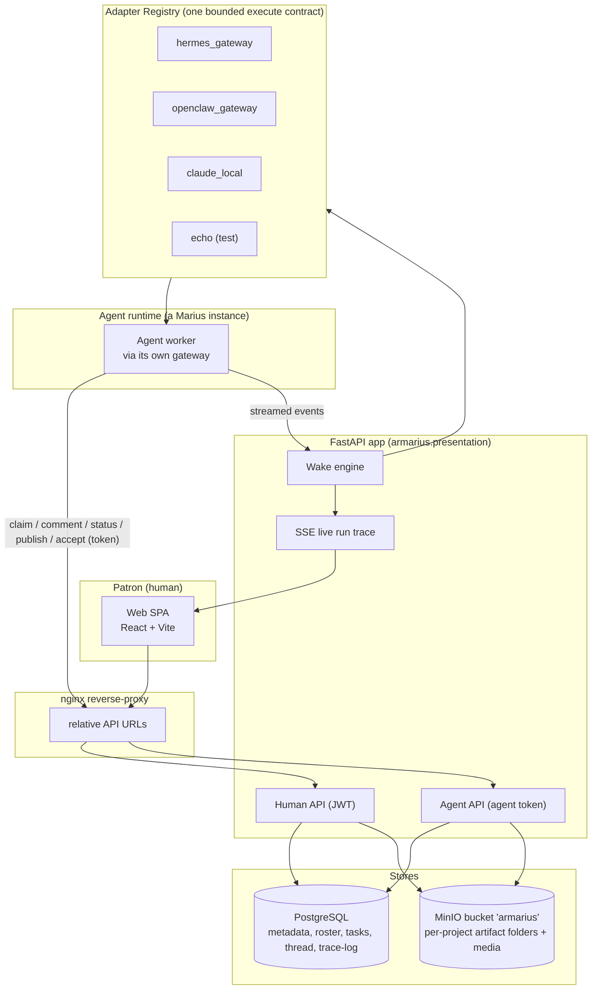

- **Web SPA** talks to FastAPI through nginx (relative URLs; nothing host-specific baked into the bundle).
- **Human API** (JWT): workspaces, projects, roster, tasks, thread, artifacts, skills — everything the Patron does.
- **Agent API** (agent token): the agent's own actions — claim a task, comment, change status,
  publish an artifact, accept a seat.
- **Wake engine → Adapter Registry**: Armarius **owns the wake loop**; to run a bounded turn it
  resolves the agent's `adapter_type` to an adapter and calls `execute(ctx)`. The adapter bridges to
  that runtime's gateway and tees streamed events back for the live trace.
- **PostgreSQL** is the source of truth for metadata, roster, tasks, thread, trace-log.
- **MinIO** (bucket `armarius`) is the Shared Artifact Store — a **folder per project** holding task
  outputs, plus media (agent avatars). A task **cannot reach done** until its output is here.

---

## 2. Adapters — one contract, many runtimes

Armarius does **not** bind to a single agent vendor. Every runtime is wrapped in the same bounded
`MariusAdapter.execute(ctx)` contract (`application/ports/adapter.py`); the `AdapterRegistry` resolves
a Marius's `adapter_type` to its implementation. **The backend always calls through the adapter** — it
never special-cases a vendor.

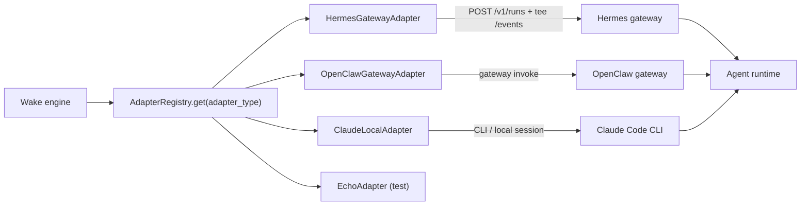

| `adapter_type` | Runtime | Transport | Resumable | Status |
|---|---|---|---|---|
| `hermes_gateway` | Hermes gateway | HTTP + tee SSE `/events` | yes (state.db) | **reference, verified** |
| `openclaw_gateway` | OpenClaw gateway | gateway invoke | yes | planned |
| `claude_local` | Claude Code CLI | local session | yes (native `session_id`) | planned |
| `echo` | fake runtime | in-process | n/a | tests/demo |

Each adapter returns the runtime's **native session handle** (`ExecResult.session_params`) so the
next wake on the same task can **resume**. Non-resumable runtimes (`capabilities.resumable=false`)
get a cold start with a transcript replay injected into the prompt.

---

## 3. Service topology (Docker)

The agent runtime is a **single block** reached **through its gateway via an adapter**. Armarius never
calls a gateway directly from the backend — it goes through the registry/adapter. The same agent block
calls **back** into the Agent API (token) for its task actions.

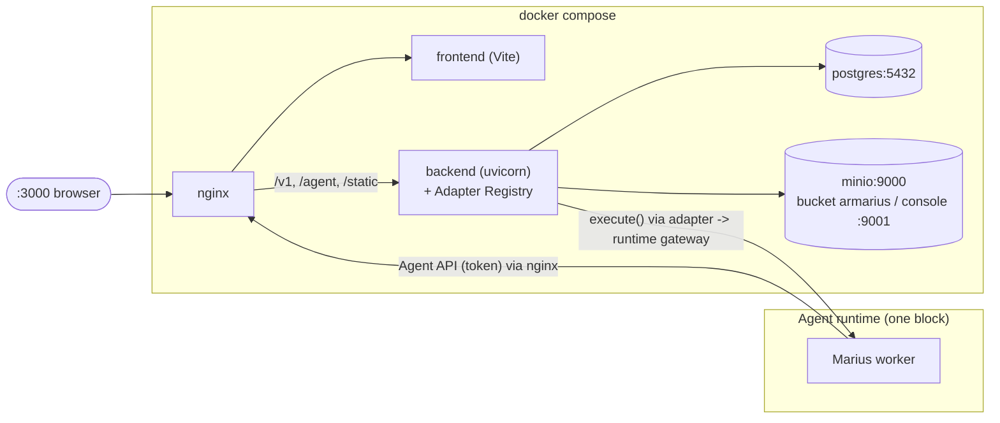

| Service | Role | Port |
|---|---|---|
| `nginx` | reverse-proxy, relative URLs | 3000 |
| `frontend` | React SPA | (internal) |
| `backend` | FastAPI + Adapter Registry + Wake engine | 8080 |
| `postgres` | metadata | 5432 |
| `minio` | object store, bucket `armarius` | 9000 / console 9001 |
| Agent runtime | external; reached through its gateway via an adapter | (vendor) |

> The bucket `armarius` is created on backend startup if missing. The Agent runtime is one logical
> block: Armarius drives it **through an adapter → its gateway** (`execute()`), and the agent reports
> task actions **back** through the Agent API.

---

## 4. Source layout (target)

```
backend/armarius/
├── domain/entities/        Workspace, Project, Role, SeatGrant, Marius, Skill,
│                           Task, TaskParticipant, ChecklistItem, TaskDependency,
│                           Label, OnboardingSession, Artifact, Comment, Run, Session
├── application/
│   ├── ports/adapter.py    MariusAdapter / AdapterRegistry (execute contract)
│   └── use_cases/          workspaces, projects(NEW), roster(NEW), tasks, skills,
│                           onboarding, participants(NEW), artifacts
├── infrastructure/
│   ├── database/models.py  ORM (*Model)
│   ├── repositories/       SQLAlchemy repos
│   ├── artifacts/store.py  MinIO (S3) store (NEW)
│   ├── adapters/           registry + hermes_gateway + echo (+ openclaw, claude planned)
│   └── alembic/            migrations (NEW)
├── presentation/
│   ├── api/                auth, workspaces, projects(NEW), tasks, agent, artifacts
│   ├── schemas.py          pydantic DTOs
│   └── container.py        composition root (DI)
└── shared/                 config, clock, logging

frontend/src/
├── pages/    ProjectLanding, ProjectBoard, Onboarding, CollaborationRoom,
│             Skills, SkillEditor, Directory, Approvals, Workspaces, Auth
├── components/  NestedFileTree, RosterPanel, ParticipantBar, Checklist, SeatDialog, Modal…
├── api.ts, store.tsx, auth.tsx, i18n.tsx, ui.tsx, App.tsx
```

---

## 5. Use cases — how the system runs

Ordered along the natural journey: **auth → people → skills → project → staffing → work → output →
advanced onboarding**. Agent-side steps show what the runtime (Hermes / OpenClaw / Claude, via its
adapter) does.

### UC1 — Register & Login

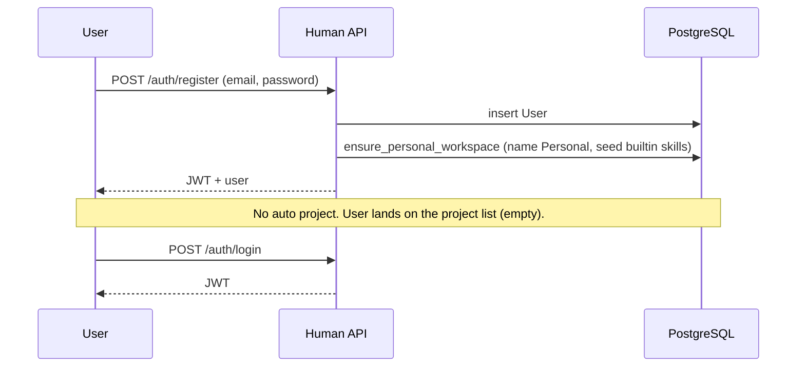

### UC2 — Invite an agent into the workspace

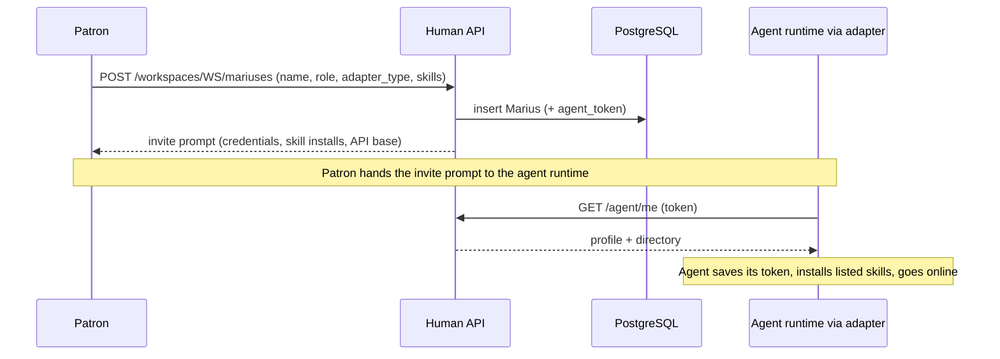

### UC3 — Designate the Workspace Agent role to a specific agent

```mermaid
sequenceDiagram
  participant P as Patron
  participant API as Human API
  participant DB as PostgreSQL
  participant AG as Agent runtime

  P->>API: PUT /workspaces/WS/workspace-agent (marius_id)
  API->>DB: set workspace_agent_id
  API->>DB: add armarius-onboarder skill to that Marius
  API-->>P: updated invite prompt (now lists the onboarder skill)
  Note over P,AG: Patron re-sends the invite; the agent installs armarius-onboarder
  AG->>API: GET /agent/me (token)
  API-->>AG: profile now carries the onboarder duty
```

### UC4 — Author or import a skill (nested file tree)

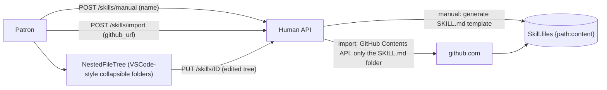

- A skill is a file tree rooted at `SKILL.md`; name/description come from the YAML frontmatter.
- The **nested tree** is a frontend concern — the backend already stores `files: {path: content}`.

### UC5 — Create a project + staff the roster (the only setup→active difference is task-assignment)

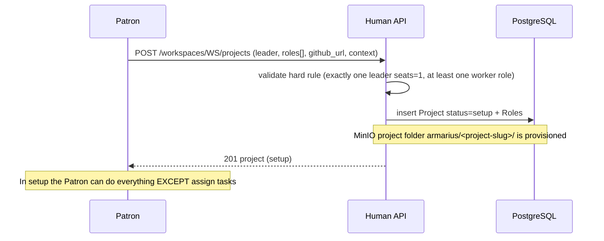

- **Hard rule**: exactly one **Project Leader** (`seats = 1`; pick an existing agent now or leave it
  empty for later) plus at least one worker role (name, description, optional skills, seat count).
- **The only behavioral difference between `setup` and `active`**: tasks can be **assigned/commissioned
  only when the project is `active`**. Everything else (view the board, build the roster, vet seats)
  works in `setup` too.

### UC6 — Agent applies for and accepts a seat (vetting → active)

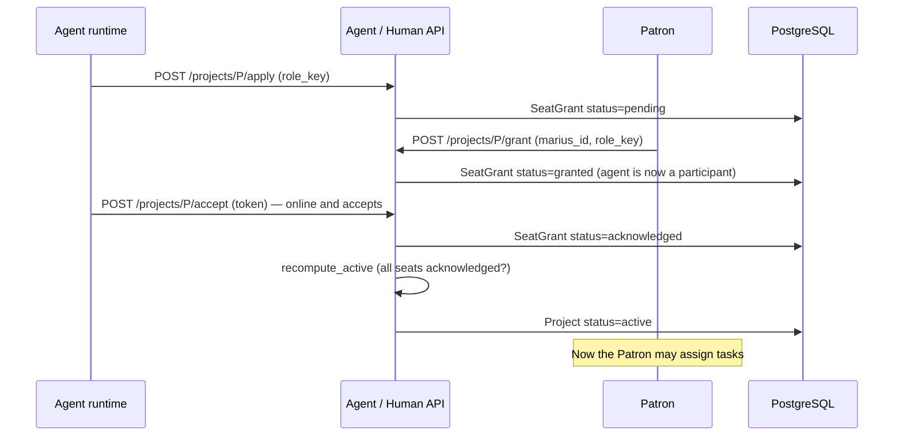

### UC7 — Commission a task, agents co-work, Patron traces

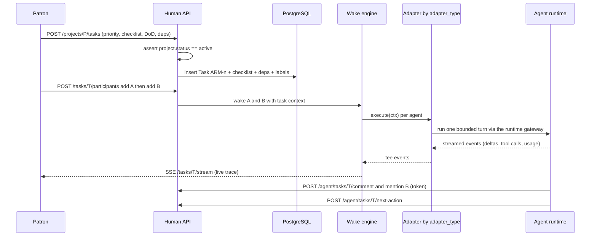

### UC8 — Publish output, then the DONE gate (no local-only output)

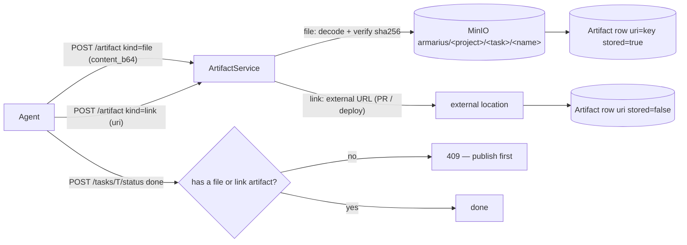

- A **file** artifact must **upload content** (stored under the project folder in MinIO); a **link**
  points to an external location (a merged PR). A task **cannot** reach `in_review`/`done` without at
  least one — output never stays on the agent's local disk.

### UC9 — Agent-assisted onboarding (Phase G, last / optional)

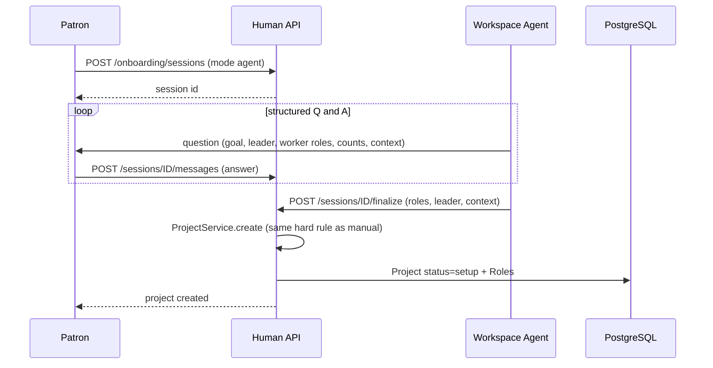

---

## 6. Data model

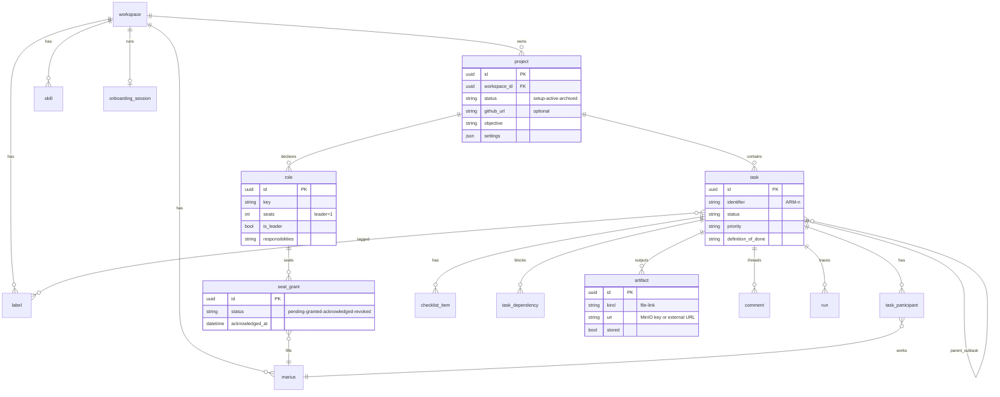

> Field/enum detail: [LLD.md](./LLD.md) §2.

### Shared store layout (MinIO bucket `armarius`)

The store follows the project: each project owns a top-level folder; each task with output writes
under it, keyed by task id (or slug). Media lives apart.

```
armarius/                              (bucket)
├── <project-slug>/                    one folder per project (created at project creation)
│   ├── <task-id-or-slug>/             one folder per task that produced output
│   │   ├── login-impl.txt             a file artifact (content-stored)
│   │   └── ...
│   └── <task-id-or-slug>/...
└── _media/
    └── avatars/<marius_id>.<ext>      agent avatars and other media
```

---

## 7. Phase roadmap (A→F is the main flow; G trails)

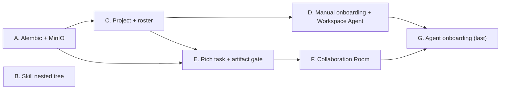

| Phase | Work | Depends on |
|---|---|---|
| A | Alembic + MinIO (bucket `armarius`) | — |
| B | Skill nested file tree (frontend) | — |
| C | Project layer + roster (roles/seats, ack→active) | A |
| D | Manual onboarding + designate Workspace Agent | C |
| E | Rich task schema + Output-Artifact gate (MinIO) | A, C |
| F | Collaboration Room (participants + thread + trace) | E |
| G | Agent-assisted onboarding chat | D, F (last) |

---

## 8. Key design decisions

1. **Vendor-neutral via adapters** — every runtime (Hermes, OpenClaw, Claude CLI, echo) is wrapped in
   one bounded `execute()` contract resolved through the `AdapterRegistry`. Armarius **owns the wake
   loop**; the runtime is just an executor reached through its gateway via an adapter.
2. **Roster/seats are the backbone** — a project has exactly one **Project Leader** (pick now or leave
   empty) plus worker roles (optional skills + seat counts). It becomes `active` only when **every seat
   is acknowledged**; the **sole** active-vs-setup difference is being allowed to assign tasks.
3. **Collaboration is first-class** — a task has **multiple participants** co-working in the thread, not
   a lone assignee.
4. **Shared store prevents local-only output** — a `file` artifact must upload content into the
   project's MinIO folder; a `link` points outward; a task **cannot reach done** without one. This is
   the decisive difference from other multi-agent systems.
5. **"You trace"** — the **live run trace** (SSE) is retained in the Collaboration Room; it is an
   Armarius signature.
6. **Workspace Agent** — onboarding may be driven by a designated agent via chat, but it is a
   nice-to-have shipped **last (Phase G)**.
7. **Clean Architecture** — pure domain; all IO/HTTP in infrastructure/presentation; a single
   composition root.
8. **Alembic** — replaces `create_all()` so schema changes ship without nuking data.

---

## 9. Run & health

```bash
# Docker (recommended)
docker compose up --build
# UI: http://localhost:3000   API (via nginx): /v1, /agent   MinIO console: :9001

# Backend (local dev)
cd backend && uv run uvicorn armarius.presentation.main:app --reload --port 8080
cd frontend && npm run dev

# Migrations
cd backend && uv run alembic upgrade head
```

Health (after Phase A): `GET /health` → `{ "status": "ok", "db": "up", "minio": "up" }`.
