> ⚠️ **ĐÃ LỖI THỜI (ARCHIVED).** Nguồn sự thật hiện tại là [`spec/`](../spec/) (tiếng Việt). Xem [docs/README.md](README.md).

# Architecture — Armarius (A.R.MARIUS)

> **High-level (target) architecture** for the "multi-project + onboarding + rich task +
> collaboration" wave. Lower-level detail lives in [HLD.md](./HLD.md) · [LLD.md](./LLD.md) ·
> [API_CONTRACT.md](./API_CONTRACT.md) · [SPRINT_PLAN.md](../SPRINT_PLAN.md) — if they disagree, **those win**.
> Diagrams favor Mermaid; the system is presented **by use case** — how the system runs for each one.

Armarius is a **provisioner for cross-team multi-agent collaboration**. Core philosophy (from
`ARMARIUS Design/`):

> **"You task. They collaborate. You trace."** — the Patron tasks, agents collaborate, the Patron traces.

Two distinct planes:

1. **Provisioning / orchestration (synchronous, REST)** — create a project → staff its roster →
   commission tasks → wake agents.
2. **Execution (real-time, via an adapter → the runtime's gateway + SSE)** — agents run a task,
   collaborate in the thread, publish output, and the Patron watches the live trace.

---

## 1. Component overview

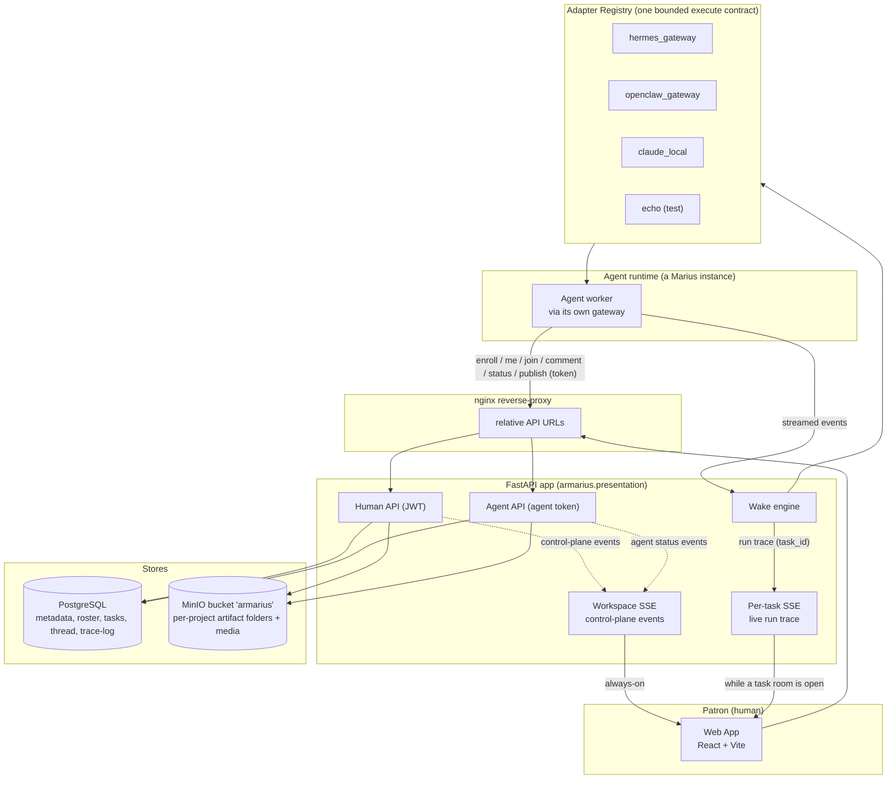

- **Web App** talks to FastAPI through nginx (relative URLs; nothing host-specific baked into the bundle).
- **Human API** (JWT): workspaces, projects, roster, tasks, thread, artifacts, skills — everything the Patron does.
- **Agent API** (agent token): the agent's own actions — enroll, confirm identity (`/agent/me`), join a
  task, comment, change status, publish an artifact. (There is no "accept a seat" — grants are
  system-only, §5 UC6.)
- **Wake engine → Adapter Registry**: Armarius **owns the wake loop**; to run a bounded turn it
  resolves the agent's `adapter_type` to an adapter and calls `execute(ctx)`. The adapter bridges to
  that runtime's gateway and tees streamed events back for the live trace.
- **Two SSE channels (both server→browser, never agent)**: a single **always-on Workspace SSE** carries
  light *control-plane* events (agent online, status, `project.active`, `task.created`, commission
  preview, approvals); a **per-task Trace SSE** is opened **only while a Collaboration Room is open** and
  carries that task's heavy *live run trace* (`run.delta`/`run.tool`/`run.usage`). This keeps the
  always-on connection cheap while still streaming every task's work in real time. See §5.
- **PostgreSQL** is the source of truth for metadata, roster, tasks, thread, trace-log.
- **MinIO** (bucket `armarius`) is the Shared Artifact Store — a **folder per project** holding task
  outputs, plus media (agent avatars). A task **cannot reach done** until its output is here.

---

## 2. Adapters — one contract, many runtimes

Armarius does **not** bind to a single agent vendor. Every runtime is wrapped in the same bounded
`MariusAdapter.execute(ctx)` contract (`application/ports/adapter.py`); the `AdapterRegistry` resolves
a Marius's `adapter_type` to its implementation. **The backend always calls through the adapter** — it
never special-cases a vendor.

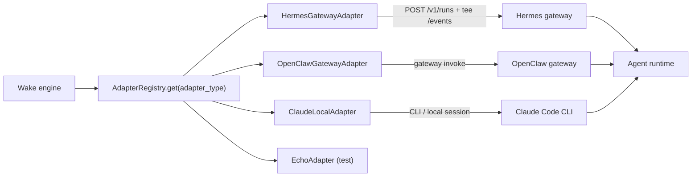

| `adapter_type` | Runtime | Transport | Resumable | Status |
|---|---|---|---|---|
| `hermes_gateway` | Hermes gateway | HTTP + tee SSE `/events` | yes (state.db) | **reference, verified** |
| `openclaw_gateway` | OpenClaw gateway | gateway invoke | yes | planned |
| `claude_local` | Claude Code CLI | local session | yes (native `session_id`) | planned |
| `echo` | fake runtime | in-process | n/a | tests/demo |

Each adapter returns the runtime's **native session handle** (`ExecResult.session_params`) so the
next wake on the same task can **resume**. Non-resumable runtimes (`capabilities.resumable=false`)
get a cold start with a transcript replay injected into the prompt.

---

## 3. Service topology (Docker)

The agent runtime is a **single block** reached **through its gateway via an adapter**. Armarius never
calls a gateway directly from the backend — it goes through the registry/adapter. The same agent block
calls **back** into the Agent API (token) for its task actions.


| Service | Role | Port |
|---|---|---|
| `nginx` | reverse-proxy, relative URLs | 3000 |
| `frontend` | React web app | (internal) |
| `backend` | FastAPI + Adapter Registry + Wake engine | 8080 |
| `postgres` | metadata | 5432 |
| `minio` | object store, bucket `armarius` | 9000 / console 9001 |
| Agent runtime | external; reached through its gateway via an adapter | (vendor) |

> The bucket `armarius` is created on backend startup if missing. The Agent runtime is one logical
> block: Armarius drives it **through an adapter → its gateway** (`execute()`), and the agent reports
> task actions **back** through the Agent API.

---

## 4. Source layout (target)

```
backend/armarius/
├── domain/entities/        Workspace, Project, Role, SeatGrant, Marius, Skill,
│                           Task, TaskParticipant, ChecklistItem, TaskDependency,
│                           Label, OnboardingSession, Artifact, Comment, Run, Session
├── application/
│   ├── ports/adapter.py    MariusAdapter / AdapterRegistry (execute contract)
│   └── use_cases/          workspaces, projects(NEW), roster(NEW), tasks, skills,
│                           onboarding, participants(NEW), artifacts
├── infrastructure/
│   ├── database/models.py  ORM (*Model)
│   ├── repositories/       SQLAlchemy repos
│   ├── artifacts/store.py  MinIO (S3) store (NEW)
│   ├── adapters/           registry + hermes_gateway + echo (+ openclaw, claude planned)
│   └── alembic/            migrations (NEW)
├── presentation/
│   ├── api/                auth, workspaces, projects(NEW), tasks, agent, artifacts
│   ├── schemas.py          pydantic DTOs
│   └── container.py        composition root (DI)
└── shared/                 config, clock, logging

frontend/src/
├── pages/    ProjectLanding, ProjectBoard, Onboarding, CollaborationRoom,
│             Skills, SkillEditor, Directory, Approvals, Workspaces, Auth
├── components/  NestedFileTree, RosterPanel, ParticipantBar, Checklist, SeatDialog, Modal…
├── api.ts, store.tsx, auth.tsx, i18n.tsx, ui.tsx, App.tsx
```

---

## 5. Use cases — how the system runs

Each use case is drawn end-to-end with the **real data** it moves. Three interaction rules hold
throughout:

- **Humans never talk to the API directly.** The Patron acts on the **web app** (browser UI); the web
  app calls the API with the user's JWT and renders the result. Diagrams label it `WEB` (Web App).
- **Agents talk to the API directly** with their agent token (issued during the invite handshake).
  Agent-side steps spell out exactly what the runtime does (save key, install skills, call back).
- **The web app learns of async changes by push, not polling.** It holds open an **always-on
  Workspace SSE** (`GET /v1/workspaces/WS/events`) and the backend pushes *control-plane* events down it
  — `marius.online`, `marius.status_changed`, `marius.liveness`, `project.active`, `task.created`,
  `commission.*`, approvals. **SSE = Server-Sent Events**: a one-way (server→browser), long-lived HTTP
  stream. SSE is a *Web-App-only* family of channels; agents never use SSE (they use request/response +
  adapter wakes). So when a diagram shows `API → SSE → WEB`, that is the backend telling the UI about a
  change the UI did not itself trigger.
- **Two channels (Hybrid): one always-on workspace stream + a per-task trace stream.** The heavy **live
  run trace** does **not** ride the workspace stream — it has its own **per-task SSE**
  (`GET /v1/tasks/T/stream`, `run.delta`/`run.tool`/`run.usage`) that the Collaboration Room opens
  **only while that task is on screen** and closes when you leave. So the browser holds **one** always-on
  connection plus **at most one** trace connection for the focused task. This is the deliberate split:
  control-plane events belong to no task and must arrive even with no room open, while a task's trace is
  only interesting while you are watching it — and not downloading every agent's trace at once keeps the
  always-on stream cheap. Multiple agents on a task interleave on that task's stream in real time. This
  is distinct from the **agent runtime session** (one per task/run, backend↔agent) which is unchanged:
  the wake engine **tees** each session's streamed events onto that task's trace SSE.

> This section is the design intent (what we are building), not a transcript of the current code.

Order follows the journey: **auth → invite agents → designate roles → skills → project → staffing →
work → output → advanced onboarding.**

### Liveness — what "online" means (and how it decays)

"Online" is **not** a flag set once at invite time — it is **signal recency**, and it decays. A
*signal* is **any** contact from the agent — the source does not matter. There are two ways a signal
arrives:

1. **The system probes (primary).** The agent does **not** have to call anything on its own. When an
   agent has been idle, Armarius **opens a light throwaway session and asks it to reply "OK"**; the
   reply is a signal, and the session is discarded. This is the mechanism that decides liveness, and it
   works even for an agent that is sitting completely idle.
2. **An incidental call counts too (bonus).** While an agent is *already* working a task it naturally
   calls the API (comment, status, publish, `/agent/me`, the enroll reply). Each such call is **also**
   counted as a signal, which **resets the idle timer and saves an unnecessary probe**. So there is **no
   heartbeat endpoint to implement** — the agent is never required to self-report; incidental calls are
   just opportunistically reused.

The system watches the time since the **last signal** and probes on idle.

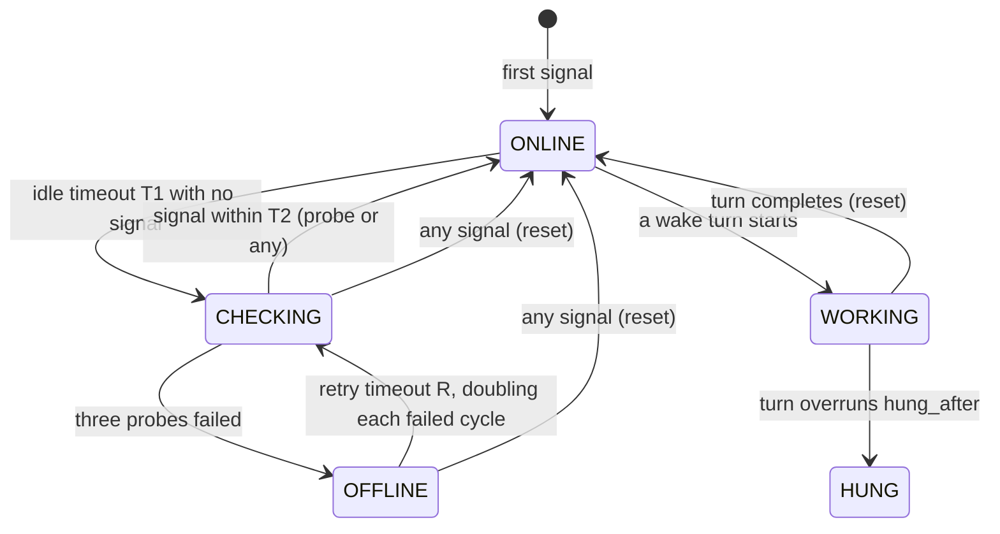

- **Idle timeout (T1)**: no signal from the agent for T1 → send a **light probe** ("reply OK" in a
  throwaway session) and wait a short **T2**.
- **Retry 3×**: no answer → state `CHECKING` (you called it "waking"); retry the probe up to 3 times.
- **OFFLINE**: all 3 probes failed. Then a **retry timeout R** fires and the whole probe loop runs
  again — and **R doubles each failed cycle** (R → 2R → 4R → …), so a busy agent or an overloaded LLM
  isn't hammered. (A max cap on R is set in HLD/LLD.)
- **Reset on any signal**: the moment *any* signal arrives from the agent — mid-probe, from OFFLINE,
  or a real task response — everything resets: state → `ONLINE`, the idle timer restarts, and the
  backoff resets to the base `R`.
- A turn in flight ⇒ `WORKING`; a turn that overruns `hung_after` ⇒ `HUNG` (watchdog).

So an agent invited today and never heard from again is **OFFLINE by the time you create a project
weeks later** — the watchdog already demoted it (with an exponentially slowing retry cadence); the UI
never shows a stale ONLINE.

**Grant vs commission under this model** (this is how the UCs below treat liveness):

- **Grant a seat**: always proceeds — it is system-only. If the role carries skills, the skill-install
  is **queued** and resumes when the agent is back ONLINE; if no skills, nothing is sent.
- **Project `active`**: reached **once**, when every seat is granted **and** every seated agent is
  ONLINE at staffing time. It **stays active** afterwards — a worker going offline later does not revoke
  activation.
- **Commission**: only needs the project to be **active** (initial staffing was complete). It chats the
  **Project Leader**, who must be reachable (an offline leader is handled like any offline agent —
  wait/retry, not a hard block at the form). A **worker** going offline after activation is **not** a
  commission gate — it is an operational matter resolved at run time by the wake/report machinery.

### UC1 — Register & Login (and where the user lands)

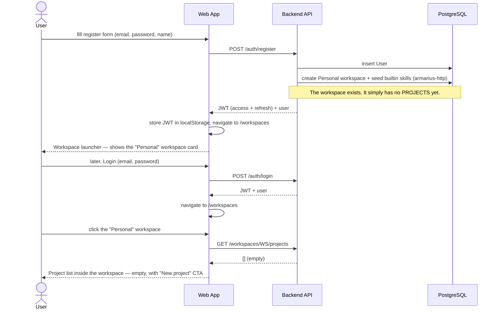

- After login the user lands on the **workspace launcher** (`/workspaces`), which always shows at least
  the **Personal** workspace (created at registration). Entering a workspace shows its **project list**,
  which is empty for a brand-new account — that emptiness is at the *project* level, not the workspace
  level. There is no auto-created project; the user creates one via UC5.

### UC2 — Invite an agent (pick a type, copy the prompt, agent joins back, Patron sees it online)

Modeled on Paperclip's openclaw-gateway invite: the Patron only **chooses the agent type**; Armarius
prepares everything and produces a single **copyable prompt**. The agent uses that prompt to **join
back** (`/agent/enroll`) and **waits on that call**; when the Patron **approves**, the backend
**completes the held enroll call by returning the token** — so the agent gets its key on the same
session it opened, no separate "claim" needed (claim exists only as a recovery fallback). That first
authenticated callback is the **success signal** the Patron sees.

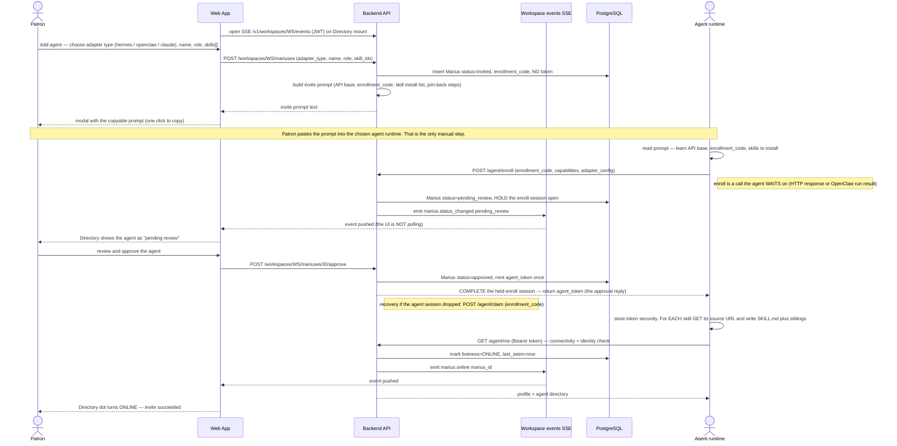

Step detail (the parts that were previously hand-waved):

- **Choosing the type** is all the Patron configures; `adapter_type` decides which gateway the runtime
  speaks and which `adapter_config` fields the agent must fill (e.g. `openclaw_gateway` → ws URL +
  gateway token).
- **Where the token comes from**: it does **not** exist at invite time, and it is **never printed in
  the prompt**. The agent opens `/agent/enroll` (with its `enrollment_code`) and **waits on that call**.
  On approval the backend mints the token and **returns it as the enroll call's response** — the agent
  receives it on the same session it opened (HTTP response for Hermes/Claude-local; the run result for
  OpenClaw). `/agent/claim(enrollment_code)` exists only as a **recovery fallback** if that session was
  lost (restart/timeout) before approval completed.
- **How skills are installed**: for each linked skill the prompt lists a source URL; the agent fetches
  that skill's `SKILL.md` **plus its sibling files** (the full file tree) and writes them into its local
  skill directory. Builtin `armarius-http` teaches it to call the API.
- **How it is tested**: the agent calls `GET /agent/me` with its token; HTTP 200 + its profile means
  credentials and connectivity are good (401 ⇒ bad token).
- **How the Patron knows it worked**: that first authenticated call back marks the agent ONLINE and
  the backend **emits a `marius.online` event on the workspace-events SSE** the Web App is subscribed
  to — so the Directory dot flips to ONLINE in real time. The Web App never has to guess or poll: the
  same stream also carries `marius.status_changed` (e.g. `pending_review`), approvals, and task-status
  changes. (The first `/agent/me` after approval is what flips ONLINE; thereafter liveness is kept by
  the system probe — see the Liveness section. At this tier the contract is *"the agent calls back, the
  backend marks it online and pushes that to the Web App over SSE."*)

### UC3 — Designate the Workspace Agent role to a specific agent

The chosen agent is **already online** (from UC2), so the system reaches it **directly through its
adapter** — the Patron does not copy or relay anything. The badge appears once the agent confirms
install, pushed back over SSE.

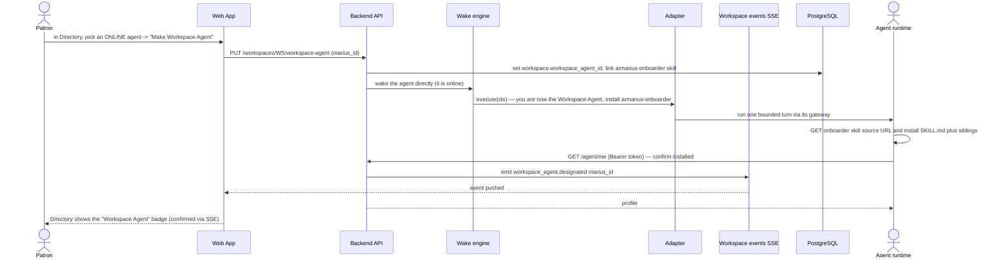

- Only one agent per workspace holds this role. It is what makes **UC9** (agent-assisted onboarding)
  possible; until an agent is designated, the onboarding-chat mode is disabled in the Web App.
- No snippet, no Patron relay: because the agent is online, designation is a **direct adapter wake**,
  and the badge is the SSE-confirmed result.

### UC4 — Author or import a skill (nested file tree)

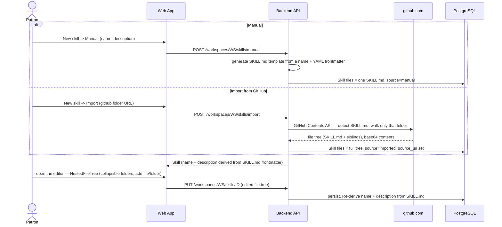

- A skill is a file tree rooted at `SKILL.md`; `name`/`description` come from its YAML frontmatter.
- The **nested tree** is a frontend rendering concern — the backend stores a flat `files: {path:
  content}` map and splits on `/` in the UI.

### UC5 — Create a project + staff the roster (setup vs active differ only by task-assignment)

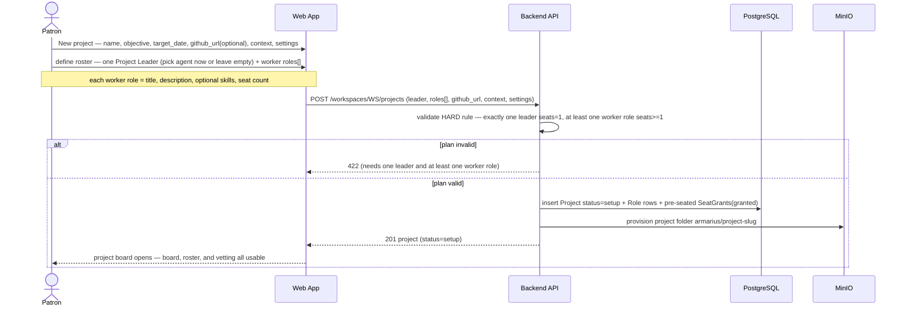

- **Hard rule**: exactly one **Project Leader** (`seats = 1`; pick an existing agent now or leave the
  seat empty for later) plus at least one worker role (title, description, optional skills, seat count).
  The leader's job is to push agents, drive tasks, and report status (default behavior TBC).
- **setup vs active**: the **only** thing `active` unlocks is **task assignment** (via the Project
  Leader — see UC7). In `setup` the Patron can already view the board, edit the roster, and grant seats
  — they just cannot commission tasks until the project goes **active** (UC6: every seat granted and
  every seated agent online).

### UC6 — Grant seats (system-only) → project goes active when staffed + online

Granting a seat is a **pure system action** — it does not change the agent. Agents never self-apply.
The agent is contacted **only** when its new role carries skills it must install; otherwise the seat is
just recorded state. The project goes `active` when every seat is granted **and** every seated agent is
online (the online signal reused from UC2 — no extra "accept" step).

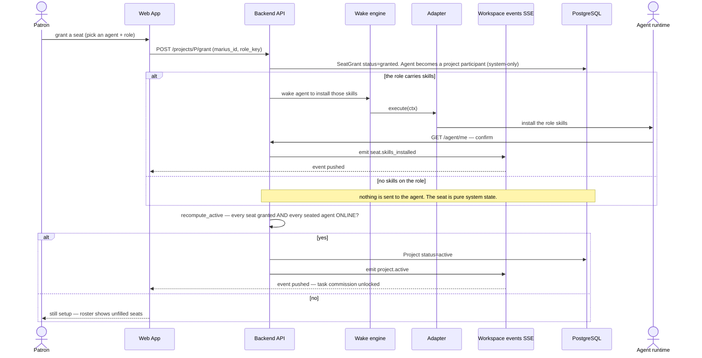

- No self-apply; no agent "accept". A seat is `granted` (system) and that is the whole record. If the
  role has skills, the agent is woken once to install them — the only agent touchpoint. If the agent is
  **offline** at grant time, that skill-install is **queued** and resumes when it is back ONLINE (see
  the liveness model above).
- **`active` = every seat granted and every seated agent ONLINE** (liveness already tracked from the
  invite). Once activated it stays active; an agent going offline later just shows offline, it does not
  revoke activation. The role itself is replayed to the agent later whenever it is woken on a task.

### UC7 — Commission a task through the Project Leader (no manual form)

There is **no manual task form**. Because every project has a **Project Leader** agent, "Commission
task" opens a **chat with the Leader**. The Patron states what they want; the Leader analyzes, asks
back when there is more than one option, breaks the work down if it is too large, **fills every task
field** (priority, DoD, checklist, deps, due date), **picks the workers** from the roster, and
produces a **preview**. The Patron then edits it manually or asks the Leader to refine. Confirming
creates the task and wakes the chosen workers. This commissioning runs in a **fresh Leader session**
seeded with the project + roster + worker context.

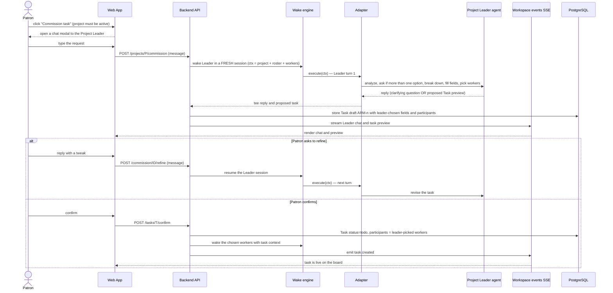

- The Patron **never fills task fields** — that is the Leader's job. "You task" is literal: you tell
  the Leader what you want, the Leader shapes the task.
- Commission is **not gated on per-worker liveness**: it only needs the project to be **active** (it
  was staffed online once). If a chosen worker is offline, that is resolved at run time by the
  wake/report machinery — only the **Leader** must be reachable, because the chat is with it.
- The Leader can also **edit a confirmed task** later the same way (Patron messages a change → Leader
  revises). Once work is underway, participants co-work in the task thread (comments, @mentions,
  `next_action`) and the Patron watches the live trace — that collaboration is UC8-adjacent and the
  trace panel is unchanged.

### UC8 — Publish output, then the DONE gate (no local-only output)

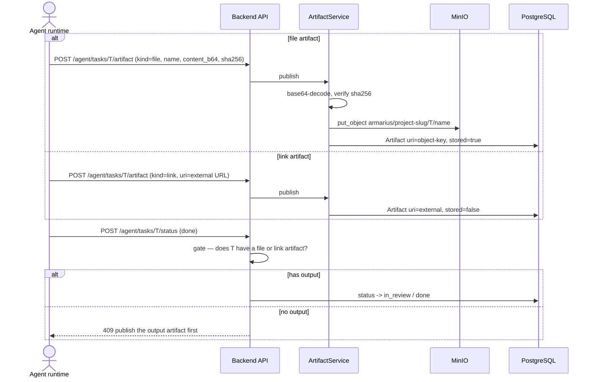

- A **file** artifact **uploads content** into the project's MinIO folder
  (`armarius/<project-slug>/<task>/<name>`); a **link** records an external location (a merged PR). A
  task **cannot** reach `in_review`/`done` without at least one — output never stays on the agent's
  local disk.

### UC9 — Agent-assisted onboarding (Phase G, last / optional)

The Workspace Agent (UC3) runs the project-onboarding chat, then materializes the same project payload
as the manual UC5 path.

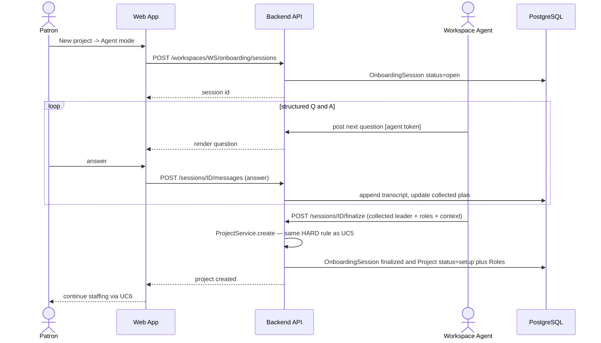

---

## 6. Data model

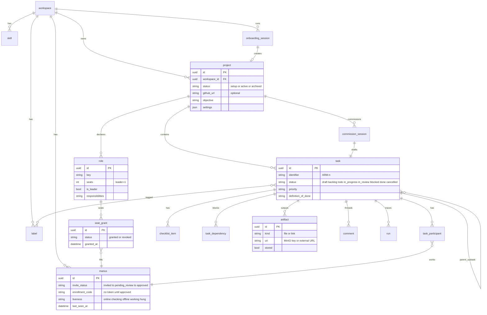

> Boxes show the **key/changed** fields only — full field and enum detail is in
> [LLD.md](./LLD.md) §2.

### Shared store layout (MinIO bucket `armarius`)

The store follows the project: each project owns a top-level folder; each task with output writes
under it, keyed by task id (or slug). Media lives apart.

```
armarius/                              (bucket)
├── <project-slug>/                    one folder per project (created at project creation)
│   ├── <task-id-or-slug>/             one folder per task that produced output
│   │   ├── login-impl.txt             a file artifact (content-stored)
│   │   └── ...
│   └── <task-id-or-slug>/...
└── _media/
    └── avatars/<marius_id>.<ext>      agent avatars and other media
```

---

## 7. Phase roadmap (A→F is the main flow; G trails)

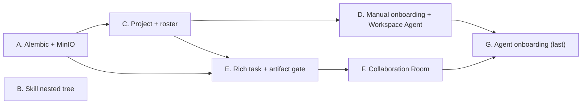

| Phase | Work | Depends on |
|---|---|---|
| A | Alembic + MinIO (bucket `armarius`) | — |
| B | Skill nested file tree (frontend) | — |
| C | Project layer + roster (roles/seats, ack→active) | A |
| D | Manual onboarding + designate Workspace Agent | C |
| E | Rich task schema + Output-Artifact gate (MinIO) | A, C |
| F | Collaboration Room (participants + thread + trace) | E |
| G | Agent-assisted onboarding chat | D, F (last) |

---

## 8. Key design decisions

1. **Vendor-neutral via adapters** — every runtime (Hermes, OpenClaw, Claude CLI, echo) is wrapped in
   one bounded `execute()` contract resolved through the `AdapterRegistry`. Armarius **owns the wake
   loop**; the runtime is just an executor reached through its gateway via an adapter.
2. **Invite = enroll-and-wait, not print-a-token** — the Patron only picks the agent type; the agent
   enrolls and **waits on that call**; on approval the backend **returns the token as the enroll
   response** (claim exists only as a recovery fallback). The token is never printed in the prompt.
3. **Roster/seats are the backbone** — a project has exactly one **Project Leader** (pick now or leave
   empty) plus worker roles (optional skills + seat counts). Granting a seat is **system-only** (no
   self-apply; the agent is contacted only to install the role's skills, and that is queued if the
   agent is offline). The project becomes `active` **once** every seat is granted and every seated
   agent is online; it **stays active** — a worker going offline later is an operational matter, not a
   revoke. The **sole** active-vs-setup difference is being allowed to commission tasks.
4. **Liveness is recency + probe, not a sticky flag** — "online" means *a signal was received
   recently*. The deciding mechanism is a **system probe** (a light "reply OK" turn in a throwaway
   session) the backend runs on idle — the agent never has to self-report, so **there is no heartbeat
   endpoint**. After an idle timeout the system probes (3× retry → offline); OFFLINE then re-probes on a
   timeout that **doubles each failed cycle**, so a busy agent or overloaded LLM isn't hammered. Any
   incidental agent call (comment/status/`/agent/me`) is *also* counted as a signal so the probe is
   skipped. **Any signal resets everything** (state, idle timer, backoff). So a long-silent agent is
   OFFLINE by the time you need it; the UI never shows a stale ONLINE. (Full state machine in §5.)
5. **Commission is leader-mediated, never a manual form** — "Commission task" opens a chat with the
   **Project Leader**, who analyzes, asks back, breaks the work down, fills every field, and picks the
   workers; the Patron reviews the preview and refines or confirms. "You task" is literal.
6. **Collaboration is first-class** — a task has **multiple participants** co-working in the thread, not
   a lone assignee.
7. **Shared store prevents local-only output** — a `file` artifact must upload content into the
   project's MinIO folder; a `link` points outward; a task **cannot reach done** without one. This is
   the decisive difference from other multi-agent systems.
8. **The UI is push-driven, over two SSE channels (Hybrid)** — an **always-on Workspace SSE** carries
   control-plane events (liveness/status/approval/`project.active`/`task.created`/`commission.*`), and a
   **per-task Trace SSE** opened only while a Collaboration Room is on screen carries that task's live
   run trace. No polling, and no "the UI magically knew" steps.
9. **"You trace"** — the **live run trace** (the per-task Trace SSE) is retained in the Collaboration
   Room; it is an Armarius signature.
10. **Workspace Agent** — onboarding may be driven by a designated agent via chat, but it is a
    nice-to-have shipped **last (Phase G)**.
11. **Clean Architecture** — pure domain; all IO/HTTP in infrastructure/presentation; a single
    composition root.
12. **Alembic** — replaces `create_all()` so schema changes ship without nuking data.

---

## 9. Run & health

```bash
# Docker (recommended)
docker compose up --build
# UI: http://localhost:3000   API (via nginx): /v1, /agent   MinIO console: :9001

# Backend (local dev)
cd backend && uv run uvicorn armarius.presentation.main:app --reload --port 8080
cd frontend && npm run dev

# Migrations
cd backend && uv run alembic upgrade head
```

Health (after Phase A): `GET /health` → `{ "status": "ok", "db": "up", "minio": "up" }`.
