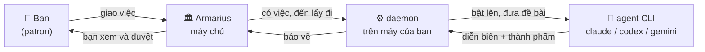

# Tài liệu A.R.MARIUS

> **A.R.MARIUS — Agents Are MARIUS.** Một xưởng làm việc cho đội agent của chính bạn:
> bạn giao việc, chúng tự làm và tự bàn với nhau, bạn xem lại rồi duyệt.

Điều đáng biết đầu tiên, vì nó quyết định mọi thứ còn lại:

**Agent không chạy trên máy chủ của chúng tôi. Chúng chạy trên máy của bạn.**

Armarius không nuôi một con agent nào. Nó giao việc, còn thứ thật sự làm việc là **agent CLI
bạn đã cài sẵn trên máy mình** — Claude Code, Codex, Gemini CLI — đang đăng nhập bằng tài
khoản của bạn. Một chương trình nhỏ tên là **daemon** chạy trên máy đó, tự đi hỏi Armarius
"có việc gì cho tôi không", rồi bật agent CLI lên ngay tại chỗ.

Hệ quả của cái mũi tên đi từ phải sang trái ấy: máy của bạn **không cần mở cổng nào**. Laptop
gập lại, router ở nhà, firewall công ty đều không sao — daemon là bên đi hỏi, không phải bên
bị gọi.

---

## Bắt đầu

| Trang | Đọc khi |
| --- | --- |
| [Quickstart](quickstart.md) | Bạn muốn dựng Armarius lên và giao được đầu việc đầu tiên |
| [Khái niệm cốt lõi](concepts.md) | Bạn gặp một từ trên giao diện mà không rõ nó nghĩa gì |
| [A.R.MARIUS chạy như thế nào](how-armarius-works.md) | Bạn muốn hiểu đường đi của một đầu việc, từ lúc giao tới lúc duyệt |

## Máy và daemon

| Trang | Đọc khi |
| --- | --- |
| [Máy và daemon](machines-and-daemon.md) | Bạn cần cài daemon, nối máy, hoặc máy đang báo *không nhận việc được* |

## Đội ngũ

| Trang | Đọc khi |
| --- | --- |
| [Agent](agents.md) | Bạn muốn tạo agent, và hiểu vì sao nó *đang nối* hay *mất liên lạc* |
| [Kỹ năng](skills.md) | Bạn muốn dạy agent một cách làm việc, hoặc nhập kỹ năng từ GitHub |

## Làm việc hằng ngày

| Trang | Đọc khi |
| --- | --- |
| [Dự án và đầu việc](projects-and-tasks.md) | Bạn muốn mở dự án, dựng đội hình, giao và theo đầu việc |
| [Hộp thư Patron](inbox.md) | Có thứ đang chờ bạn quyết, và bạn muốn biết vì sao nó tới đó |

---

## Tài liệu dành cho người viết mã

Ba thứ dưới đây **không** phải tài liệu người dùng, ghi ra để bạn không phải đi tìm:

- [`daemon/README.md`](../daemon/README.md) — mọi thiết lập của daemon, cách chạy nó như một
  dịch vụ hệ thống, cách nâng cấp.
- [`specs/`](../specs/) — đặc tả đang có hiệu lực. Đây là nơi giữ sự thật về hành vi hệ thống.
- [`.specify/memory/constitution.md`](../.specify/memory/constitution.md) — Hiến pháp dự án:
  những điều mọi đặc tả đều phải tuân.

`_archive/` giữ tài liệu đã chết. Đừng đọc để hiểu hành vi hôm nay.
