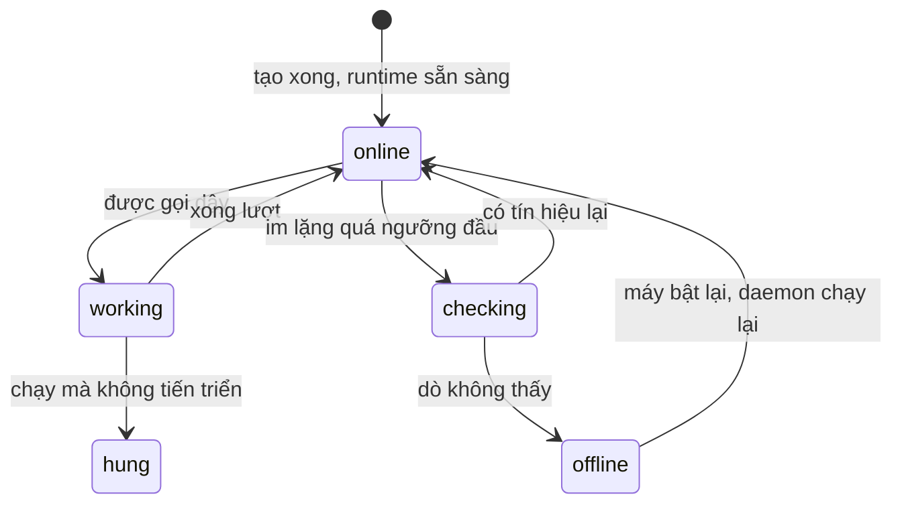

# Agent

Một **agent** (trong dự án này còn gọi là **MARIUS**) là một người làm việc có tên, có chỉ dẫn
riêng, chạy trên đúng một runtime ở một máy của bạn.

---

## Tạo agent

**Danh bạ → Tạo agent.** Ba thứ quyết định:

**Tên** — độc nhất trong không gian làm việc. Đây cũng là cái tên người khác `@mention` để gọi
nó.

**Runtime** — chọn trong danh sách runtime **đang sẵn sàng**. Hai điều đáng biết:

- Chọn **một lần**, không đổi được về sau. Một agent làm việc ở đúng một chỗ.
- Chưa nối máy nào thì danh sách này **rỗng**, và bạn không tạo được agent nào cả. Đây là lý
  do [nối máy](machines-and-daemon.md) là bước đứng trước.

**Chỉ dẫn** — cách nó cư xử và bối cảnh nó cần biết. **Đây là thứ duy nhất** làm nên tính cách
của một agent.

> Trong Armarius không có "vai theo dự án". Dự án đưa **việc**, không đưa thêm một nhân cách
> thứ hai. Một agent bạn tạo với chỉ dẫn *"bạn viết frontend, cẩn thận về accessibility"* thì ở
> dự án nào nó cũng là người ấy.

Tuỳ runtime mà có thêm những thứ chọn được — ví dụ model nào, mức suy nghĩ tới đâu. Danh sách
ấy là **câu trả lời của runtime**, không phải của Armarius: nó đọc ra từ chính CLI có trên máy
bạn.

Kỹ năng gắn được ngay lúc tạo hoặc thêm sau ([Kỹ năng](skills.md)).

---

## Trạng thái của một agent

Agent chỉ có **một** trạng thái, và nó trả lời đúng một câu: *bây giờ có gọi được nó không?*

| Trạng thái | Nghĩa |
| --- | --- |
| **Đang nối** (`online`) | Gọi được. Cũng là trạng thái *rảnh giữa hai lượt* |
| **Đang làm** (`working`) | Đang trong một lượt chạy |
| **Đang dò** (`checking`) | Im lặng quá ngưỡng đầu, hệ thống đang kiểm |
| **Mất liên lạc** (`offline`) | Không gọi được. Máy tắt, daemon tắt, hoặc runtime đóng |
| **Treo** (`hung`) | Lượt chạy còn mở nhưng không tiến triển gì |

Trạng thái này **thuộc Armarius**, không thuộc CLI. Nó đọc ra từ nhịp của máy và từ diễn biến
của lượt chạy, chứ không phải hỏi CLI xem nó có sống không.

Agent *mất liên lạc* thì đầu việc của nó **không mất**. Nó nằm chờ, và thang leo sẽ báo Trưởng
dự án — rồi báo bạn, nếu không ai gỡ được.

---

## Agent CLI nào dùng được

| CLI | Cài bằng | File bối cảnh nó tự đọc |
| --- | --- | --- |
| **Claude Code** (`claude`) | `npm i -g @anthropic-ai/claude-code` | `CLAUDE.md` |
| **Codex** (`codex`) | `npm i -g @openai/codex` | `AGENTS.md` |
| **Gemini CLI** (`gemini`) | `npm i -g @google/gemini-cli` | `GEMINI.md` |

daemon **tự dò** — cài xong CLI rồi chạy lại `armarius-daemon start` là runtime mới hiện lên
màn hình Máy.

Đề bài của một lượt chạy được đặt vào **đúng file bối cảnh mà CLI ấy tự mở**, còn kỹ năng đặt
vào **đúng thư mục kỹ năng của CLI ấy**. Bạn không cấu hình gì; daemon biết từng CLI cần gì.

---

## Ghế Trưởng dự án

**Trưởng dự án** không phải một loại agent khác. Đó là một **cái ghế trong một dự án**: agent
nào ngồi vào thì trong dự án ấy nó chia việc, xem lại việc người khác, và ký chữ ký thứ nhất
khi đóng một đầu việc.

Cùng một agent có thể là Trưởng dự án ở dự án này và người làm việc ở dự án kia.

---

## Đọc thêm

- [Kỹ năng](skills.md) — dạy agent một cách làm việc
- [Dự án và đầu việc](projects-and-tasks.md) — dựng đội hình
- [Máy và daemon](machines-and-daemon.md) — runtime không sẵn sàng thì làm gì
