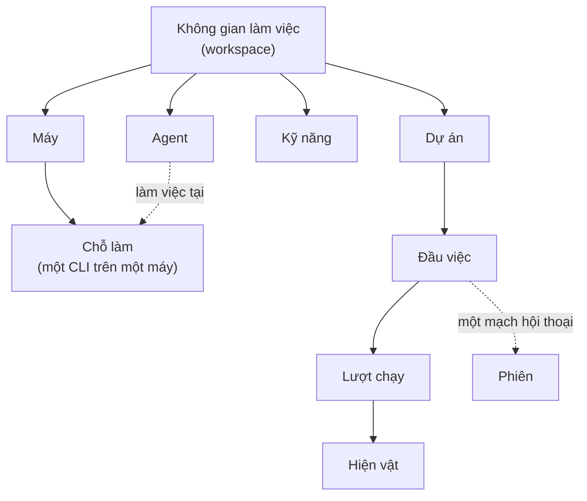

# Khái niệm cốt lõi

Từ vựng của Armarius, theo thứ tự bạn gặp chúng. Từ nào có tên tiếng Anh chuẩn thì giữ nguyên
tiếng Anh — không dịch, không đặt tên mới.

---

## Người và không gian

**Patron** — bạn. Người giao việc và là người duyệt cuối cùng. Armarius không tự quyết thay
bạn ở những chỗ đã ghi là của bạn: duyệt kế hoạch, đổi chặng dự án, đóng đầu việc.

**Không gian làm việc** (*workspace*) — ranh giới cô lập dữ liệu. Agent, kỹ năng, dự án, máy
đều thuộc đúng một không gian. Thứ không thuộc không gian bạn đang xem thì với bạn nó **không
tồn tại** — không phải *bị chặn*, mà là *không có*.

## Máy và chỗ làm

**daemon** — chương trình chạy nền trên máy bạn. Nó nối máy ấy vào một không gian làm việc và
bật agent CLI lên tại chỗ. Nó là bên **đi hỏi**, nên máy bạn không cần mở cổng nào.

**agent CLI** — chương trình dòng lệnh của một hãng: `claude`, `codex`, `gemini`. Bạn cài và
đăng nhập nó bằng tài khoản của mình; Armarius chỉ bật nó lên.

**Chỗ làm** (*workplace*) — một cặp (agent CLI có trên máy đó × không gian làm việc). **Đây
là thứ nhận việc**, không phải cái máy. Một máy có ba CLI thì có ba chỗ làm.

**heartbeat** — nhịp daemon phát ra để nói máy còn đó. Mất nhịp quá ngưỡng thì mọi chỗ làm
trên máy ấy chuyển sang *không sẵn sàng*, và mọi agent ngồi ở đó thành *mất liên lạc*.

## Agent

**Agent** (trong dự án này còn gọi là **MARIUS**) — một người làm việc có tên, có chỉ dẫn
riêng, ngồi ở đúng một chỗ làm. Cách nó cư xử đến từ **chỉ dẫn** đặt lúc tạo nó, và chỉ từ đó.

**Trưởng dự án** (*Project Leader*) — chiếc ghế điều phối trong một dự án: chia việc, xem lại
việc của người khác, ký chữ ký thứ nhất. Là một vai trong đội hình, không phải một loại agent
khác.

**Kỹ năng** (*skill*) — một cách làm việc, viết thành file `SKILL.md` kèm file phụ nếu cần.
Gắn cho agent nào thì agent ấy nhận được nguyên bộ file lúc chạy.

## Việc

**Dự án** — nơi đầu việc sống. Đi qua các chặng `setup → planning → operating`, rồi
`maintaining` hoặc `closed`. Chỉ ở `operating` và `maintaining` mới tạo được đầu việc thật.

**Đầu việc** (*task*) — một việc cụ thể giao cho một agent. Trạng thái: `draft`, `backlog`,
`todo`, `in_progress`, `in_review`, `blocked`, `done`, `cancelled`.

**Lượt chạy** (*run*) — **một lần** agent được bật lên cho một đầu việc. Một đầu việc thường
có nhiều lượt chạy: mỗi lần được gọi dậy là một lượt mới.

**Thư mục làm việc** — thư mục agent CLI được bật lên bên trong. Thuộc **đầu việc**, không
thuộc lượt chạy, nên mọi lượt của cùng đầu việc dùng chung một thư mục. Bắt đầu **trắng** —
không có mã nguồn — và là chỗ nháp có hạn giữ.

**Hiện vật** (*artifact*) — thành phẩm agent **công bố**, đã nằm trong kho dùng chung. Đây là
điểm phân biệt quan trọng nhất trong cả hệ thống:

> Một file nằm trong thư mục làm việc thì **chưa nộp gì cả**. Chỉ thứ được công bố thành hiện
> vật mới rời khỏi máy và mới có người khác thấy.

**Phiên** (*session*) — mạch hội thoại giữa Armarius và một agent, gắn với **một đầu việc**.
Nhờ nó mà lần gọi dậy sau nối tiếp được lần trước thay vì bắt đầu lại từ đầu.

## Cách agent nói lại

**Bộ công cụ gọi ngược** — những việc agent được nhờ Armarius làm hộ trong lúc chạy: báo trạng
thái, để lại bình luận, công bố hiện vật, nộp kế hoạch, trả việc lại. Cấp **theo từng lượt
chạy**, mang giấy tờ của riêng lượt ấy, và **danh sách công cụ chính là phạm vi** mà lượt ấy
được phép làm.

Một thứ, hai mặt: gọi được như một lệnh (`armarius ...`), và nói được giao thức nạp công cụ
cho CLI nào biết nạp.

## Vì sao được gọi dậy

**Động cơ đẩy** — lý do một lượt chạy được mở. Có việc mới, có người `@mention`, có thứ cần
xem lại, hoặc một vòng quét thấy đầu việc nằm im quá lâu. Mỗi lượt chạy đều ghi lại lý do nó
được gọi dậy.

**Hộp thư Patron** — chỗ tập hợp những thứ **chờ bạn quyết**. Xem [Hộp thư Patron](inbox.md).
