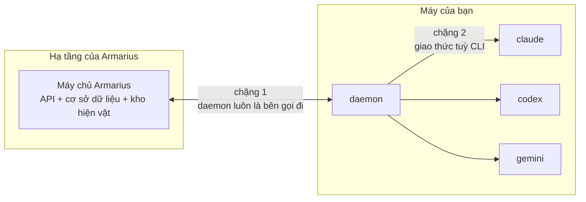
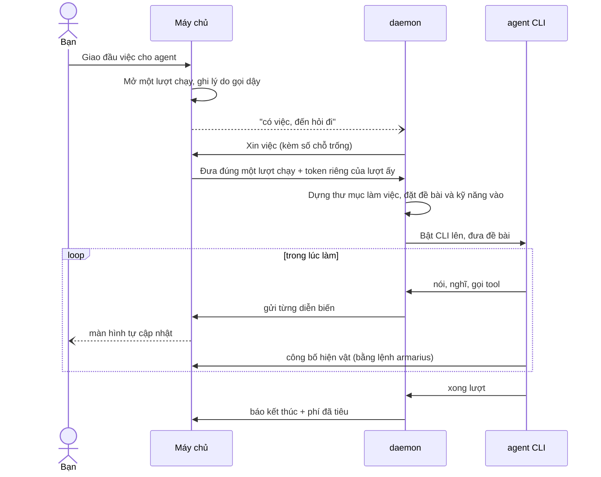
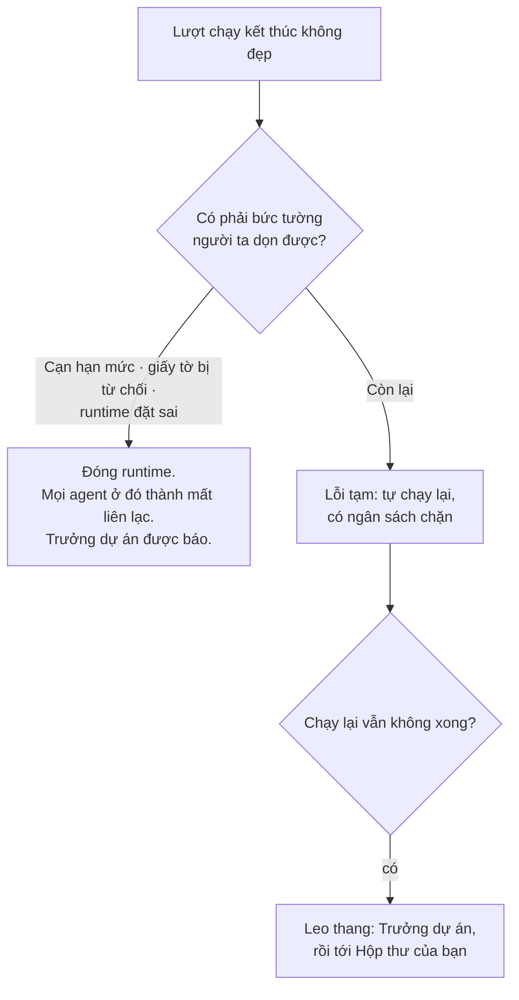

# A.R.MARIUS chạy như thế nào

Trang này mô tả đường đi thật của một đầu việc. Đọc nó khi bạn muốn hiểu vì sao hệ thống cư xử
như nó đang cư xử — nhất là lúc có gì đó không chạy.

## Hai chặng, không phải một

**Chặng 1** — giữa máy chủ và daemon. Daemon **luôn** là bên khởi xướng. Máy chủ có một đường
để nói *"có việc, đến hỏi đi"*, nhưng tin ấy không mang việc theo và không phải một lệnh chạy.
Nếu tin ấy rơi mất, daemon vẫn tự hỏi theo nhịp đều của nó. Đường phụ đó là lý do hệ thống
không hỏng khi mạng chập chờn.

**Chặng 2** — giữa daemon và agent CLI. Mỗi họ CLI nói một kiểu khác nhau, và daemon che hết
sự khác nhau đó:

| Họ | CLI | Cách nói |
| --- | --- | --- |
| **one-shot** | `claude` | Bật một lần cho mỗi lượt, in ra từng dòng JSON, rồi thoát |
| **ACP** | `gemini` | Giữ một cuộc hội thoại JSON-RPC qua luồng chuẩn |
| **app-server** | `codex` | Cũng JSON-RPC, nhưng bằng từ vựng riêng của Codex |

Bạn không cần biết CLI của mình thuộc họ nào. Đây là chỗ để bạn hiểu vì sao thêm một loại CLI
mới không phải là sửa lại hệ thống.

## Một đầu việc đi từ đâu tới đâu

Bốn điều đáng nhớ trong sơ đồ trên:

**Việc được *xin*, không được *đẩy*.** Máy chủ không bao giờ ra lệnh cho một máy cụ thể phải
chạy. Nó công bố việc; máy nào rảnh thì xin. Nên một cái laptop đang gập không làm việc bị kẹt
— việc nằm chờ tới khi máy bật lại.

**Đúng một máy cầm được một đầu việc.** Việc trao tay bằng một câu lệnh duy nhất vừa kiểm điều
kiện vừa đổi trạng thái, nên hai máy cùng xin thì đúng một máy được. Không có ca hai agent cùng
làm một việc.

**Mỗi lượt chạy có giấy tờ riêng của nó.** Token của máy nằm trong máy và không bao giờ đi
đâu. Thứ agent cầm là token đúc cho **một lượt chạy**, hết lượt là hết giá trị. Một agent bị
lộ token cũng không mở được lượt chạy nào khác.

**Thư mục làm việc bắt đầu trắng.** Không có mã nguồn, không có gì. Nó thuộc **đầu việc** nên
lần gọi dậy sau vẫn thấy thứ lần trước để lại — nhưng nó là chỗ nháp có hạn giữ, và thứ không
được công bố thì mất.

## Khi có gì đó hỏng

Hệ thống phân biệt **lỗi tạm** với **lỗi cần người xử**, và hai loại đi hai đường khác nhau.

Nguyên tắc đứng sau: **mã lỗi lạ được đọc thành *lỗi tạm***. Đoán nhầm chiều ấy thì đã có ngân
sách chặn thiệt hại; đoán nhầm chiều kia thì mọi trục trặc nhỏ đều thành một lần làm phiền bạn.

Và một nguyên tắc nữa, chặt hơn: hệ thống **chỉ khai một loại hỏng khi nó đo được**. Chưa từng
thấy tận mắt một lần cạn hạn mức của một CLI nào thì không có bộ dò cho CLI ấy — nó đi đường
*lỗi tạm*. Đoán một hình dạng chưa đo được là nhét sự thật bịa vào một bản ghi vốn để làm bằng
chứng.

## Máy tắt thì sao

Không có đường xử lý riêng, và đó là chủ ý. Máy tắt thì hết nhịp; hết nhịp thì mọi runtime
trên đó không sẵn sàng; agent ở đó thành *mất liên lạc*; và **luồng ngoại tuyến đang có** tiếp
quản — đúng cái luồng vẫn chạy khi một agent offline vì lý do khác. Một tình huống mới đi lại
con đường cũ thì không phải viết thêm gì, và cái không viết thì không hỏng.

Máy tắt cũng **không** bị tuyên mất liên lạc ngay. Có một khoảng ân hạn tính bằng giây, đủ cho
một lần mạng chập hoặc một lần khởi động lại.

---

## Đọc thêm

- [Khái niệm cốt lõi](concepts.md) — từ vựng
- [Máy và daemon](machines-and-daemon.md) — runtime không sẵn sàng thì làm gì
- [`specs/002-daemon-acp-runtime/spec.md`](../specs/002-daemon-acp-runtime/spec.md) — đặc tả
  đầy đủ của tầng này, nếu bạn muốn đọc luật thay vì đọc mô tả
