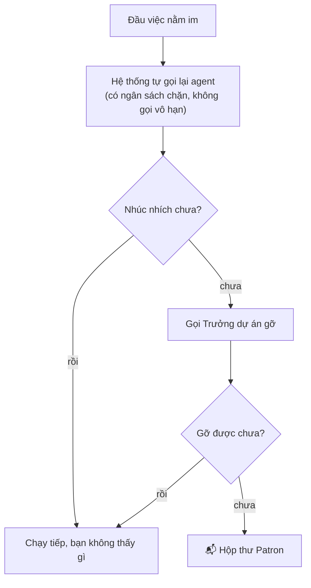

# Hộp thư Patron

**Những quyết định đang chờ chính bạn — không phải danh sách việc của cả đội.**

Đó là toàn bộ luật của trang này. Thứ gì hệ thống hoặc Trưởng dự án gỡ được thì không xuất hiện
ở đây. Thứ đã tới đây là thứ **chỉ bạn quyết được**.

---

## Sáu loại thư

| Loại | Đến khi |
| --- | --- |
| **Công nhận đầu ra** | Một đầu việc đã có chữ ký của Trưởng dự án và đang chờ chữ ký của bạn |
| **Duyệt kế hoạch** | Trưởng dự án trình Bối cảnh dự án hoặc kế hoạch |
| **Duyệt thay đổi lớn** | Có đề nghị đổi phạm vi hoặc đổi hướng |
| **Quyết chuyển giai đoạn** | Dự án xin sang chặng khác |
| **Việc cần bạn gỡ** | Hệ thống đã thử, Trưởng dự án đã được hỏi, và vẫn kẹt |
| **Câu hỏi** | Một agent hỏi thẳng bạn một câu nó không tự trả lời được |

---

## Việc leo tới bạn bằng đường nào

Nên một lá thư ở đây **đã đi qua hai nấc**. Nó không phải một lần làm phiền sớm — nó là chỗ hệ
thống hết cách.

Vì thế mỗi lá thư *cần bạn gỡ* đều mang theo **hồ sơ hệ thống đã thử những gì**: kẹt vì cái gì,
tự gọi lại bao nhiêu lần mà không nhúc nhích, Trưởng dự án đã được hỏi chưa, lần thử gần nhất
lúc nào, và **điều cần bạn quyết**. Không có hồ sơ ấy thì bạn phải tự đi dựng lại xem hệ thống
đã làm gì rồi mới trả lời được.

---

## Trả lời ngay tại chỗ

Với một lá thư *cần bạn gỡ*, bốn cách trả lời. Ba cách đầu là *hệ thống làm hộ tôi việc này*;
cách thứ tư là *tôi đã xử lý bên ngoài rồi, chạy tiếp đi*.

| Cách | Nghĩa |
| --- | --- |
| **Giao lại cho…** | Chuyển đầu việc sang một agent khác, kèm lý do — người mới đọc đúng câu đó |
| **Đổi việc kế tiếp** | Giữ nguyên người, nhưng nói rõ việc phải bắt tay làm ngay |
| **Huỷ đầu việc** | Bỏ, kèm lý do |
| **Tôi đã xử lý xong** | Bạn tự gỡ ngoài hệ. Nấc thang bị xoá, hệ chạy tiếp bình thường |

Với thư **Công nhận đầu ra**, hai lựa chọn: **Công nhận**, hoặc **Trả lại sửa** — và trả lại
thì phải nói rõ cần sửa gì, vì thợ nhận đúng câu đó làm việc kế tiếp.

---

## Chỗ hay thắc mắc

**Không còn gì chờ bạn** là trạng thái bình thường và tốt. Hộp thư rỗng nghĩa là mọi thứ đang
chạy mà không cần bạn.

**Dự án đã đóng** thì lá thư còn nằm đó nhưng không đổi được gì trên đầu việc nữa — chỉ còn dọn
nó đi.

**Đã nhắc lần 2, lần 3** trên một lá thư nghĩa là nó chờ lâu rồi. Hệ thống nhắc, chứ không tự
quyết thay bạn.

---

## Đọc thêm

- [Dự án và đầu việc](projects-and-tasks.md) — hai chữ ký, và cửa đòi hiện vật
- [A.R.MARIUS chạy như thế nào](how-armarius-works.md) — vì sao có thứ tự tạm và có thứ cần người
