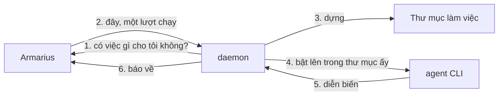

# Máy và daemon

Trang này trả lời đúng ba câu: **daemon là gì**, **cài nó thế nào**, và **runtime báo không
nhận việc được thì làm gì**.

---

## daemon là gì

Armarius không nuôi agent. Agent của bạn là những **agent CLI** bạn đã cài trên máy mình —
`claude`, `codex`, `gemini` — đang đăng nhập bằng tài khoản của bạn. Nhưng Armarius chạy ở
một nơi khác và không thể với tay vào máy bạn được.

**daemon là cái bắc cầu.** Một chương trình nhỏ chạy nền trên máy bạn, tự đi hỏi Armarius có
việc gì, rồi bật agent CLI lên ngay tại chỗ.



Chiều của mũi tên số 1 là cả thiết kế: **daemon là bên gọi đi**, nên máy bạn không cần mở
cổng nào, không cần IP tĩnh, không cần chọc lỗ firewall. Laptop gập lại thì việc nằm chờ, mở
ra thì nó tự đi lấy.

Một máy chạy daemon **không** cần chạy suốt. Việc giao lúc máy tắt sẽ nằm chờ.

---

## Cài daemon

**Linux / macOS** — một dòng:

```sh
curl -fsSL https://raw.githubusercontent.com/gnust-company/A.R.MARIUS/main/scripts/install.sh | bash
```

Nó dò hệ điều hành và kiến trúc, tải đúng archive, **kiểm chữ ký** trước khi cài, đặt cả hai
chương trình vào `/usr/local/bin` (không ghi được thì `$HOME/.local/bin`, kèm dòng `PATH` viết hộ),
rồi in ra việc kế tiếp. Chạy lại là nâng cấp; đang mới nhất thì nó nói vậy rồi dừng.

Ba biến môi trường nếu bạn cần: `ARMARIUS_BIN_DIR` (cài vào đâu), `ARMARIUS_VERSION` (một bản cụ
thể thay vì bản mới nhất), `ARMARIUS_NO_PATH_EDIT` (in dòng `PATH` ra thay vì tự ghi vào cấu hình
shell). Xem hết bằng `--help`.

**Windows** — chưa có installer. Tải `.zip` ở
[trang phát hành](https://github.com/gnust-company/A.R.MARIUS/releases/latest), đặt cả hai file
`.exe` vào một thư mục có trong `PATH`, ví dụ `%LOCALAPPDATA%\Programs\Armarius`. Rồi đọc mục
Developer Mode bên dưới — **bắt buộc**.

### Hai file, và vì sao chúng phải đi cùng nhau

| File | Là gì |
| --- | --- |
| `armarius-daemon` | chương trình bạn chạy |
| `armarius` | lệnh nhỏ agent dùng để gọi ngược về Armarius trong lúc làm việc |

daemon tìm `armarius` **ở ngay cạnh chính nó** và **từ chối khởi động** nếu không thấy. Một agent
được đưa đề bài có nhắc tới một lệnh không tồn tại sẽ trượt ở mọi lần gọi, và không bên nào báo
được vì sao — nên thà không chạy.

Vì thế installer coi hai cái là **một khối**: đặt được cái đầu mà không đặt được cái sau thì nó gỡ
cái đầu ra, để bạn không còn lại một daemon chỉ chịu nói ra là nó vô dụng vào lúc bạn cần nó nhất.

### Cài bằng tay

Installer là tiện lợi, không phải điều kiện. Tải archive rồi:

```sh
tar -xzf armarius-daemon_<phiên-bản>_<os>_<arch>.tar.gz
sudo install -m 0755 armarius-daemon armarius /usr/local/bin/
armarius-daemon version
```

### macOS: lần đầu chạy một file tải về chưa ký

Gatekeeper chặn. Vào **System Settings → Privacy & Security** cho phép, hoặc tự xoá cờ cách ly:

```sh
xattr -d com.apple.quarantine /usr/local/bin/armarius-daemon /usr/local/bin/armarius
```

### Windows: phải bật Developer Mode

**Settings → System → For developers → Developer Mode.**

Đây không phải tuỳ chọn. Mỗi lượt chạy được dựng một thư mục home riêng, và những phần phải sống
lâu hơn lượt chạy — nhất là trạng thái phiên của agent — được **nối** ra ngoài chứ không **copy**.
Copy thì mọi thứ lượt chạy ghi ra sẽ bị bỏ đi cùng cái home, agent mất sạch ký ức về đầu việc mà
không ai báo. Không bật thì mọi runtime trên máy báo *không tạo được liên kết tượng trưng*.

## Nối máy vào không gian làm việc

```sh
armarius-daemon login -server <địa-chỉ-API-của-Armarius>
```

> **`-server` là địa chỉ API, không phải địa chỉ trang web.** Chạy Armarius trên máy mình thì đó là
> `http://localhost:8080`, còn `:3000` là trang web. Đây là địa chỉ daemon **gọi vào**; trang nó
> **mở ra** cho bạn thì nó lấy từ câu trả lời của API, không tự đoán. Nhập địa chỉ trang web vào
> đây thì mọi lệnh của nó đều trượt.

Nó **tự mở trang phê duyệt** ra, với mã đã nằm sẵn trên địa chỉ. Trên trang ấy bạn thấy máy nào
đang hỏi, chọn không gian làm việc, rồi bấm **Đồng ý**. Không phải chép mã sang đâu cả.

Mã sống **10 phút** và dùng được **một lần**. Hết hạn hoặc đã dùng thì chạy lại `login` để lấy
mã mới.

### Vì sao vẫn phải bấm đồng ý

Vì cái mở ra là một *đường liên kết*, và đường liên kết là thứ người khác gửi cho bạn được. Mã đi
trong địa chỉ chỉ tiết kiệm cho bạn việc gõ; thứ chặn một daemon lạ vào không gian làm việc của
bạn là **một người nhìn tên máy và không nhận ra nó**. Nên trang ấy hiện hostname, hệ điều hành và
phiên bản daemon — máy tự khai, không phải giấy tờ đã kiểm — và nói thẳng ra là mã này đến từ
đường liên kết chứ không phải bạn tự gõ.

### Địa chỉ ấy được kiểm trước khi mở

Địa chỉ phê duyệt là **câu trả lời của server**, tức là dữ liệu vào, không phải hằng số. Và thứ
mở trang trên một desktop làm được nhiều hơn là hiện một trang web: một địa chỉ `file:` đọc đĩa
của bạn, còn trên Windows thì thứ mở trang được đưa đường dẫn tới một chương trình sẽ **chạy**
chương trình ấy. Nên daemon từ chối mở, và từ chối luôn cả việc *in ra*, bất cứ địa chỉ nào
không phải một trang `http`/`https` có tên máy chủ hẳn hoi.

Nó **không** đòi địa chỉ ấy cùng máy chủ với `-server`: `-server` là API còn đây là trang web,
hai cổng khác nhau và thường là hai tên máy chủ khác nhau.

### Máy không mở được trang nào

Server nối qua SSH, container, máy không màn hình: daemon không thử mở gì cả (trên Linux nó xem
`DISPLAY`/`WAYLAND_DISPLAY`, rỗng cả hai thì thôi). Nó in địa chỉ **kèm mã** ra, bạn mở ở máy nào
cũng được — kể cả điện thoại.

Muốn thế kể cả khi máy có desktop:

```sh
armarius-daemon login -no-browser -server <địa-chỉ-API-của-Armarius>
```

Hoặc đặt `ARMARIUS_NO_BROWSER=1` — dùng cho script, cho CI, cho ảnh máy dựng sẵn.

Token của máy được ghi vào `~/.armarius/daemon.json` (`%USERPROFILE%\.armarius\daemon.json`
trên Windows) và **không bao giờ ra khỏi đó**. Agent không bao giờ cầm token này — thứ chúng
cầm là token đúc cho một lượt chạy.

Rồi bật daemon:

```sh
armarius-daemon start
```

**Đây là bước khai runtime, và nó không nằm trong `login`.** `login` chỉ nối máy; `start` mới dò
agent CLI trên máy và khai chúng lên. Nối mà chưa chạy `start` thì màn Máy hiện máy của bạn kèm
câu *daemon chưa chạy lần nào* và không có runtime nào — đúng sự thật, và không tạo được agent nào.

Nó đọc lên những agent CLI nó tìm thấy, rồi đứng đó. Ctrl-C để dừng. Muốn nó tự bật khi mở
máy thì xem mục *Running it as a service* trong [`daemon/README.md`](../daemon/README.md).

Hỏi nó đang làm gì:

```sh
armarius-daemon status
armarius-daemon status -json   # cho script
```

---

## Runtime là gì, và vì sao nó chứ không phải cái máy

Một **runtime** là một cặp (agent CLI có trên máy đó × không gian làm việc). Máy bạn có cả
`claude`, `codex` và `gemini` thì màn hình **Máy** sẽ hiện một cái máy với **ba** runtime.

Nhận việc là **runtime**, không phải cái máy. Nên `claude` cạn hạn mức không kéo theo `codex`
trên cùng máy ấy — hai runtime khác nhau, hai tài khoản khác nhau.

Mỗi runtime có một **trần số lượt chạy đồng thời**, đổi được ngay trên màn hình Máy. Trần mới
có hiệu lực **từ lần máy xin việc kế tiếp**: hạ trần là ngừng đưa thêm, không phải thu về thứ
đã ra khỏi tay.

---

## Runtime báo *Không nhận việc được*

Trên màn hình luôn có câu nói vì sao. Bảng đầy đủ:

| Lý do | Nghĩa là | Làm gì |
| --- | --- | --- |
| **Agent CLI này đã bị gỡ khỏi máy** | daemon không còn tìm thấy binary ấy | Cài lại CLI. Runtime sống lại, agent vẫn nguyên chỗ cũ |
| **Daemon trên máy này đã tắt** | daemon chào tạm biệt rồi thoát | `armarius-daemon start`. Không có gì bị gỡ |
| **Máy đã ngừng báo nhịp** | máy tắt, ngủ, hoặc mất mạng | Bật máy lên và chạy lại daemon |
| **Đã cạn hạn mức của nhà cung cấp** | tài khoản của CLI ấy hết lượt | Nạp thêm hoặc đăng nhập tài khoản khác. Mọi agent ở runtime này sống lại cùng lúc |
| **Không tạo được liên kết tượng trưng** | thường là Windows chưa bật Developer Mode | Bật Developer Mode rồi chạy lại daemon |
| **Chưa nhận việc được** (không rõ lý do) | daemon báo về một tình trạng chưa có tên | Xem `armarius-daemon status` trên máy ấy |

Một runtime đóng thì **mọi agent ngồi ở đó** chuyển sang *mất liên lạc* cùng lúc, và Trưởng dự
án của chúng được báo. Không có đầu việc nào biến mất — chúng nằm chờ.

---

## Đọc thêm

- [`daemon/README.md`](../daemon/README.md) — bảng đầy đủ mọi thiết lập, chạy như dịch vụ hệ
  thống, nâng cấp không cắt ngang lượt chạy đang chạy
- [Agent](agents.md) — vì sao một agent *đang nối* hay *mất liên lạc*
- [A.R.MARIUS chạy như thế nào](how-armarius-works.md) — đường đi của một lượt chạy
