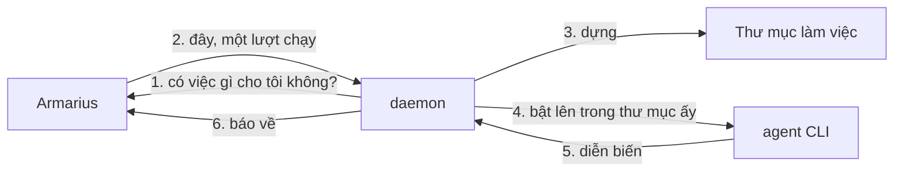

# Máy và daemon

Trang này trả lời đúng ba câu: **daemon là gì**, **cài nó thế nào**, và **chỗ làm báo không
nhận việc được thì làm gì**.

---

## daemon là gì

Armarius không nuôi agent. Agent của bạn là những **agent CLI** bạn đã cài trên máy mình —
`claude`, `codex`, `gemini` — đang đăng nhập bằng tài khoản của bạn. Nhưng Armarius chạy ở
một nơi khác và không thể với tay vào máy bạn được.

**daemon là cái bắc cầu.** Một chương trình nhỏ chạy nền trên máy bạn, tự đi hỏi Armarius có
việc gì, rồi bật agent CLI lên ngay tại chỗ.



Chiều của mũi tên số 1 là cả thiết kế: **daemon là bên gọi đi**, nên máy bạn không cần mở
cổng nào, không cần IP tĩnh, không cần chọc lỗ firewall. Laptop gập lại thì việc nằm chờ, mở
ra thì nó tự đi lấy.

Một máy chạy daemon **không** cần chạy suốt. Việc giao lúc máy tắt sẽ nằm chờ.

---

## Cài daemon

Tải archive cho hệ điều hành của bạn ở
**[trang phát hành](https://github.com/gnust-company/A.R.MARIUS/releases/latest)**.

Trong mỗi archive có **hai** file, và chúng phải nằm cạnh nhau:

| File | Là gì |
| --- | --- |
| `armarius-daemon` | chương trình bạn chạy |
| `armarius` | lệnh nhỏ agent dùng để gọi ngược về Armarius trong lúc làm việc |

Vì sao bắt buộc phải có cả hai: daemon tìm `armarius` **ở ngay cạnh chính nó** và **từ chối
khởi động** nếu không thấy. Một agent được đưa đề bài có nhắc tới một lệnh không tồn tại sẽ
trượt ở mọi lần gọi, và không bên nào báo được vì sao.

### Linux và macOS

```sh
tar -xzf armarius-daemon_<phiên-bản>_<os>_<arch>.tar.gz
sudo install -m 0755 armarius-daemon armarius /usr/local/bin/
armarius-daemon version
```

Trên macOS, lần đầu chạy một file tải về chưa ký sẽ bị Gatekeeper chặn. Vào **System Settings
→ Privacy & Security** cho phép, hoặc tự xoá cờ cách ly:

```sh
xattr -d com.apple.quarantine /usr/local/bin/armarius-daemon /usr/local/bin/armarius
```

### Windows

Giải nén rồi đặt cả hai file vào một thư mục có trong `PATH`.

Còn một việc nữa **bắt buộc**: **bật Developer Mode**. Mỗi lượt chạy đều cần tạo symbolic
link, và trên Windows quyền ấy không có sẵn. Không bật thì chỗ làm sẽ báo *không tạo được liên
kết tượng trưng*.

---

## Nối máy vào không gian làm việc

```sh
armarius-daemon login -server <địa-chỉ-Armarius-của-bạn>
```

Nó in ra một mã ngắn và đứng đợi. Mở trang nối máy trên giao diện — đường dẫn `/link`, ví dụ
`http://localhost:3000/link` nếu bạn đang chạy Armarius trên máy mình — nhập mã đó rồi chọn
không gian làm việc máy này tham gia.

Mã sống **10 phút** và dùng được **một lần**. Hết hạn hoặc đã dùng thì chạy lại `login` để lấy
mã mới.

Token của máy được ghi vào `~/.armarius/daemon.json` (`%USERPROFILE%\.armarius\daemon.json`
trên Windows) và **không bao giờ ra khỏi đó**. Agent không bao giờ cầm token này — thứ chúng
cầm là token đúc cho một lượt chạy.

Rồi bật daemon:

```sh
armarius-daemon start
```

Nó đọc lên những agent CLI nó tìm thấy, rồi đứng đó. Ctrl-C để dừng. Muốn nó tự bật khi mở
máy thì xem mục *Running it as a service* trong [`daemon/README.md`](../daemon/README.md).

Hỏi nó đang làm gì:

```sh
armarius-daemon status
armarius-daemon status -json   # cho script
```

---

## Chỗ làm là gì, và vì sao nó chứ không phải cái máy

Một **chỗ làm** là một cặp (agent CLI có trên máy đó × không gian làm việc). Máy bạn có cả
`claude`, `codex` và `gemini` thì màn hình **Máy** sẽ hiện một cái máy với **ba** chỗ làm.

Nhận việc là **chỗ làm**, không phải cái máy. Nên `claude` cạn hạn mức không kéo theo `codex`
trên cùng máy ấy — hai chỗ làm khác nhau, hai tài khoản khác nhau.

Mỗi chỗ làm có một **trần số lượt chạy đồng thời**, đổi được ngay trên màn hình Máy. Trần mới
có hiệu lực **từ lần máy xin việc kế tiếp**: hạ trần là ngừng đưa thêm, không phải thu về thứ
đã ra khỏi tay.

---

## Chỗ làm báo *Không nhận việc được*

Trên màn hình luôn có câu nói vì sao. Bảng đầy đủ:

| Lý do | Nghĩa là | Làm gì |
| --- | --- | --- |
| **Agent CLI này đã bị gỡ khỏi máy** | daemon không còn tìm thấy binary ấy | Cài lại CLI. Chỗ làm sống lại, agent vẫn nguyên chỗ cũ |
| **Daemon trên máy này đã tắt** | daemon chào tạm biệt rồi thoát | `armarius-daemon start`. Không có gì bị gỡ |
| **Máy đã ngừng báo nhịp** | máy tắt, ngủ, hoặc mất mạng | Bật máy lên và chạy lại daemon |
| **Đã cạn hạn mức của nhà cung cấp** | tài khoản của CLI ấy hết lượt | Nạp thêm hoặc đăng nhập tài khoản khác. Mọi agent ở chỗ làm này sống lại cùng lúc |
| **Không tạo được liên kết tượng trưng** | thường là Windows chưa bật Developer Mode | Bật Developer Mode rồi chạy lại daemon |
| **Chưa nhận việc được** (không rõ lý do) | daemon báo về một tình trạng chưa có tên | Xem `armarius-daemon status` trên máy ấy |

Một chỗ làm đóng thì **mọi agent ngồi ở đó** chuyển sang *mất liên lạc* cùng lúc, và Trưởng dự
án của chúng được báo. Không có đầu việc nào biến mất — chúng nằm chờ.

---

## Đọc thêm

- [`daemon/README.md`](../daemon/README.md) — bảng đầy đủ mọi thiết lập, chạy như dịch vụ hệ
  thống, nâng cấp không cắt ngang lượt chạy đang chạy
- [Agent](agents.md) — vì sao một agent *đang nối* hay *mất liên lạc*
- [A.R.MARIUS chạy như thế nào](how-armarius-works.md) — đường đi của một lượt chạy
