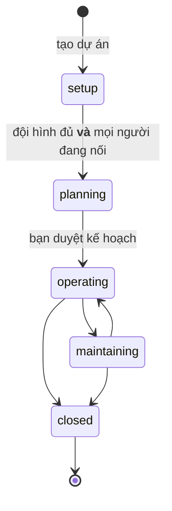
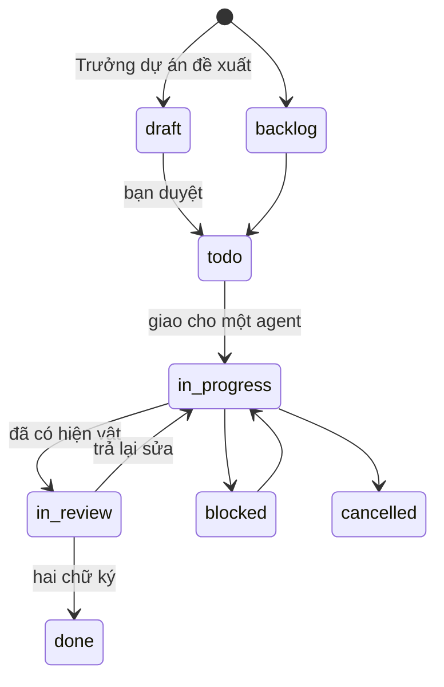
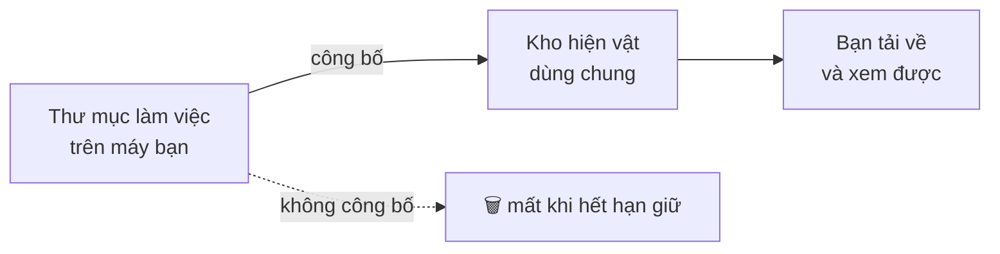

# Dự án và đầu việc

Dự án là nơi đầu việc sống. Trang này đi qua vòng đời của cả hai.

---

## Vòng đời một dự án

| Chặng | Nghĩa | Tạo được đầu việc thật? |
| --- | --- | --- |
| **setup** | Đang dựng đội hình | Không |
| **planning** | Đội hình đủ; Trưởng dự án đang lập kế hoạch | Không |
| **operating** | Đang chạy | **Có** |
| **maintaining** | Đã xong phần chính, còn bảo trì | **Có** |
| **closed** | Đóng. Đóng băng, không sửa được gì nữa | Không |

Hai chỗ đáng chú ý:

**Đội hình đủ mua được quyền *lập kế hoạch*, không phải quyền *bắt tay làm*.** `setup` chỉ
chuyển sang `planning` khi mọi suất trong đội hình đã có người **và** mọi người ấy đang nối.
Chuyển một lần, không lùi lại.

**`closed` là chặng cuối.** Mở lại là một dự án mới, không phải một lần hồi sinh.

---

## Đội hình

**Dự án → Tạo dự án**, ba bước: dự án → đội hình → xem lại.

Luật đội hình là luật cứng, và cửa sẽ từ chối nếu vi phạm:

- **Đúng một** vai Trưởng dự án, với **đúng một** suất.
- **Ít nhất một** vai không phải Trưởng dự án, mỗi vai ít nhất một suất.

Mỗi vai được cấp cho một agent. Chưa chọn được ai thì để *giao sau* — nhưng dự án đứng ở
`setup` tới khi đủ.

---

## Kế hoạch, và cửa duyệt của bạn

Trưởng dự án **trình**, bạn **quyết**. Nó nộp hai thứ, và cả hai chờ bạn:

**Bối cảnh dự án** — mục tiêu, phạm vi, ràng buộc. Chỉ bản **đã duyệt** được gửi cho agent
trong gói việc; một bản còn chờ duyệt là một đề xuất, và đem nó ra làm việc thì cửa duyệt chỉ
còn là hình thức.

**Kế hoạch** — các mốc, theo thứ tự.

Không có lệnh nào cho agent tự duyệt kế hoạch hay tự đổi chặng dự án. Đó là chủ ý: agent nộp và
đề xuất, bạn quyết.

---

## Vòng đời một đầu việc

**Một đầu việc không rời khỏi *đang làm* với cái kệ rỗng.** Không sang *chờ duyệt*, mà cũng
không sang *xong* — cả hai đều đòi phải có thứ đã công bố. Đây là cửa của hệ thống, không phải
một lời khuyên: agent có đọc hướng dẫn hay không thì cửa vẫn chặn.

**Đóng một đầu việc cần hai chữ ký**: Trưởng dự án, rồi bạn.

---

## Hiện vật — chỗ hay bị hiểu sai nhất

Agent làm việc trong một **thư mục làm việc** trắng trên máy bạn. Thư mục ấy là chỗ nháp, có
hạn giữ, và **không ai ngoài agent đó thấy được**.

> Một file nằm trong thư mục làm việc thì **chưa nộp gì cả**. Công bố là cách thành phẩm rời
> khỏi máy bạn.

Công bố **lặp lại được an toàn**: cùng một tên với cùng nội dung thì chỉ ghi một lần, gửi bao
nhiêu lần cũng vậy. Nên một lần công bố bị đứt giữa đường thì cứ gửi lại.

Hiện vật tải về được ngay trên màn hình đầu việc, và tên file đúng cái tên agent đặt.

---

## Agent gặp bế tắc thì sao

Nó **trả việc lại** hoặc **hỏi một câu**, và cả hai đều là hành vi lành mạnh, không phải thất
bại: đầu việc vẫn sống, Trưởng dự án được gọi dậy để trả lời. Thứ thất bại là ngồi im trên một
việc mình không làm nổi.

Gỡ không được ở tầng Trưởng dự án thì việc leo lên [Hộp thư Patron](inbox.md) của bạn — kèm hồ
sơ hệ thống đã thử những gì.

---

## Đọc thêm

- [Hộp thư Patron](inbox.md) — những gì chờ bạn quyết
- [Agent](agents.md) — ghế Trưởng dự án
- [A.R.MARIUS chạy như thế nào](how-armarius-works.md) — một lượt chạy đi đường nào
