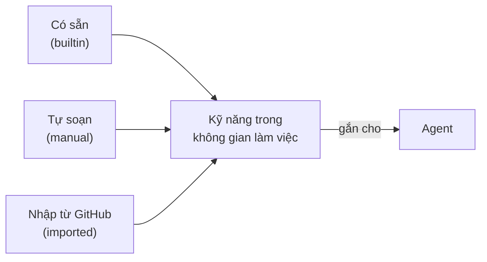
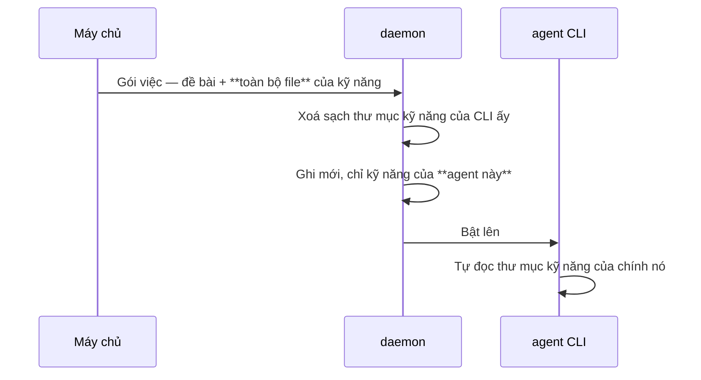

# Kỹ năng

Một **kỹ năng** là một cách làm việc, viết ra thành file. Gắn cho agent nào thì agent ấy nhận
được nguyên bộ file mỗi lần nó chạy.

---

## Kỹ năng trông như thế nào

Một thư mục, gốc là `SKILL.md`, kèm file phụ nếu cần:

```
kiem-tra-truoc-khi-nop/
├── SKILL.md          ← bắt buộc
├── scripts/
│   └── smoke.sh
└── references/
    └── checklist.md
```

`SKILL.md` mở đầu bằng một khối YAML, và **tên với mô tả lấy từ chính khối ấy** — không phải từ
form trên giao diện:

```markdown
---
name: kiem-tra-truoc-khi-nop
description: Chạy bộ kiểm trước khi công bố hiện vật. Dùng trước mỗi lần chuyển đầu việc sang chờ duyệt.
---

# Kiểm tra trước khi nộp

...
```

`description` là thứ agent đọc để **quyết có dùng kỹ năng này hay không**. Viết nó như một câu
nói *khi nào thì mở ra*, đừng viết như một cái tên.

---

## Ba đường tạo kỹ năng



**Có sẵn** — gieo vào mọi không gian làm việc lúc nó được tạo, và **không xoá được**. Hiện có
đúng một cái, nói ở mục dưới.

**Tự soạn** — **Kỹ năng → Kỹ năng mới**. Bạn được một `SKILL.md` mẫu, sửa ngay trên giao diện,
và thêm được file phụ.

**Nhập từ GitHub** — dán đường dẫn tới **một thư mục** trong repo. Armarius tìm `SKILL.md`
trong đó, lấy **đúng thư mục ấy** (không lấy cả repo), rồi cho bạn xem và sửa trước khi lưu.

Kỹ năng thuộc **một không gian làm việc**, không dùng chung qua ranh giới.

---

## "Talking to Armarius" — kỹ năng có sẵn duy nhất

Đây không phải một kỹ năng *cách làm việc*. Đây là **tờ hướng dẫn giao thức**: nó dạy agent
cách nói lại với Armarius — đọc đề bài, báo trạng thái, công bố hiện vật, trả việc lại, hỏi
một câu rồi đợi.

Cần phân biệt hai thứ hay bị lẫn:

| | Đến từ đâu | Có phải chọn không |
| --- | --- | --- |
| **Bộ công cụ gọi ngược** (lệnh `armarius`) | daemon bơm vào **mỗi lượt chạy**, mang giấy tờ riêng của lượt ấy | Không. Luôn có, không tắt được, không cài gì |
| **Tờ hướng dẫn** dùng bộ công cụ ấy | là một kỹ năng, gắn cho agent | Có — và **hãy gắn nó cho mọi agent** |

Nói cách khác: agent nào cũng **có** mấy cái công cụ đó, nhưng agent không được gắn tờ hướng
dẫn thì phải tự mò ra cách dùng. Gắn nó vào.

---

## Kỹ năng tới tay agent bằng cách nào



Ba điều đứng sau sơ đồ ấy:

**Kỹ năng đi theo gói việc, nguyên vẹn.** Không phải một danh sách để agent tự đi lấy. Một
agent phải đi lấy thì nó bắt đầu đọc trước khi file tới, và việc đầu tiên nó làm là đúng việc
nó chưa được trang bị.

**Ghi mới mỗi lượt, và xoá sạch trước khi ghi.** Nhiều agent dùng chung một chỗ làm, nên nếu
không xoá thì kỹ năng của agent A còn nằm đó lúc agent B chạy.

**Chỉ kỹ năng của đúng agent ấy.** Danh sách đọc từ **agent**, không đọc từ chỗ làm — đọc từ
chỗ làm là gom kỹ năng của mọi agent trên máy ấy lại một lượt.

---

## Vì sao hiện chỉ có một kỹ năng sẵn

Vì kỹ năng *cách làm việc* thì phụ thuộc vào việc bạn làm, và Armarius không biết bạn làm gì.
Tờ hướng dẫn giao thức thì khác: **mọi** agent đều cần, bất kể nó làm việc gì. Đó là lý do đúng
một cái được gieo sẵn.

Phần còn lại là của bạn — soạn, hoặc nhập từ GitHub. Cả hai đường đều đã chạy được.

---

## Đọc thêm

- [Agent](agents.md) — gắn kỹ năng cho agent
- [A.R.MARIUS chạy như thế nào](how-armarius-works.md) — gói việc gồm những gì
