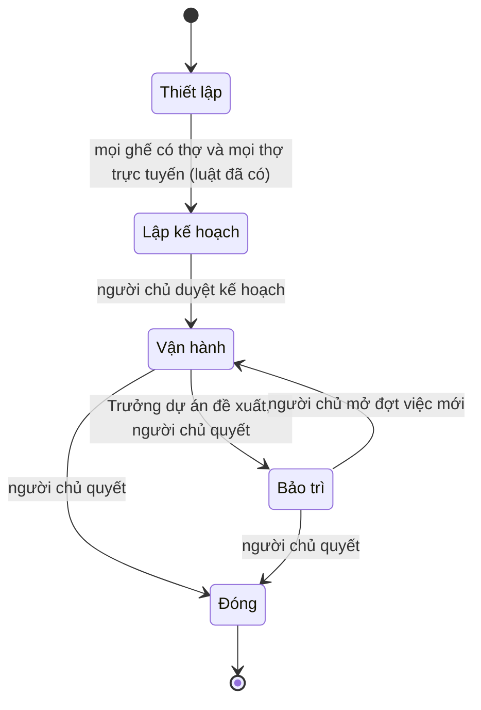
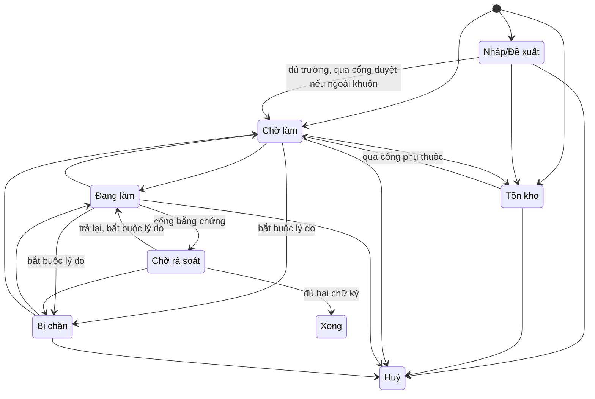
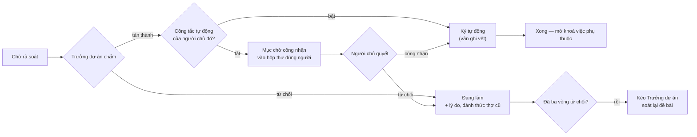

# Mô hình dữ liệu: Vận hành dự án tự chủ

**Giai đoạn 1** của [plan.md](./plan.md) · Đặc tả: [spec.md](./spec.md) · Khảo sát: [research.md](./research.md)

Ký hiệu: **[có]** thực thể/trường đã tồn tại, giữ nguyên · **[sửa]** đã tồn tại, phải đổi · **[mới]** chưa có.

---

## 1. Dự án

| Trường | Trạng thái | Ghi chú |
|---|---|---|
| Định danh, workspace, tên, slug, khoá, mô tả | **[có]** | |
| Giai đoạn | **[sửa]** | Từ ba giá trị lên năm: *thiết lập*, *lập kế hoạch*, *vận hành*, *bảo trì*, *đóng* |
| Bối cảnh | **[sửa]** | Hiện là một chuỗi rời rạc bên cạnh mục tiêu, thước đo, ngày đích. Gom thành một khối có phiên bản và trạng thái duyệt |
| Thiết lập | **[sửa]** | Bỏ cờ chết `require_approval_for_done`; giữ hoặc gỡ `yolo_mode` tuỳ QĐ dưới |
| Bộ đếm số thứ tự đầu việc | **[có]** | Cấp nguyên tử, không tái dùng |
| Ngưỡng thời gian | **[mới]** | Bộ ngưỡng chỉnh được theo dự án; thiếu thì lấy mặc định hệ thống |

**Vòng đời giai đoạn** (FR-001 → FR-006):

**Luật**:
- Chuyển *thiết lập → lập kế hoạch* là **một chiều, một lần**; một thợ rớt mạng sau đó không kéo ngược. Luật
  này đã chạy đúng, chỉ đổi đích đến.
- Chỉ người chủ được đưa dự án sang *đóng*. Công tắc tự động công nhận **không** thay người chủ ở đây.
- Vào *đóng* thì mọi nhịp đánh thức của dự án dừng, lịch sử thành chỉ đọc.

## 2. Bối cảnh dự án **[mới]**

| Trường | Ghi chú |
|---|---|
| Dự án | Một khối cho một dự án |
| Mục tiêu tối hậu, bối cảnh/lý do, ràng buộc cứng, phạm vi, nguyên tắc chung | Năm phần nội dung |
| Phiên bản | Tăng mỗi lần sửa được duyệt |
| Trạng thái duyệt | *đang soạn* · *chờ duyệt* · *đã duyệt* |
| Mốc duyệt, người duyệt | Ghi vết |

Bối cảnh **đã duyệt** là bản được đính vào mọi gói tin đánh thức (FR-009). Bản *chờ duyệt* không có hiệu lực.

## 3. Bản kế hoạch **[mới]**

| Trường | Ghi chú |
|---|---|
| Dự án, phiên bản | |
| Danh sách hạng mục | Mỗi hạng mục: tiêu đề, mô tả, thứ tự, phụ thuộc vào hạng mục nào, định nghĩa hoàn thành mức hạng mục |
| Rủi ro thấy trước, mốc dự kiến | Nội dung tự do |
| Trạng thái | *đang trình* · *được duyệt* · *bị yêu cầu chỉnh* |
| Góp ý của người chủ | Khi bị yêu cầu chỉnh |
| Mốc trình, mốc quyết, người quyết | Ghi vết |

**Hạng mục là cái định nghĩa "trong khuôn"** (FR-027): một đầu việc gắn với một hạng mục đã duyệt thì Trưởng
dự án tạo và giao ngay; đầu việc không gắn hạng mục nào thì phải ở lại *nháp/đề xuất*.

## 4. Ghế

| Trường | Trạng thái | Ghi chú |
|---|---|---|
| Dự án, khoá vai, agent, trạng thái, mốc cấp | **[có]** | |
| **Người chủ đã cấp** | **[mới]** | Người này chịu trách nhiệm công nhận đầu ra của agent ngồi ghế (FR-034). **Không** sao chép sang từng đầu việc |

## 5. Thiết lập tự động công nhận **[mới]**

Một công tắc theo cặp *(dự án, người chủ)*.

| Trường | Ghi chú |
|---|---|
| Dự án, người chủ | Khoá đôi |
| Bật/tắt | Mặc định **tắt** |
| Mốc đổi gần nhất, người đổi | Chỉ chính người chủ đó đổi được (FR-038) |

Khi bật: mọi việc cần chữ ký của người đó **cho công việc của agent do họ cấp** coi như đã ký sẵn. **Không**
áp cho ba quyết định cấp dự án — duyệt kế hoạch, duyệt thay đổi lớn, chuyển giai đoạn (FR-037).

## 6. Đầu việc

| Trường | Trạng thái | Ghi chú |
|---|---|---|
| Mã định danh `{KHOÁ}-{số}` | **[có]** | Bất biến, cấp nguyên tử |
| Tiêu đề | **[có]** | |
| Mô tả chi tiết | **[sửa]** | Thành **bắt buộc** trước khi giao (FR-029) |
| Trạng thái, lý do trạng thái | **[có]** | Lý do thành bắt buộc ở một số chuyển (FR-030) |
| Độ ưu tiên | **[có]** | |
| Người phụ trách | **[có]** | Đúng một |
| Việc phụ thuộc | **[có]** | Cạnh riêng, đã chống vòng |
| Đầu việc cha | **[có]** | |
| Định nghĩa hoàn thành | **[sửa]** | Từ chuỗi tự do lên **danh sách tiêu chí** (mục 7) |
| Thành phẩm | **[có]** | Bắt buộc trước khi rời *đang làm* |
| Việc kế tiếp | **[có]** | Bền, trả lại kèm khi đánh thức |
| Hạn chót, người tạo, ba mốc thời gian, dự án chứa | **[có]** | |
| **Hạng mục kế hoạch** | **[mới]** | Trỏ tới hạng mục trong bản kế hoạch đã duyệt; rỗng nghĩa là ngoài khuôn |
| **Động cơ đẩy** | **[mới]** | Mục 9 |
| **Cờ đình trệ + lý do** | **[mới]** | |
| **Chữ ký công nhận** | **[mới]** | Mục 8 |
| Nhật ký thay đổi | **[mới]** | Mục 10 |

Bỏ hẳn: cờ *cần Chủ đồng-approve* theo từng việc (thay bằng quy tắc hai chữ ký mặc định).

### Vòng đời đầu việc — đường được phép sau khi siết

**Ba thay đổi so với bảng đang chạy** (đều là siết, không nới):

| Đường | Hiện tại | Sau khi sửa | Vì sao |
|---|---|---|---|
| *đang làm → xong* | cho phép | **cấm** | Thợ không được tự tuyên xong, phải qua rà soát (FR-024) |
| *xong → đang làm* | cho phép thường ngày | chỉ qua thao tác **mở lại** có ghi vết | *Xong* là trạng thái đóng (FR-022) |
| *huỷ → tồn kho* | cho phép thường ngày | chỉ qua thao tác **mở lại** có ghi vết | Như trên |
| *nháp → tồn kho* | thiếu | **thêm** | Cất để dành một đề xuất |

### Năm cổng

| Cổng | Trạng thái | Chặn gì |
|---|---|---|
| Phụ thuộc | **[có]** | Vào *chờ làm*/*đang làm* khi còn việc phụ thuộc chưa xong |
| Bằng chứng | **[có]** | Vào *chờ rà soát* khi chưa nộp thành phẩm |
| Một-người | **[có]** | Gán người thứ hai |
| Mô tả | **[mới]** | Giao khi mô tả chi tiết còn trống |
| Duyệt | **[sửa]** | Rời *nháp* khi đầu việc nằm ngoài khuôn kế hoạch đã duyệt |

## 7. Tiêu chí công nhận **[sửa]**

Nối thực thể mục danh mục đang có vào vai trò "cái thước".

| Trường | Ghi chú |
|---|---|
| Đầu việc | |
| Nội dung tiêu chí | Một khẳng định đúng/sai kiểm được |
| Thứ tự | |
| Kết quả chấm | *chưa chấm* · *đạt* · *chưa đạt* |
| Bằng chứng đối chiếu | Trỏ tới thành phẩm nào chứng minh |

Đặt **trước khi** thợ bắt tay; bất biến trong lúc làm (sửa là một thay đổi lớn — FR-075).

## 8. Chữ ký công nhận **[mới]**

Một dòng cho mỗi chữ ký trên mỗi đầu việc.

| Trường | Ghi chú |
|---|---|
| Đầu việc | |
| Loại người ký | *Trưởng dự án* · *người chủ chịu trách nhiệm* |
| Người ký | Agent hoặc người dùng |
| Kết quả | *tán thành* · *từ chối* |
| Lý do | Bắt buộc khi từ chối |
| Có phải ký tự động không | Đúng khi công tắc tự động công nhận đang bật (FR-039 vẫn đòi ghi vết) |
| Mốc ký | |

**Luật đóng đầu việc**: chỉ vào *xong* khi có đủ **hai** chữ ký *tán thành* — một của Trưởng dự án, một của
người chủ chịu trách nhiệm (hoặc chữ ký tự động thay cho người đó).

## 9. Động cơ đẩy **[mới]**

Một dòng cho mỗi đầu việc **chưa đóng** — đúng một, không hơn không kém (FR-056).

| Trường | Ghi chú |
|---|---|
| Đầu việc | Khoá duy nhất |
| Loại | Sáu loại: *đang có lượt chạy* · *đã hẹn đánh thức* · *chờ mốc bên ngoài* · *chờ người chủ* · *bị chặn bởi việc khác* · *chờ hành động phục hồi* |
| Mốc hết hạn | Vòng quét chỉ so mốc này với hiện tại |
| Tham chiếu | Lượt chạy, mục hộp thư, đầu việc chặn… tuỳ loại |
| Số lần tự phục hồi đã dùng | Đặt lại về không khi đầu việc có tiến triển thật (FR-060) |

**Cách vận hành** (QĐ-4 trong khảo sát): động cơ được **tính lại mỗi khi đầu việc đổi trạng thái hoặc có sự
kiện**, không phải suy ra trong vòng quét. Vòng quét chỉ làm một việc rẻ: tìm đầu việc chưa đóng mà không có
động cơ, hoặc có mà đã quá mốc hết hạn → nổi **cờ đình trệ**.

## 10. Nhật ký thay đổi đầu việc **[mới]**

Bản ghi bất biến, chỉ thêm không sửa. Đây là thứ bốn yêu cầu cùng cần (FR-021, FR-039, FR-061, FR-079).

| Trường | Ghi chú |
|---|---|
| Đầu việc, thứ tự | |
| Loại việc xảy ra | Đổi trạng thái, gán người, ký công nhận, nổi cờ đình trệ, leo thang, đánh thức… |
| Ai gây ra | Người dùng, agent, hoặc hệ thống |
| Trước → sau, lý do | |
| Mốc thời gian | |

Khác với vết theo lượt chạy đang có: vết đó bám theo *một lần agent chạy*; nhật ký này bám theo *đầu việc*
suốt đời nó.

## 11. Mục hộp thư người chủ **[mới]**

| Trường | Ghi chú |
|---|---|
| Người chủ nhận | Định tuyến theo FR-035 |
| Dự án, đầu việc liên quan | Đầu việc có thể rỗng (mục cấp dự án) |
| Loại | *chờ duyệt kế hoạch* · *chờ duyệt thay đổi lớn* · *chờ trả lời* · *chờ công nhận đầu ra* · *cảnh báo leo thang* · *chờ quyết chuyển giai đoạn* |
| Trạng thái | *đang chờ* · *đã giải quyết* |
| Bậc nhắc đã gửi | 0 → 1 → 2 → 3, phục vụ nhắc ba bậc (FR-065) |
| Mốc tạo, mốc nhắc gần nhất, mốc giải quyết | |
| Hồ sơ đã thử | Chỉ với cảnh báo leo thang (FR-061) |

## 12. Lệnh đánh thức và lượt chạy

| Trường | Trạng thái | Ghi chú |
|---|---|---|
| Lệnh đánh thức: agent, đầu việc, cớ gọi, trạng thái, lượt chạy | **[có]** | Đã có cả trạng thái *đã gộp* |
| **Ràng buộc duy nhất** | **[mới]** | Tối đa một lệnh *đang treo* và một lượt chạy cho mỗi cặp *(agent, đầu việc)* — cưỡng chế ở tầng lưu trữ, không bằng bộ nhớ tiến trình (QĐ-6) |
| **Lý do gộp** | **[sửa]** | Khi gộp, giữ lý do mạnh hơn và liệt kê đủ mọi cớ |
| Cớ gọi | **[sửa]** | Thêm: *nhịp điều phối*, *đầu việc chờ rà soát*, *đầu việc xong*, *nhắc người chủ*, *phục hồi treo* |

## 13. Gói tin đánh thức **[sửa]**

Tám phần bắt buộc (FR-044). Phần nào rỗng thì ghi rõ "không có" (FR-045).

| Phần | Trạng thái |
|---|---|
| Vai của agent trong dự án | **[có]** |
| **Bối cảnh dự án** | **[mới]** — thiếu hẳn trong gói tin hiện tại |
| Đầu việc kèm mô tả và trạng thái | **[có]** |
| Lý do gọi dậy, viết thành câu | **[có]** |
| Danh bạ đồng đội kèm trạng thái sống | **[có]** |
| Tin nhắn mới kể từ lượt trước | **[có]** |
| Việc kế tiếp đang chờ | **[có]** |
| Nơi nộp thành phẩm và cách báo trạng thái | **[sửa]** — đang lẫn trong đoạn hướng dẫn, tách thành mục riêng |

---

## 14. Di trú dữ liệu

| Việc | Rủi ro | Cách làm |
|---|---|---|
| Thêm hai giai đoạn dự án | Thấp | Dự án đang ở *vận hành* giữ nguyên; *lưu trữ* ánh xạ sang *đóng* |
| Thêm người cấp vào ghế | **Trung bình** | Ghế cũ không biết ai cấp. Lấp bằng người tạo dự án, ghi rõ đây là suy đoán |
| Siết bảng chuyển trạng thái | **Cao** | Rà dữ liệu thật xem có đầu việc nào đã đi *đang làm → xong*. Đầu việc đang *xong* giữ nguyên, không hồi tố |
| Nâng định nghĩa hoàn thành thành danh sách | Trung bình | Chuỗi tự do cũ thành **một** tiêu chí *chưa chấm*, không cố tự tách dòng |
| Bỏ cờ chết `require_approval_for_done` | Thấp | Không nơi nào đọc |
| Dựng động cơ đẩy cho đầu việc đang mở | Trung bình | Một lần chạy lấp: suy động cơ từ trạng thái hiện tại; suy không ra thì nổi cờ đình trệ — đúng tinh thần FR-058 |
