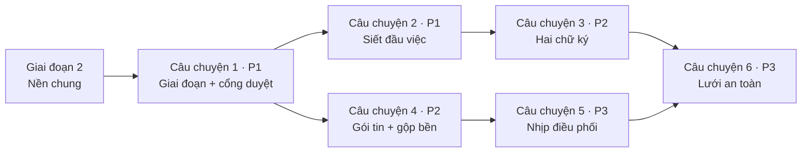

# Danh sách việc: Vận hành dự án tự chủ

**Đầu vào**: tài liệu thiết kế trong `specs/001-van-hanh-du-an/`

**Bắt buộc đã có**: [plan.md](./plan.md) · [spec.md](./spec.md) · [research.md](./research.md) ·
[data-model.md](./data-model.md) · [contracts/](./contracts/) · [quickstart.md](./quickstart.md)

**Bài kiểm**: **CÓ** — Hiến pháp đòi "mã theo sau và phải chứng minh khớp đặc tả", và luật dự án cấm coi
"biên dịch sạch" là xong. Mỗi câu chuyện viết bài kiểm trước, để nó đỏ, rồi mới dựng mã.

**Cách gom nhóm**: theo sáu câu chuyện trong đặc tả, đúng sáu đợt trong [plan.md](./plan.md). **Mỗi đợt là
một nhánh, một PR, dừng chờ người chủ duyệt.**

## Dạng thức: `[Mã] [P?] [Câu chuyện] Mô tả kèm đường dẫn tệp`

- **[P]**: chạy song song được (tệp khác nhau, không phụ thuộc việc chưa xong)
- **[US1]…[US6]**: thuộc câu chuyện nào trong `spec.md`

## Quy ước đường dẫn

- Máy chủ: `backend/armarius/` (bốn tầng Kiến trúc sạch), bài kiểm ở `backend/tests/`
- Giao diện: `frontend/src/`
- Gói lớp trung gian: `mcp/` — **bộ kiểm riêng**, chạy bằng `cd mcp && uv run pytest`

## Một điểm lệch so với plan.md

[plan.md](./plan.md) xếp "hộp thư thật" vào Đợt 3. Nhưng Đợt 1 đã cần chỗ đặt mục *chờ duyệt kế hoạch* và
Đợt 2 cần chỗ đặt mục *chờ duyệt đầu việc ngoài khuôn*. Nên **thực thể mục hộp thư dời lên Giai đoạn 2
(nền chung)**; Đợt 3 giữ phần khó thật sự của nó — định tuyến theo người cấp agent, công tắc tự động, bậc
nhắc. Nhật ký thay đổi đầu việc cũng lên nền chung vì bốn yêu cầu ở bốn đợt khác nhau cùng cần nó
(FR-021, FR-039, FR-061, FR-079) — dựng một lần, không vá lẻ.

## Vá sau bước soi chéo (2026-07-31)

Bước `/speckit-analyze` tìm ra mười lăm chỗ hở giữa ba tài liệu. Người chủ đã quyết hết; các quyết định ghi
ở mục *Làm rõ · Phiên 2026-07-31* trong [spec.md](./spec.md). Những chỗ chạm vào danh sách việc:

- **Kênh sự kiện người chủ được dựng nhưng không ai bắn lên** — hộp thư ở giao diện sẽ buộc phải hỏi vòng,
  trái Hiến pháp IV. Vá ở T015, T141, T146.
- **FR-066 không việc nào phủ** — thêm T147.
- **Hai ngưỡng "im lâu" và "sắp trễ" chưa có số** — chốt ở T004, dùng ở T118.
- Sáu chỗ hở nhỏ hơn vá tại chỗ: T036, T040, T057, T058, T062, T069, T070, T138.
- **Mười bốn yêu cầu đã có sẵn trong mã nhưng không bài kiểm nào canh** — thêm T161.

---

## Giai đoạn 1: Chuẩn bị (không đổi hành vi)

**Mục đích**: biết mình đang đứng ở đâu trước khi siết. Ba trong bốn việc dưới đây là để không bị bất ngờ.

- [X] T001 Rà cơ sở dữ liệu thật đếm số đầu việc đã đi thẳng *đang làm → xong* và số đầu việc đang *xong* mà không có thành phẩm, ghi kết quả vào `specs/001-van-hanh-du-an/khao-sat-du-lieu.md`
- [X] T002 [P] Ghi mốc nền vào `specs/001-van-hanh-du-an/khao-sat-du-lieu.md`: số bài kiểm máy chủ đang xanh, số lỗi mypy, số cảnh báo lint giao diện — để sau này phân biệt "đỏ đúng" với "đỏ do mình làm hỏng"
- [X] T003 [P] Rà mọi nơi gọi `TaskService.claim` trong `mcp/src/`, `frontend/src/` và `backend/armarius/presentation/`, ghi kết quả vào `specs/001-van-hanh-du-an/khao-sat-du-lieu.md` (rủi ro của QĐ-8)
- [X] T004 [P] Khai bộ ngưỡng thời gian mặc định của hệ thống trong `backend/armarius/shared/config.py` (nghi treo 10 phút, ân hạn 2 phút, quét canh gác 60 giây, nhịp điều phối 15 phút, nhắc 8/24/72 giờ, trần Mức 1 là 3, trần từ chối là 3, **im lâu 5 phút**, **sắp trễ ở bốn mốc 24/12/6/1 giờ**)

---

## Giai đoạn 2: Nền chung (chặn mọi câu chuyện)

**Mục đích**: hai thực thể và hai kênh sự kiện mà từ ba câu chuyện trở lên cùng cần.

**⚠️ Không câu chuyện nào bắt đầu được trước khi giai đoạn này xong.**

### Bài kiểm nền

- [X] T005 [P] Bài kiểm nhật ký thay đổi đầu việc — chỉ thêm không sửa, đúng thứ tự thời gian — trong `backend/tests/test_task_log.py`
- [X] T006 [P] Bài kiểm hộp thư: tạo mục, đọc theo người nhận, đánh dấu đã giải quyết, cách ly theo workspace — trong `backend/tests/test_inbox_api.py`

### Thực thể và lưu trữ

- [X] T007 [P] Thực thể nhật ký thay đổi đầu việc trong `backend/armarius/domain/entities/task_log.py`
- [X] T008 [P] Thực thể mục hộp thư người chủ (loại, người nhận, dự án, đầu việc, bậc nhắc, hồ sơ đã thử) trong `backend/armarius/domain/entities/inbox_item.py`
- [X] T009 Bảng `task_logs` và `inbox_items` trong `backend/armarius/infrastructure/database/models.py`
- [X] T010 Bản di trú nền chung trong `backend/armarius/infrastructure/alembic/versions/` (hai bảng mới, chỉ mục theo đầu việc và theo người nhận)
- [X] T011 Bộ ánh xạ hai thực thể mới trong `backend/armarius/infrastructure/persistence/mappers.py`
- [X] T012 Giao diện kho trong `backend/armarius/domain/repositories/repositories.py` và bản dựng trong `backend/armarius/infrastructure/persistence/repositories.py`
- [X] T013 Nối hai kho vào đơn vị công việc trong `backend/armarius/infrastructure/persistence/unit_of_work.py` và cổng `backend/armarius/application/ports/unit_of_work.py`

### Dịch vụ và mặt giao tiếp

- [X] T014 Dịch vụ ghi nhật ký đầu việc trong `backend/armarius/application/use_cases/task_log.py` — một điểm vào duy nhất cho mọi loại việc xảy ra
- [X] T015 Dịch vụ hộp thư (đặt mục, đọc theo người, giải quyết) trong `backend/armarius/application/use_cases/inbox.py`, **bắn `hop-thu.muc-moi` và `hop-thu.da-giai-quyet` lên kênh người chủ ở mọi lối vào ra** — không có bước này thì hộp thư ở giao diện buộc phải hỏi vòng, trái Hiến pháp IV
- [X] T016 Bộ ngưỡng thời gian theo dự án trong `backend/armarius/domain/entities/project.py` — mở rộng `default_project_settings()`, thiếu trường nào thì lấy mặc định hệ thống ở T004
- [X] T017 Hai kênh sự kiện mới (theo dự án, theo người chủ) trong `backend/armarius/infrastructure/events/topic_bus.py`, giữ số thứ tự để nối lại sau khi đứt
- [X] T018 Lối vào dòng sự kiện cho hai kênh mới trong `backend/armarius/presentation/api/events.py`, giới hạn theo workspace người nghe
- [X] T019 Lối vào `GET /v1/tasks/{id}/log` trong `backend/armarius/presentation/api/tasks.py` và lược đồ đáp trong `backend/armarius/presentation/schemas.py`
- [X] T020 Lối vào `GET/PUT /v1/projects/{id}/thresholds` trong `backend/armarius/presentation/api/projects.py`
- [X] T021 Bộ định tuyến hộp thư `GET /v1/inbox` và `POST /v1/inbox/{item_id}/resolve` trong `backend/armarius/presentation/api/inbox.py`, gắn vào `backend/armarius/main.py`
- [X] T022 Bơm dịch vụ nhật ký và hộp thư vào `backend/armarius/presentation/container.py`

### Giao diện — chỉ phần ống dẫn

- [X] T023 [P] Đăng ký hai kênh sự kiện mới trong `frontend/src/lib/sse.ts`
- [X] T024 [P] Kiểu dữ liệu và lời gọi hộp thư, nhật ký trong `frontend/src/lib/api.ts`
- [X] T025 [P] Bộ ánh xạ mục hộp thư và dòng nhật ký trong `frontend/src/lib/mappers.ts`

**Chốt chặn**: `cd backend && uv run pytest -q` xanh, `uv run pytest tests/test_migration_schema_parity.py` xanh. Nền sẵn sàng — bắt đầu được Đợt 1.

---

## Giai đoạn 3: Câu chuyện 1 — Giai đoạn dự án và cổng duyệt kế hoạch (Ưu tiên: P1) 🎯 Nửa đầu của mốc dùng được

**Đích**: dự án chạy đúng vòng *thiết lập → lập kế hoạch → duyệt → vận hành*; không một đầu việc thật nào
được tạo trước khi người chủ gật. Phủ FR-001 → FR-014.

**Kiểm độc lập**: tạo dự án để trống một ghế → đứng ở *thiết lập*, không đánh thức ai, tạo đầu việc bị từ
chối. Cấp đủ thợ và cho mọi thợ trực tuyến → tự sang *lập kế hoạch*, Trưởng dự án được gọi đúng một lần.
Trưởng dự án tự duyệt kế hoạch của mình → bị chặn. Người chủ duyệt → sang *vận hành*, cửa tạo đầu việc mở.

### Bài kiểm (viết trước, phải đỏ) ⚠️

- [X] T026 [P] [US1] Bài kiểm luật năm giai đoạn bằng hàm thuần trong `backend/tests/test_project_phases.py`
- [X] T027 [P] [US1] Bài kiểm cổng duyệt: ba lựa chọn, cấm Trưởng dự án tự duyệt, *yêu cầu chỉnh* giữ dự án ở *lập kế hoạch* — trong `backend/tests/test_plan_gate.py`
- [X] T028 [P] [US1] Bài kiểm mặt giao tiếp Bối cảnh và kế hoạch hai chiều người dùng/agent trong `backend/tests/test_plan_api.py`
- [X] T029 [P] [US1] Bài kiểm FR-003 — chặn tạo và giao đầu việc khi dự án chưa *vận hành*/*bảo trì* — bổ sung vào `backend/tests/test_task_rules.py`

### Thực thể và luật thuần

- [X] T030 [P] [US1] Mở rộng vòng đời dự án lên năm giai đoạn trong `backend/armarius/domain/entities/project.py`, bỏ cờ chết `require_approval_for_done` khỏi `default_project_settings()`
- [X] T031 [P] [US1] Thực thể Bối cảnh dự án có phiên bản và trạng thái duyệt trong `backend/armarius/domain/entities/project_context.py`
- [X] T032 [P] [US1] Thực thể bản kế hoạch và hạng mục trong `backend/armarius/domain/entities/plan.py`
- [X] T033 [US1] Đổi đích của `recompute_active` sang *lập kế hoạch* và thêm bảng chuyển giai đoạn hợp lệ trong `backend/armarius/domain/services/project_rules.py` (giữ nguyên luật đủ đội — nó đã đúng)
- [X] T034 [US1] Luật cổng duyệt trong `backend/armarius/domain/services/plan_gate.py`: ba lựa chọn, cấm tự duyệt (FR-014), điều kiện rời *lập kế hoạch*

### Lưu trữ

- [X] T035 [US1] Cột giai đoạn và ba bảng `project_contexts`, `plans`, `plan_items` trong `backend/armarius/infrastructure/database/models.py`
- [X] T036 [US1] Bản di trú Đợt 1 trong `backend/armarius/infrastructure/alembic/versions/`: thêm hai giai đoạn, ánh xạ *lưu trữ* → *đóng*, ba bảng mới, gỡ **hai** cờ khỏi thiết lập dự án: cờ chết `require_approval_for_done` và công tắc `yolo_mode` (xem T062)
- [X] T037 [US1] Bộ ánh xạ Bối cảnh và kế hoạch trong `backend/armarius/infrastructure/persistence/mappers.py`
- [X] T038 [US1] Kho chứa Bối cảnh và kế hoạch trong `backend/armarius/infrastructure/persistence/repositories.py` và giao diện ở `backend/armarius/domain/repositories/repositories.py`, nối vào `backend/armarius/infrastructure/persistence/unit_of_work.py`

### Ứng dụng

- [X] T039 [US1] Ca sử dụng trình Bối cảnh, trình kế hoạch, ghi quyết định của người chủ trong `backend/armarius/application/use_cases/plans.py` — kèm đặt mục *chờ duyệt kế hoạch* vào hộp thư qua dịch vụ ở T015 và bắn `ke-hoach.trinh` lên kênh dự án
- [X] T040 [US1] Chuyển giai đoạn (Trưởng dự án đề xuất, người chủ quyết), dừng nhịp khi vào *đóng*, và **khoá toàn bộ lịch sử dự án đã đóng ở dạng chỉ đọc** — mọi lối vào ghi trả `409` (FR-005) — trong `backend/armarius/application/use_cases/projects.py`
- [X] T041 [US1] Cổng FR-003 chặn tạo và giao đầu việc thật khi dự án chưa *vận hành*/*bảo trì* trong `backend/armarius/application/use_cases/tasks.py`
- [X] T042 [US1] Cớ đánh thức "dự án vừa đủ đội" và "người chủ quyết kế hoạch" trong `backend/armarius/domain/entities/wakeup.py`, bắn từ `backend/armarius/application/use_cases/wake_engine.py`
- [X] T043 [US1] Ghi nhật ký mốc duyệt và mốc chuyển giai đoạn qua dịch vụ T014, phát sự kiện `du-an.doi-giai-doan` và `ke-hoach.quyet` lên kênh dự án

### Mặt giao tiếp

- [X] T044 [US1] Lối vào cho người chủ — giai đoạn, Bối cảnh, kế hoạch, quyết định — trong `backend/armarius/presentation/api/projects.py` theo [contracts/mat-nguoi-dung.md](./contracts/mat-nguoi-dung.md) mục 1–3
- [X] T045 [US1] Lối vào cho Trưởng dự án — nộp Bối cảnh, trình kế hoạch, đề xuất chuyển giai đoạn — trong `backend/armarius/presentation/api/agent.py` theo [contracts/mat-agent.md](./contracts/mat-agent.md) mục 2
- [X] T046 [US1] Lược đồ yêu cầu và đáp cho Bối cảnh, kế hoạch, quyết định trong `backend/armarius/presentation/schemas.py`

### Giao diện

- [X] T047 [P] [US1] Kiểu và lời gọi giai đoạn, Bối cảnh, kế hoạch trong `frontend/src/lib/api.ts` và bộ ánh xạ trong `frontend/src/lib/mappers.ts`
- [X] T048 [US1] Trang kế hoạch và cổng duyệt ba nút trong `frontend/src/pages/ProjectPlan.tsx`, gắn tuyến lồng dưới `/w/:workspaceId` trong `frontend/src/App.tsx`
- [X] T049 [US1] Huy hiệu giai đoạn và vô hiệu nút tạo đầu việc khi dự án chưa *vận hành* trong `frontend/src/pages/ProjectBoard.tsx`
- [X] T050 [P] [US1] Chuỗi hiển thị tiếng Việt đủ dấu và bản tiếng Anh trong `frontend/src/i18n/vi.ts` và `frontend/src/i18n/en.ts`

### Kiểm chứng chạy thật

- [X] T051 [US1] Dựng lại vùng chứa máy chủ và giao diện, chạy trọn Kịch bản 1 của `specs/001-van-hanh-du-an/quickstart.md`, lái giao diện bằng Playwright, không lỗi ở bảng điều khiển trình duyệt

**Chốt chặn**: Câu chuyện 1 chạy độc lập được. Một PR, dừng chờ người chủ duyệt.

---

## Giai đoạn 4: Câu chuyện 2 — Đầu việc chuẩn hoá và năm cổng chặn (Ưu tiên: P1) 🎯 Hoàn tất mốc dùng được

**Đích**: siết bảng chuyển trạng thái, bịt ba lối tắt, thêm cổng mô tả và cổng duyệt theo khuôn kế hoạch.
Phủ FR-015 → FR-032 và FR-072.

**Kiểm độc lập**: đầu việc thiếu mô tả → không giao được. Gán người thứ hai → chặn. *Đang làm → xong* →
**chặn** (khác luật cũ). Phụ thuộc khép vòng → chặn ngay lúc tạo. Đầu việc trong khuôn hạng mục đã duyệt →
tạo và giao ngay; ngoài khuôn → ở lại *nháp*, mục chờ duyệt vào hộp thư.

**Phụ thuộc**: Giai đoạn 3 — cần hạng mục kế hoạch để biết thế nào là "trong khuôn".

### Bài kiểm (viết trước, phải đỏ) ⚠️

- [X] T052 [P] [US2] Bài kiểm bảng chuyển trạng thái đã siết — ba đường bị cấm, một đường được thêm — bổ sung vào `backend/tests/test_task_rules.py`
- [X] T053 [P] [US2] Bài kiểm cổng mô tả và cổng lý do bắt buộc trong `backend/tests/test_task_gates.py`
- [X] T054 [P] [US2] Bài kiểm cổng duyệt theo khuôn kế hoạch (trong khuôn cho qua, ngoài khuôn ở lại *nháp*) trong `backend/tests/test_task_scope_gate.py`
- [X] T055 [P] [US2] Bài kiểm mở khoá việc phụ thuộc và đánh thức Trưởng dự án khi một đầu việc *xong* — bổ sung vào `backend/tests/test_task_dependencies.py`
- [X] T056 [P] [US2] Bài kiểm danh sách tiêu chí công nhận thay chuỗi tự do trong `backend/tests/test_task_criteria.py`

### Siết vòng đời

- [X] T057 [US2] Siết `VALID_TRANSITIONS` trong `backend/armarius/domain/entities/task.py`: bỏ *đang làm → xong*, đưa *xong → đang làm* và *huỷ → tồn kho* ra khỏi đường thường ngày, thêm *nháp → tồn kho*, và **chặn cứng mọi đường vào *xong* khi đầu việc đang mang cờ đình trệ** (FR-058)
- [X] T058 [US2] Cổng mô tả (FR-029), cổng lý do bắt buộc (FR-030), và **chặn thợ sửa mô tả gốc của đầu việc** — thợ chỉ được thêm ghi chú tiến trình (FR-018) — trong `backend/armarius/domain/entities/task.py`
- [X] T059 [US2] Trường hạng mục kế hoạch trên đầu việc và luật "trong khuôn / ngoài khuôn" (FR-027) trong `backend/armarius/domain/entities/task.py`
- [X] T060 [US2] Nâng định nghĩa hoàn thành lên danh sách tiêu chí — nối `backend/armarius/domain/entities/checklist_item.py` vào vai trò cái thước, thêm kết quả chấm và bằng chứng đối chiếu

### Ứng dụng

- [X] T061 [US2] Gỡ `TaskService.claim` khỏi `backend/armarius/application/use_cases/tasks.py` (FR-072), thay bằng ca sử dụng "xin nhận việc" định tuyến tới Trưởng dự án
- [X] T062 [US2] **Gỡ hẳn** `yolo_mode`, thay bằng điều kiện "trong khuôn hạng mục đã duyệt" ở `approve_proposed` trong `backend/armarius/application/use_cases/tasks.py` — rà sạch mọi chỗ đọc nó ở `backend/armarius/domain/services/leader_chat_prompt.py`, `backend/armarius/presentation/` và `frontend/src/`, không để lại cờ chết thứ hai
- [X] T063 [US2] Xử lý hệ quả khi đầu việc *xong* (FR-031): ghi mốc hoàn tất, rà và mở khoá việc phụ thuộc, đánh thức Trưởng dự án — trong `backend/armarius/application/use_cases/tasks.py`
- [X] T064 [US2] Thao tác mở lại đầu việc đã đóng, bắt buộc lý do và ghi vết, trong `backend/armarius/application/use_cases/tasks.py`
- [X] T065 [US2] Ghi nhật ký mọi lần đổi trạng thái, gán người, đổi tiêu chí qua dịch vụ T014 và phát `dau-viec.doi-trang-thai`, `dau-viec.mo-khoa` lên kênh dự án

### Lưu trữ và mặt giao tiếp

- [X] T066 [US2] Cột hạng mục kế hoạch trên bảng đầu việc và cột kết quả chấm, bằng chứng trên bảng mục danh mục trong `backend/armarius/infrastructure/database/models.py`
- [X] T067 [US2] Bản di trú Đợt 2 trong `backend/armarius/infrastructure/alembic/versions/`, kèm chuyển chuỗi định nghĩa hoàn thành cũ thành **một** tiêu chí *chưa chấm* (không tự tách dòng)
- [X] T068 [US2] Bộ ánh xạ các trường mới trong `backend/armarius/infrastructure/persistence/mappers.py`
- [X] T069 [US2] Lối vào `POST /v1/tasks/{id}/reopen` và `GET/PUT /v1/tasks/{id}/criteria` trong `backend/armarius/presentation/api/tasks.py`, mã lỗi `409` cho vi phạm cổng; **mở rộng lối vào đọc một đầu việc để trả thêm hạng mục kế hoạch, động cơ đẩy, cờ đình trệ và các chữ ký đã có** — bốn trường này là thứ giao diện cần để vẽ (T099, T152), thiếu chúng thì bảng dự án không có dữ liệu
- [X] T070 [US2] Lối vào `POST /agent/tasks/{id}/request` và `POST /agent/tasks/{id}/handback` trong `backend/armarius/presentation/api/agent.py`, gỡ đường tự-nhận; **rà xác nhận mặt agent không có lối nào cho thợ đặt thứ gì vào hộp thư người chủ** — thợ chỉ nói qua bình luận và phòng cộng tác của đầu việc, Trưởng dự án được đánh thức đọc thay (FR-071)
- [X] T071 [US2] Thêm trường hạng mục vào lối vào tạo đầu việc ở cả `backend/armarius/presentation/api/projects.py` và `backend/armarius/presentation/api/agent.py`

### Sửa hậu quả

- [X] T072 [US2] Sửa các bài kiểm hiện có đang dựa vào đường *đang làm → xong* trong `backend/tests/` — sửa bài kiểm theo luật mới, **không** nới luật cho bài kiểm xanh
- [X] T073 [US2] Chạy bộ kiểm của gói lớp trung gian (`cd mcp && uv run pytest`) và sửa `mcp/src/`, `mcp/tests/` theo lược đồ đầu việc mới

### Giao diện

- [X] T074 [P] [US2] Ô danh sách tiêu chí công nhận trên thẻ đầu việc trong `frontend/src/pages/CollaborationRoom.tsx`
- [X] T075 [US2] Bỏ nút chuyển thẳng sang *xong* và hiện lý do bị chặn trong `frontend/src/pages/ProjectBoard.tsx`
- [X] T076 [P] [US2] Chuỗi hiển thị mới trong `frontend/src/i18n/vi.ts` và `frontend/src/i18n/en.ts`

### Kiểm chứng chạy thật

- [X] T077 [US2] Dựng lại hai vùng chứa, chạy trọn Kịch bản 2 của `specs/001-van-hanh-du-an/quickstart.md` gồm bảng chín phép thử, lái giao diện bằng Playwright

**Chốt chặn**: Đợt 1 và 2 xong — **mốc dùng được đầu tiên**. Dự án chạy đúng vòng và đầu việc không còn lối tắt nào.

---

## Giai đoạn 5: Câu chuyện 3 — Hai chữ ký và công tắc tự động công nhận (Ưu tiên: P2)

**Đích**: mọi đầu việc cần hai chữ ký; đầu ra định tuyến bằng quan hệ **ai đã cấp agent vào ghế**; công tắc
tự động theo cặp *(dự án, người chủ)*. Phủ FR-033 → FR-043 và FR-077.

**Phạm vi — một người chủ** *(chốt 2026-08-03)*: sản phẩm chưa có cơ chế mời người vào vùng làm việc, nên mỗi
dự án hiện có đúng một người chủ. Quy tắc hai chữ ký và công tắc **không đổi** — Trưởng dự án là agent, người
chủ là người. Thứ hoãn sang tính năng sau chỉ là phần **định tuyến giữa nhiều người chủ**.

**Kiểm độc lập**: một người chủ, một thợ do người đó cấp ghế. Trưởng dự án gật → đầu việc **chưa** đóng, mục
chờ công nhận rơi vào hộp thư người chủ **theo quan hệ ai cấp ghế đọc từ dữ liệu**, không suy từ "ai là chủ
vùng". Người chủ gật → *xong*. Bật công tắc → đầu ra kế tiếp đóng ngay, không mục nào vào hộp thư, nhưng vết
vẫn ghi rõ họ được coi là đã ký.

**Phụ thuộc**: Giai đoạn 4.

### Bài kiểm (viết trước, phải đỏ) ⚠️

- [X] T078 [P] [US3] Bài kiểm luật hai chữ ký bằng hàm thuần trong `backend/tests/test_approval_rules.py`
- [X] T079 [P] [US3] Bài kiểm định tuyến theo người cấp agent — mục chờ công nhận phải tra ra người nhận từ **người cấp ghế** đã ghi, và ghế không ghi người cấp thì hỏng chứ không âm thầm rơi về chủ vùng — trong `backend/tests/test_approval_routing.py`. *(Vế hai người chủ không lẫn hộp thư: hoãn.)*
- [X] T080 [P] [US3] Bài kiểm công tắc tự động: mặc định tắt, Trưởng dự án không đụng được, **không** áp cho ba quyết định cấp dự án (FR-037) — trong `backend/tests/test_auto_approval.py`. *(Vế người chủ khác bật thay: hoãn.)*
- [X] T081 [P] [US3] Bài kiểm vòng từ chối: về *đang làm*, đánh thức đúng thợ cũ, ba vòng thì kéo Trưởng dự án vào — trong `backend/tests/test_approval_rejection.py`

### Thực thể và luật thuần

- [X] T082 [P] [US3] Trường "người chủ đã cấp" trên ghế trong `backend/armarius/domain/entities/seat_grant.py`
- [X] T083 [P] [US3] Thực thể chữ ký công nhận trong `backend/armarius/domain/entities/approval.py`
- [X] T084 [P] [US3] Thực thể thiết lập tự động công nhận theo cặp *(dự án, người chủ)* trong `backend/armarius/domain/entities/auto_approval.py`
- [X] T085 [US3] Luật công nhận trong `backend/armarius/domain/services/approval_rules.py`: đủ hai chữ ký mới đóng, suy người chủ chịu trách nhiệm từ ghế, ba quyết định cấp dự án nằm ngoài công tắc

### Lưu trữ

- [X] T086 [US3] Cột người cấp trên bảng ghế, bảng `task_approvals` và `project_auto_approvals` trong `backend/armarius/infrastructure/database/models.py`
- [X] T087 [US3] Bản di trú Đợt 3 trong `backend/armarius/infrastructure/alembic/versions/`, lấp người cấp cho ghế cũ bằng chủ vùng làm việc và **ghi rõ trong chú thích bản di trú rằng đây là suy đoán, không phải sự thật lịch sử** — trong phạm vi một người chủ suy đoán này đang đúng, nhưng ghế cấp **từ nay trở đi** phải ghi người thật (T097), không được dựa vào suy đoán đó
- [X] T088 [US3] Bộ ánh xạ và kho chứa cho chữ ký, công tắc trong `backend/armarius/infrastructure/persistence/mappers.py` và `backend/armarius/infrastructure/persistence/repositories.py`, nối vào `backend/armarius/infrastructure/persistence/unit_of_work.py`

### Ứng dụng

- [X] T089 [US3] Ca sử dụng ký công nhận trong `backend/armarius/application/use_cases/approvals.py`: chữ ký Trưởng dự án, chữ ký người chủ, ký tự động khi công tắc bật
- [X] T090 [US3] Định tuyến mục *chờ công nhận đầu ra* vào hộp thư đúng người chủ (FR-035) trong `backend/armarius/application/use_cases/approvals.py`
- [X] T091 [US3] Xử lý từ chối (FR-040): kéo về *đang làm*, đặt việc kế tiếp "sửa theo phản hồi", đánh thức đúng thợ cũ — trong `backend/armarius/application/use_cases/approvals.py`
- [X] T092 [US3] Đếm vòng từ chối và kéo Trưởng dự án vào soát lại đề bài sau vòng thứ ba (FR-041) trong `backend/armarius/application/use_cases/approvals.py`
- [X] T093 [US3] Bản tổng kết đợt khi cả đợt việc đã *xong* kèm ba lựa chọn chuyển giai đoạn (FR-043) trong `backend/armarius/application/use_cases/projects.py`
- [X] T094 [US3] Ghi vết đầy đủ mọi chữ ký kể cả ký tự động và mọi lần bật/tắt công tắc (FR-039) qua dịch vụ T014, phát `cong-nhan.ky` lên kênh dự án

### Mặt giao tiếp

- [X] T095 [US3] Lối vào `POST /v1/tasks/{id}/approval` và `GET/PUT /v1/projects/{id}/auto-approval` trong `backend/armarius/presentation/api/tasks.py` và `backend/armarius/presentation/api/projects.py`, trả `403` khi người gọi không phải người chủ chịu trách nhiệm — kiểm bằng **người cấp ghế**, giữ nguyên phép kiểm này dù hôm nay nó luôn trùng chủ vùng
- [X] T096 [US3] Lối vào `POST /agent/tasks/{id}/approval` cho Trưởng dự án trong `backend/armarius/presentation/api/agent.py`
- [X] T097 [US3] Ghi người cấp ngay lúc cấp ghế trong `backend/armarius/application/use_cases/projects.py` và lối vào cấp ghế tương ứng

### Giao diện

- [X] T098 [US3] Thay bộ lọc phía trình duyệt bằng hộp thư thật đọc từ `GET /v1/inbox`, phân loại mục và hiện bậc nhắc, trong `frontend/src/pages/Inbox.tsx`
- [X] T099 [US3] Ô công nhận đầu ra đặt cạnh danh sách tiêu chí và thành phẩm trong `frontend/src/pages/CollaborationRoom.tsx`
- [X] T100 [P] [US3] Công tắc tự động công nhận của chính người dùng trong `frontend/src/pages/ProjectBoard.tsx` kèm chuỗi hiển thị trong `frontend/src/i18n/vi.ts` và `frontend/src/i18n/en.ts`

### Kiểm chứng chạy thật

- [X] T101 [US3] Dựng lại hai vùng chứa, tạo **một** người chủ cấp một thợ, chạy trọn bảy bước của Kịch bản 3 trong `specs/001-van-hanh-du-an/quickstart.md`, và soi cơ sở dữ liệu thật để chắc ghế có ghi người cấp

**Chốt chặn**: Câu chuyện 3 chạy độc lập được. Một PR, dừng chờ người chủ duyệt.

---

## Giai đoạn 6: Câu chuyện 4 — Gói tin đánh thức tám phần và gộp lời gọi bền (Ưu tiên: P2)

**Đích**: gói tin đủ tám phần kèm Bối cảnh dự án; gộp lời gọi trùng cưỡng chế ở tầng lưu trữ để sống sót qua
khởi động lại. Phủ FR-044 → FR-051.

**Kiểm độc lập**: đọc gói tin một thợ nhận → đủ tám phần, có Bối cảnh, phần rỗng ghi "không có". Bắn ba cớ
gọi cùng lúc cho một cặp thợ–đầu việc → đúng một lần gọi, lý do gộp liệt kê đủ ba cớ. **Khởi động lại vùng
chứa máy chủ giữa lúc có lệnh treo** → vẫn chỉ một lệnh treo.

**Phụ thuộc**: Giai đoạn 3 (cần Bối cảnh đã duyệt). Chạy song song được với Giai đoạn 5.

### Bài kiểm (viết trước, phải đỏ) ⚠️

- [ ] T102 [P] [US4] Bài kiểm tám phần và quy tắc "không có" cho phần rỗng — bổ sung vào `backend/tests/test_wake_prompt.py`
- [ ] T103 [P] [US4] Bài kiểm bất biến gộp ở tầng lưu trữ: hai cớ đồng thời cho cùng cặp chỉ sinh một lệnh treo — trong `backend/tests/test_wake_coalesce.py`
- [ ] T104 [P] [US4] Bài kiểm sống sót qua khởi động lại: dựng lại bộ máy đánh thức từ dữ liệu bền, không sinh lệnh thứ hai — trong `backend/tests/test_wake_coalesce.py`

### Gói tin

- [ ] T105 [US4] Thêm Bối cảnh dự án đã duyệt vào `WakeContext` trong `backend/armarius/domain/services/wake_prompt.py`
- [ ] T106 [US4] Tách "nơi nộp thành phẩm và cách báo trạng thái" thành mục riêng, không lẫn trong đoạn hướng dẫn, trong `backend/armarius/domain/services/wake_prompt.py`
- [ ] T107 [US4] Ghi rõ "không có" cho mọi phần rỗng thay vì bỏ qua im lặng (FR-045) trong `backend/armarius/domain/services/wake_prompt.py`
- [ ] T108 [US4] Nạp Bối cảnh vào ngữ cảnh đánh thức trong `backend/armarius/application/use_cases/wake_engine.py`

### Gộp lời gọi bền

- [ ] T109 [US4] Ràng buộc duy nhất "tối đa một lệnh treo và một lượt chạy cho mỗi cặp *(agent, đầu việc)*" trong `backend/armarius/infrastructure/database/models.py`
- [ ] T110 [US4] Bản di trú Đợt 4 trong `backend/armarius/infrastructure/alembic/versions/`, kèm dọn lệnh treo trùng còn sót trước khi đặt ràng buộc
- [ ] T111 [US4] Bỏ từ điển trong tiến trình `WakeEngine._active`, chuyển quyết định gộp sang đọc/ghi cơ sở dữ liệu và ghi trạng thái *đã gộp* trong `backend/armarius/application/use_cases/wake_engine.py`
- [ ] T112 [US4] Lý do gộp liệt kê đủ mọi cớ và giữ lý do mạnh hơn trong `backend/armarius/application/use_cases/wake_engine.py`
- [ ] T113 [US4] Đánh giá lại nhu cầu gọi khi một lượt chạy kết thúc (FR-050) trong `backend/armarius/application/use_cases/runs.py`
- [ ] T114 [US4] Bổ sung cớ đánh thức còn thiếu (*đầu việc chờ rà soát*, *đầu việc xong*, *người chủ quyết*, *thợ trả việc*, *nhắc vì im lâu*) trong `backend/armarius/domain/entities/wakeup.py` và luật chọn cớ trong `backend/armarius/domain/services/wake_policy.py`

### Kiểm chứng chạy thật

- [ ] T115 [US4] Dựng lại vùng chứa máy chủ, chạy trọn năm bước của Kịch bản 4 trong `specs/001-van-hanh-du-an/quickstart.md`, **bao gồm bước khởi động lại giữa lúc có lệnh treo**

**Chốt chặn**: Câu chuyện 4 chạy độc lập được. Một PR, dừng chờ người chủ duyệt.

---

## Giai đoạn 7: Câu chuyện 5 — Nhịp điều phối có kiểm soát (Ưu tiên: P3)

**Đích**: Trưởng dự án tự rà bảng việc theo nhịp, nhưng chỉ bị gọi dậy khi có điểm treo thật. Phủ
FR-052 → FR-055.

**Kiểm độc lập**: dự án chạy trơn tru → số lần gọi theo nhịp bằng **không**. Ba đầu việc rơi vào ba tình
cảnh → nhịp kế tiếp gọi **đúng một lần**, lý do nêu đích danh cả ba.

**Phụ thuộc**: Giai đoạn 6.

### Bài kiểm (viết trước, phải đỏ) ⚠️

- [ ] T116 [P] [US5] Bài kiểm dò điểm treo bằng hàm thuần với đồng hồ cố định trong `backend/tests/test_orchestration_cadence.py`
- [ ] T117 [P] [US5] Bài kiểm nhịp im lặng khi không có điểm treo và trần số lần gọi trong một giờ — trong `backend/tests/test_orchestrator_loop.py`

### Thực thể và luật thuần

- [ ] T118 [US5] Luật dò bốn loại điểm treo trong `backend/armarius/domain/services/orchestration_cadence.py` theo đúng định nghĩa ở FR-052: *im lâu* (5 phút không hoạt động **và** không có lượt chạy sống), *sắp trễ* (chạm mốc 24/12/6/1 giờ trước hạn chót, đầu việc không có hạn chót thì bỏ qua), *mắc kẹt* (đang ở *bị chặn*), *chờ Trưởng dự án quyết*
- [ ] T119 [US5] Luật giãn và làm dày nhịp kèm trần số lần gọi trong một giờ (FR-055) trong `backend/armarius/domain/services/orchestration_cadence.py`

### Vòng lặp nền

- [ ] T120 [US5] Vòng điều phối theo khuôn `LivenessWatchdog` — thân vòng gọi được riêng để kiểm thử — trong `backend/armarius/application/use_cases/orchestrator.py`
- [ ] T121 [US5] Gắn vòng điều phối vào vòng đời ứng dụng trong `backend/armarius/main.py` và `backend/armarius/presentation/container.py`
- [ ] T122 [US5] Gói tin nhịp điều phối nêu đích danh từng điểm treo (FR-054) trong `backend/armarius/domain/services/wake_prompt.py`
- [ ] T123 [US5] Đọc ngưỡng nhịp từ thiết lập dự án (T016), không đóng cứng, trong `backend/armarius/application/use_cases/orchestrator.py`

### Giao diện

- [ ] T124 [P] [US5] Hiện lần rà gần nhất và các điểm treo đang có trên `frontend/src/pages/ProjectBoard.tsx` kèm chuỗi hiển thị trong `frontend/src/i18n/vi.ts` và `frontend/src/i18n/en.ts`

### Kiểm chứng chạy thật

- [ ] T125 [US5] Dựng lại vùng chứa máy chủ, chạy trọn bốn bước của Kịch bản 5 trong `specs/001-van-hanh-du-an/quickstart.md` — **đếm số lần gọi theo nhịp phải bằng không** ở bước 1

**Chốt chặn**: Câu chuyện 5 chạy độc lập được. Một PR, dừng chờ người chủ duyệt.

---

## Giai đoạn 8: Câu chuyện 6 — Lưới an toàn (Ưu tiên: P3)

**Đích**: không đầu việc nào âm thầm chết. Động cơ đẩy, cờ đình trệ, thang phục hồi ba mức, nhắc ba bậc,
xếp hàng, dựng lại sau khởi động lại. Phủ FR-056 → FR-069, FR-075, FR-076.

**Kiểm độc lập**: giết một lượt chạy giữa chừng → trong một chu kỳ, đầu việc bị phát hiện, kéo về trạng thái
làm được, người phụ trách cũ được gọi lại đúng chỗ đang dở. Ép một đầu việc mất hết động cơ → mang cờ đình
trệ, **không bao giờ** tự nhảy sang *xong*.

**Phụ thuộc**: Giai đoạn 5 và Giai đoạn 7.

### Bài kiểm (viết trước, phải đỏ) ⚠️

- [ ] T126 [P] [US6] Bài kiểm bất biến "mỗi đầu việc chưa đóng có đúng một động cơ đẩy sống hoặc mang cờ đình trệ" trong `backend/tests/test_push_reason.py`
- [ ] T127 [P] [US6] Bài kiểm thang ba mức không nhảy cóc và trần Mức 1 kèm đặt lại bộ đếm khi có tiến triển thật — trong `backend/tests/test_escalation.py`
- [ ] T128 [P] [US6] Bài kiểm phục hồi treo: tuyên treo, đóng lượt chạy ma, kéo về *chờ làm*, gọi lại đúng người phụ trách cũ — bổ sung vào `backend/tests/test_liveness_watchdog.py`
- [ ] T129 [P] [US6] Bài kiểm nhắc ba bậc và không tự đánh dấu xong/thất bại trong `backend/tests/test_inbox_reminders.py`
- [ ] T130 [P] [US6] Bài kiểm xếp hàng theo ưu tiên → hạn chót → tuổi đời kèm nâng dần chống bỏ đói trong `backend/tests/test_task_queue.py`
- [ ] T131 [P] [US6] Bài kiểm dựng lại động cơ đẩy sau khởi động lại trong `backend/tests/test_push_reason_recovery.py`

### Động cơ đẩy

- [ ] T132 [P] [US6] Thực thể động cơ đẩy sáu loại kèm mốc hết hạn và bộ đếm tự phục hồi trong `backend/armarius/domain/entities/push_reason.py`
- [ ] T133 [US6] Luật tính động cơ đẩy từ trạng thái đầu việc (QĐ-4: tính lại lúc đổi trạng thái, không suy trong vòng quét) trong `backend/armarius/domain/services/push_reason_rules.py`
- [ ] T134 [US6] Bảng `task_push_reasons` và cột cờ đình trệ kèm lý do trong `backend/armarius/infrastructure/database/models.py`
- [ ] T135 [US6] Bản di trú Đợt 6 trong `backend/armarius/infrastructure/alembic/versions/`, kèm một lần chạy lấp động cơ cho mọi đầu việc đang mở — suy không ra thì nổi cờ đình trệ
- [ ] T136 [US6] Bộ ánh xạ và kho chứa động cơ đẩy trong `backend/armarius/infrastructure/persistence/mappers.py` và `backend/armarius/infrastructure/persistence/repositories.py`
- [ ] T137 [US6] Tính lại động cơ đẩy ở mọi điểm đổi trạng thái trong `backend/armarius/application/use_cases/tasks.py` và `backend/armarius/application/use_cases/approvals.py`

### Vòng quét canh gác và thang phục hồi

- [ ] T138 [US6] Vòng quét canh gác theo khuôn `LivenessWatchdog` — chỉ so mốc hết hạn với hiện tại, nổi và gỡ cờ đình trệ, bắn `dau-viec.dinh-tre` lên kênh dự án — trong `backend/armarius/application/use_cases/stall_watchdog.py`
- [ ] T139 [US6] Luật thang ba mức trong `backend/armarius/domain/services/escalation.py`: Mức 1 tự gọi lại có trần và giãn dần, Mức 2 Trưởng dự án quyết, Mức 3 lên người chủ — **không nhảy cóc**
- [ ] T140 [US6] Đặt lại bộ đếm Mức 1 về không khi đầu việc có tiến triển thật (FR-060) trong `backend/armarius/domain/services/escalation.py`
- [ ] T141 [US6] Hồ sơ đã thử đính vào mục leo thang Mức 3 (FR-061) trong `backend/armarius/application/use_cases/inbox.py`, bắn `leo-thang.muc-3` lên kênh người chủ
- [ ] T142 [US6] Gắn vòng quét canh gác vào vòng đời ứng dụng trong `backend/armarius/main.py` và `backend/armarius/presentation/container.py`

### Phục hồi sự cố

- [ ] T143 [US6] Tuyên treo đầy đủ (FR-062): đóng lượt chạy ma, kéo đầu việc về *chờ làm*, gọi lại đúng người phụ trách trỏ vào việc kế tiếp — trong `backend/armarius/application/use_cases/liveness_watchdog.py`
- [ ] T144 [US6] Thử lại giãn dần với động cơ *chờ hành động phục hồi*, không tính đình trệ (FR-063), trong `backend/armarius/application/use_cases/wake_engine.py`
- [ ] T145 [US6] Thợ ngoại tuyến → đầu việc về *bị chặn*, báo Trưởng dự án; Trưởng dự án ngoại tuyến → báo thẳng người chủ (FR-064) trong `backend/armarius/application/use_cases/liveness.py`
- [ ] T146 [US6] Nhắc ba bậc thưa dần theo ngưỡng dự án (FR-065) trong `backend/armarius/application/use_cases/inbox.py`, mỗi bậc bắn `hop-thu.nhac` lên kênh người chủ
- [ ] T147 [US6] Cho chạy tiếp mọi nhánh việc không phụ thuộc vào quyết định người chủ đang chờ (FR-066) trong `backend/armarius/application/use_cases/orchestrator.py` — dò các đầu việc mà chuỗi phụ thuộc của chúng **không** đi qua mục đang chờ, giữ chúng chạy bình thường; dự án đậu lại đúng chỗ chờ chứ không đứng cả bảng
- [ ] T148 [US6] Xếp hàng tranh chấp thợ/tài nguyên theo ưu tiên → hạn chót → tuổi đời kèm nâng dần (FR-067) trong `backend/armarius/domain/services/push_reason_rules.py`
- [ ] T149 [US6] Dựng lại động cơ đẩy cho mọi đầu việc chưa đóng lúc khởi động, lượt chạy hỏng xử như treo (FR-068), trong `backend/armarius/application/use_cases/stall_watchdog.py`
- [ ] T150 [US6] Xử lý thành phẩm mất hoặc hỏng lúc chuẩn bị công nhận (FR-069) trong `backend/armarius/application/use_cases/approvals.py`
- [ ] T151 [US6] Cổng thay đổi lớn (FR-075) và chuyển tiếp sạch khi tái hoạch định (FR-076) trong `backend/armarius/application/use_cases/plans.py`, kèm lối vào `POST /agent/projects/{id}/change-request` và `POST /agent/tasks/{id}/recovery` trong `backend/armarius/presentation/api/agent.py`

### Giao diện

- [ ] T152 [US6] Cờ đình trệ kèm lý do trên thẻ đầu việc trong `frontend/src/pages/ProjectBoard.tsx`
- [ ] T153 [P] [US6] Bậc nhắc và hồ sơ đã thử của mục leo thang trong `frontend/src/pages/Inbox.tsx` kèm chuỗi hiển thị trong `frontend/src/i18n/vi.ts` và `frontend/src/i18n/en.ts`

### Kiểm chứng chạy thật

- [ ] T154 [US6] Dựng lại hai vùng chứa, chạy trọn tám bước của Kịch bản 6 trong `specs/001-van-hanh-du-an/quickstart.md`, gồm giết lượt chạy giữa chừng và khởi động lại máy chủ

**Chốt chặn**: cả sáu câu chuyện chạy được độc lập.

---

## Giai đoạn 9: Hoàn thiện và ràng buộc xuyên suốt

**Mục đích**: các yêu cầu nền không thuộc đợt nào nhưng mọi đợt phải giữ (FR-070 → FR-084).

- [ ] T155 [P] Rà toàn bộ chuỗi hiển thị mới trong `frontend/src/i18n/vi.ts` — tiếng Việt **đủ dấu**, không chuỗi cứng nào lọt ngoài cơ chế đa ngôn ngữ (FR-084, Hiến pháp VI)
- [ ] T156 [P] Kiểm cách ly workspace cho mọi lối vào mới — truy cập chéo trả *không tìm thấy*, không phải *không có quyền* (FR-081, Hiến pháp I) — trong `backend/tests/test_agent_ws_guard.py`
- [ ] T157 [P] Tra tầng nghiệp vụ xác nhận không có nhánh mã theo loại agent (FR-083, Hiến pháp III) trong `backend/armarius/domain/` và `backend/armarius/application/`
- [ ] T158 [P] Kiểm không có vòng hỏi lại nào ở giao diện — mọi cập nhật đến từ kênh sự kiện (FR-080, Hiến pháp IV) — trong `frontend/src/lib/sse.ts` và các trang liên quan
- [ ] T159 Chạy toàn bộ lệnh kiểm tự động trong `specs/001-van-hanh-du-an/quickstart.md` mục "Lệnh kiểm tự động", gồm cả bộ kiểm của gói lớp trung gian
- [ ] T160 Chạy bảng "Kiểm chứng ràng buộc Hiến pháp" trong `specs/001-van-hanh-du-an/quickstart.md` — sáu nguyên tắc, sáu cách kiểm
- [ ] T161 [P] Bài kiểm hồi quy cho **14 yêu cầu đã có sẵn trong mã** mà không đợt nào chạm tới (FR-016, 017, 020, 023, 025, 026, 028, 032, 046, 051, 070, 073, 078, 082) trong `backend/tests/` — khảo sát kết luận chúng đang đúng, nhưng không bài kiểm nào canh để biết một đợt sau có làm hỏng không
- [ ] T162 Cập nhật trạng thái đặc tả từ *Nháp* sang *đã triển khai* trong `specs/001-van-hanh-du-an/spec.md` và ghi lại các điểm lệch còn tồn nếu có

---

## Phụ thuộc và thứ tự thực thi

### Phụ thuộc giữa các giai đoạn

- **Giai đoạn 1 (Chuẩn bị)**: không phụ thuộc gì, bắt đầu ngay được
- **Giai đoạn 2 (Nền chung)**: cần Giai đoạn 1 — **chặn mọi câu chuyện**
- **Giai đoạn 3–8 (sáu câu chuyện)**: cần Giai đoạn 2, rồi theo chuỗi phụ thuộc dưới
- **Giai đoạn 9 (Hoàn thiện)**: cần mọi câu chuyện định làm đã xong

### Phụ thuộc giữa các câu chuyện

Khác với khuôn mẫu thông thường, **sáu câu chuyện này không độc lập với nhau**. Nói thẳng ra để khỏi hụt kế
hoạch:



- **Câu chuyện 1** — sau Giai đoạn 2. Không phụ thuộc câu chuyện nào khác.
- **Câu chuyện 2** — cần Câu chuyện 1 vì "trong khuôn kế hoạch" định nghĩa cổng duyệt đầu việc.
- **Câu chuyện 3** — cần Câu chuyện 2 vì chữ ký bám vào vòng đời đầu việc đã siết.
- **Câu chuyện 4** — cần Câu chuyện 1 (Bối cảnh đã duyệt). **Chạy song song được với Câu chuyện 2 và 3.**
- **Câu chuyện 5** — cần Câu chuyện 4 (gói tin chuẩn).
- **Câu chuyện 6** — cần cả Câu chuyện 3 (hộp thư đã định tuyến) và Câu chuyện 5 (khuôn vòng lặp nền).

### Trong mỗi câu chuyện

Bài kiểm trước và phải đỏ → thực thể và luật thuần → lưu trữ và di trú → ca sử dụng → mặt giao tiếp →
giao diện → kiểm chứng chạy thật.

### Cơ hội chạy song song

- Giai đoạn 1: T002, T003, T004 song song
- Giai đoạn 2: T005–T006 song song; T007–T008 song song; T023–T025 song song
- Mỗi câu chuyện: toàn bộ bài kiểm mở đầu song song; các thực thể mới song song; chuỗi i18n song song với mã máy chủ
- **Ở cấp câu chuyện**: nhánh Câu chuyện 4 → 5 chạy song song được với nhánh Câu chuyện 2 → 3, nếu có hai người làm

---

## Ví dụ chạy song song: Câu chuyện 3

```bash
# Bốn bài kiểm mở đầu — viết cùng lúc, để cùng đỏ:
T078 backend/tests/test_approval_rules.py
T079 backend/tests/test_approval_routing.py
T080 backend/tests/test_auto_approval.py
T081 backend/tests/test_approval_rejection.py

# Ba thực thể mới — tệp khác nhau, không đụng nhau:
T082 backend/armarius/domain/entities/seat_grant.py
T083 backend/armarius/domain/entities/approval.py
T084 backend/armarius/domain/entities/auto_approval.py
```

---

## Chiến lược triển khai

### Mốc dùng được nhỏ nhất: Câu chuyện 1 + 2

1. Giai đoạn 1 (Chuẩn bị) — 4 việc
2. Giai đoạn 2 (Nền chung) — 21 việc, **chặn mọi thứ**
3. Giai đoạn 3 (Câu chuyện 1) — 26 việc → **DỪNG, kiểm chứng, một PR, chờ người chủ duyệt**
4. Giai đoạn 4 (Câu chuyện 2) — 26 việc → **DỪNG, kiểm chứng, một PR, chờ người chủ duyệt**

Tới đây dự án đã chạy đúng vòng *thiết lập → lập kế hoạch → duyệt → vận hành* và đầu việc không còn lối tắt
nào. Đó là lát cắt nhỏ nhất mà người chủ nhìn thấy giá trị. Câu chuyện 1 một mình chưa đủ — nó mở cổng nhưng
đầu việc phía sau cổng vẫn còn ba lối tắt.

### Giao từng phần

Mỗi giai đoạn từ 3 tới 8 là **một nhánh, một PR mang `Closes #<số issue>`, dừng chờ người chủ duyệt, không
tự gộp**. Sau mỗi lần gộp: đồng bộ nhánh chính rồi chạy `codegraph sync` và `codegraph status`.

### Ba điều phải nhớ suốt quá trình

1. **Đỏ đúng không phải đỏ hỏng.** T072 sẽ làm đỏ vài bài kiểm hiện có vì luật đã siết. Sửa bài kiểm theo
   luật mới, **không** nới luật cho bài kiểm xanh. Mốc nền ghi ở T002 là để phân biệt hai loại đỏ này.
2. **Đổi lược đồ đầu việc thì phải chạy bộ kiểm của gói lớp trung gian.** `cd mcp && uv run pytest` — Đợt 2
   và 3 bắt buộc, không chỉ chạy bộ kiểm của phần máy chủ.
3. **Xong việc là phải dựng dịch vụ thật lên tự chứng minh.** Mỗi câu chuyện kết bằng một việc kiểm chứng
   chạy thật (T051, T077, T101, T115, T125, T154). "Biên dịch sạch" không tính là xong.

---

## Ghi chú

- Việc gắn [P] là việc ở tệp khác và không chờ việc nào chưa xong
- Nhãn [US1]…[US6] nối việc về đúng câu chuyện trong `spec.md` để tra ngược
- Xác nhận bài kiểm đỏ trước khi dựng mã
- Bảo mật: **không** `git add` `linhtinh.md`, `.env`, `.codegraph/`, hay môi trường ảo và tệp cơ sở dữ liệu
  của gói lớp trung gian
- Ba yêu cầu ràng buộc nền (FR-078 → FR-084) không thành đợt riêng — chúng là điều mọi đợt phải giữ, kiểm ở
  Giai đoạn 9
