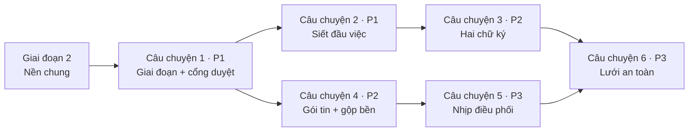

# Danh sách việc: Vận hành dự án tự chủ

**Đầu vào**: tài liệu thiết kế trong `specs/001-van-hanh-du-an/`

**Bắt buộc đã có**: [plan.md](./plan.md) · [spec.md](./spec.md) · [research.md](./research.md) ·
[data-model.md](./data-model.md) · [contracts/](./contracts/) · [quickstart.md](./quickstart.md)

**Bài kiểm**: **CÓ** — Hiến pháp đòi "mã theo sau và phải chứng minh khớp đặc tả", và luật dự án cấm coi
"biên dịch sạch" là xong. Mỗi câu chuyện viết bài kiểm trước, để nó đỏ, rồi mới dựng mã.

**Cách gom nhóm**: theo sáu câu chuyện trong đặc tả, đúng sáu đợt trong [plan.md](./plan.md). **Mỗi đợt là
một nhánh, một PR, dừng chờ người chủ duyệt.**

## Dạng thức: `[Mã] [P?] [Câu chuyện] Mô tả kèm đường dẫn tệp`

- **[P]**: chạy song song được (tệp khác nhau, không phụ thuộc việc chưa xong)
- **[US1]…[US6]**: thuộc câu chuyện nào trong `spec.md`

## Quy ước đường dẫn

- Máy chủ: `backend/armarius/` (bốn tầng Kiến trúc sạch), bài kiểm ở `backend/tests/`
- Giao diện: `frontend/src/`
- Gói lớp trung gian: `mcp/` — **bộ kiểm riêng**, chạy bằng `cd mcp && uv run pytest`

## Một điểm lệch so với plan.md

[plan.md](./plan.md) xếp "hộp thư thật" vào Đợt 3. Nhưng Đợt 1 đã cần chỗ đặt mục *chờ duyệt kế hoạch* và
Đợt 2 cần chỗ đặt mục *chờ duyệt đầu việc ngoài khuôn*. Nên **thực thể mục hộp thư dời lên Giai đoạn 2
(nền chung)**; Đợt 3 giữ phần khó thật sự của nó — định tuyến theo người cấp agent, công tắc tự động, bậc
nhắc. Nhật ký thay đổi đầu việc cũng lên nền chung vì bốn yêu cầu ở bốn đợt khác nhau cùng cần nó
(FR-021, FR-039, FR-061, FR-079) — dựng một lần, không vá lẻ.

## Vá sau bước soi chéo (2026-07-31)

Bước `/speckit-analyze` tìm ra mười lăm chỗ hở giữa ba tài liệu. Người chủ đã quyết hết; các quyết định ghi
ở mục *Làm rõ · Phiên 2026-07-31* trong [spec.md](./spec.md). Những chỗ chạm vào danh sách việc:

- **Kênh sự kiện người chủ được dựng nhưng không ai bắn lên** — hộp thư ở giao diện sẽ buộc phải hỏi vòng,
  trái Hiến pháp IV. Vá ở T015, T141, T146.
- **FR-066 không việc nào phủ** — thêm T147.
- **Hai ngưỡng "im lâu" và "sắp trễ" chưa có số** — chốt ở T004, dùng ở T118.
- Sáu chỗ hở nhỏ hơn vá tại chỗ: T036, T040, T057, T058, T062, T069, T070, T138.
- **Mười bốn yêu cầu đã có sẵn trong mã nhưng không bài kiểm nào canh** — thêm T161.

Chạy T160 trên dịch vụ thật tìm thêm hai chỗ nữa, cả hai đều là **mã không khớp nguyên tắc đã có**, không
phải yêu cầu mới:

- **Bảy lối đi cho tenant khác đọc và ghi được dữ liệu của nhau** (Hiến pháp I) — thêm T174.
- **Tạo đầu việc không bắn sự kiện, bảng dự án đang mở không thấy** (Hiến pháp IV) — thêm T175.

---

## Giai đoạn 1: Chuẩn bị (không đổi hành vi)

**Mục đích**: biết mình đang đứng ở đâu trước khi siết. Ba trong bốn việc dưới đây là để không bị bất ngờ.

- [X] T001 Rà cơ sở dữ liệu thật đếm số đầu việc đã đi thẳng *đang làm → xong* và số đầu việc đang *xong* mà không có thành phẩm, ghi kết quả vào `specs/001-van-hanh-du-an/data-survey.md`
- [X] T002 [P] Ghi mốc nền vào `specs/001-van-hanh-du-an/data-survey.md`: số bài kiểm máy chủ đang xanh, số lỗi mypy, số cảnh báo lint giao diện — để sau này phân biệt "đỏ đúng" với "đỏ do mình làm hỏng"
- [X] T003 [P] Rà mọi nơi gọi `TaskService.claim` trong `mcp/src/`, `frontend/src/` và `backend/armarius/presentation/`, ghi kết quả vào `specs/001-van-hanh-du-an/data-survey.md` (rủi ro của QĐ-8)
- [X] T004 [P] Khai bộ ngưỡng thời gian mặc định của hệ thống trong `backend/armarius/shared/config.py` (nghi treo 10 phút, ân hạn 2 phút, quét canh gác 60 giây, nhịp điều phối 15 phút, nhắc 8/24/72 giờ, trần Mức 1 là 3, trần từ chối là 3, **im lâu 5 phút**, **sắp trễ ở bốn mốc 24/12/6/1 giờ**)

---

## Giai đoạn 2: Nền chung (chặn mọi câu chuyện)

**Mục đích**: hai thực thể và hai kênh sự kiện mà từ ba câu chuyện trở lên cùng cần.

**⚠️ Không câu chuyện nào bắt đầu được trước khi giai đoạn này xong.**

### Bài kiểm nền

- [X] T005 [P] Bài kiểm nhật ký thay đổi đầu việc — chỉ thêm không sửa, đúng thứ tự thời gian — trong `backend/tests/test_task_log.py`
- [X] T006 [P] Bài kiểm hộp thư: tạo mục, đọc theo người nhận, đánh dấu đã giải quyết, cách ly theo workspace — trong `backend/tests/test_inbox_api.py`

### Thực thể và lưu trữ

- [X] T007 [P] Thực thể nhật ký thay đổi đầu việc trong `backend/armarius/domain/entities/task_log.py`
- [X] T008 [P] Thực thể mục hộp thư người chủ (loại, người nhận, dự án, đầu việc, bậc nhắc, hồ sơ đã thử) trong `backend/armarius/domain/entities/inbox_item.py`
- [X] T009 Bảng `task_logs` và `inbox_items` trong `backend/armarius/infrastructure/database/models.py`
- [X] T010 Bản di trú nền chung trong `backend/armarius/infrastructure/alembic/versions/` (hai bảng mới, chỉ mục theo đầu việc và theo người nhận)
- [X] T011 Bộ ánh xạ hai thực thể mới trong `backend/armarius/infrastructure/persistence/mappers.py`
- [X] T012 Giao diện kho trong `backend/armarius/domain/repositories/repositories.py` và bản dựng trong `backend/armarius/infrastructure/persistence/repositories.py`
- [X] T013 Nối hai kho vào đơn vị công việc trong `backend/armarius/infrastructure/persistence/unit_of_work.py` và cổng `backend/armarius/application/ports/unit_of_work.py`

### Dịch vụ và mặt giao tiếp

- [X] T014 Dịch vụ ghi nhật ký đầu việc trong `backend/armarius/application/use_cases/task_log.py` — một điểm vào duy nhất cho mọi loại việc xảy ra
- [X] T015 Dịch vụ hộp thư (đặt mục, đọc theo người, giải quyết) trong `backend/armarius/application/use_cases/inbox.py`, **bắn `inbox.item_added` và `inbox.item_resolved` lên kênh người chủ ở mọi lối vào ra** — không có bước này thì hộp thư ở giao diện buộc phải hỏi vòng, trái Hiến pháp IV
- [X] T016 Bộ ngưỡng thời gian theo dự án trong `backend/armarius/domain/entities/project.py` — mở rộng `default_project_settings()`, thiếu trường nào thì lấy mặc định hệ thống ở T004
- [X] T017 Hai kênh sự kiện mới (theo dự án, theo người chủ) trong `backend/armarius/infrastructure/events/topic_bus.py`, giữ số thứ tự để nối lại sau khi đứt
- [X] T018 Lối vào dòng sự kiện cho hai kênh mới trong `backend/armarius/presentation/api/events.py`, giới hạn theo workspace người nghe
- [X] T019 Lối vào `GET /v1/tasks/{id}/log` trong `backend/armarius/presentation/api/tasks.py` và lược đồ đáp trong `backend/armarius/presentation/schemas.py`
- [X] T020 Lối vào `GET/PUT /v1/projects/{id}/thresholds` trong `backend/armarius/presentation/api/projects.py`
- [X] T021 Bộ định tuyến hộp thư `GET /v1/inbox` và `POST /v1/inbox/{item_id}/resolve` trong `backend/armarius/presentation/api/inbox.py`, gắn vào `backend/armarius/main.py`
- [X] T022 Bơm dịch vụ nhật ký và hộp thư vào `backend/armarius/presentation/container.py`

### Giao diện — chỉ phần ống dẫn

- [X] T023 [P] Đăng ký hai kênh sự kiện mới trong `frontend/src/lib/sse.ts`
- [X] T024 [P] Kiểu dữ liệu và lời gọi hộp thư, nhật ký trong `frontend/src/lib/api.ts`
- [X] T025 [P] Bộ ánh xạ mục hộp thư và dòng nhật ký trong `frontend/src/lib/mappers.ts`

**Chốt chặn**: `cd backend && uv run pytest -q` xanh, `uv run pytest tests/test_migration_schema_parity.py` xanh. Nền sẵn sàng — bắt đầu được Đợt 1.

---

## Giai đoạn 3: Câu chuyện 1 — Giai đoạn dự án và cổng duyệt kế hoạch (Ưu tiên: P1) 🎯 Nửa đầu của mốc dùng được

**Đích**: dự án chạy đúng vòng *thiết lập → lập kế hoạch → duyệt → vận hành*; không một đầu việc thật nào
được tạo trước khi người chủ gật. Phủ FR-001 → FR-014.

**Kiểm độc lập**: tạo dự án để trống một ghế → đứng ở *thiết lập*, không đánh thức ai, tạo đầu việc bị từ
chối. Cấp đủ thợ và cho mọi thợ trực tuyến → tự sang *lập kế hoạch*, Trưởng dự án được gọi đúng một lần.
Trưởng dự án tự duyệt kế hoạch của mình → bị chặn. Người chủ duyệt → sang *vận hành*, cửa tạo đầu việc mở.

### Bài kiểm (viết trước, phải đỏ) ⚠️

- [X] T026 [P] [US1] Bài kiểm luật năm giai đoạn bằng hàm thuần trong `backend/tests/test_project_phases.py`
- [X] T027 [P] [US1] Bài kiểm cổng duyệt: ba lựa chọn, cấm Trưởng dự án tự duyệt, *yêu cầu chỉnh* giữ dự án ở *lập kế hoạch* — trong `backend/tests/test_plan_gate.py`
- [X] T028 [P] [US1] Bài kiểm mặt giao tiếp Bối cảnh và kế hoạch hai chiều người dùng/agent trong `backend/tests/test_plan_api.py`
- [X] T029 [P] [US1] Bài kiểm FR-003 — chặn tạo và giao đầu việc khi dự án chưa *vận hành*/*bảo trì* — bổ sung vào `backend/tests/test_task_rules.py`

### Thực thể và luật thuần

- [X] T030 [P] [US1] Mở rộng vòng đời dự án lên năm giai đoạn trong `backend/armarius/domain/entities/project.py`, bỏ cờ chết `require_approval_for_done` khỏi `default_project_settings()`
- [X] T031 [P] [US1] Thực thể Bối cảnh dự án có phiên bản và trạng thái duyệt trong `backend/armarius/domain/entities/project_context.py`
- [X] T032 [P] [US1] Thực thể bản kế hoạch và hạng mục trong `backend/armarius/domain/entities/plan.py`
- [X] T033 [US1] Đổi đích của `recompute_active` sang *lập kế hoạch* và thêm bảng chuyển giai đoạn hợp lệ trong `backend/armarius/domain/services/project_rules.py` (giữ nguyên luật đủ đội — nó đã đúng)
- [X] T034 [US1] Luật cổng duyệt trong `backend/armarius/domain/services/plan_gate.py`: ba lựa chọn, cấm tự duyệt (FR-014), điều kiện rời *lập kế hoạch*

### Lưu trữ

- [X] T035 [US1] Cột giai đoạn và ba bảng `project_contexts`, `plans`, `plan_items` trong `backend/armarius/infrastructure/database/models.py`
- [X] T036 [US1] Bản di trú Đợt 1 trong `backend/armarius/infrastructure/alembic/versions/`: thêm hai giai đoạn, ánh xạ *lưu trữ* → *đóng*, ba bảng mới, gỡ **hai** cờ khỏi thiết lập dự án: cờ chết `require_approval_for_done` và công tắc `yolo_mode` (xem T062)
- [X] T037 [US1] Bộ ánh xạ Bối cảnh và kế hoạch trong `backend/armarius/infrastructure/persistence/mappers.py`
- [X] T038 [US1] Kho chứa Bối cảnh và kế hoạch trong `backend/armarius/infrastructure/persistence/repositories.py` và giao diện ở `backend/armarius/domain/repositories/repositories.py`, nối vào `backend/armarius/infrastructure/persistence/unit_of_work.py`

### Ứng dụng

- [X] T039 [US1] Ca sử dụng trình Bối cảnh, trình kế hoạch, ghi quyết định của người chủ trong `backend/armarius/application/use_cases/plans.py` — kèm đặt mục *chờ duyệt kế hoạch* vào hộp thư qua dịch vụ ở T015 và bắn `plan.submitted` lên kênh dự án
- [X] T040 [US1] Chuyển giai đoạn (Trưởng dự án đề xuất, người chủ quyết), dừng nhịp khi vào *đóng*, và **khoá toàn bộ lịch sử dự án đã đóng ở dạng chỉ đọc** — mọi lối vào ghi trả `409` (FR-005) — trong `backend/armarius/application/use_cases/projects.py`
- [X] T041 [US1] Cổng FR-003 chặn tạo và giao đầu việc thật khi dự án chưa *vận hành*/*bảo trì* trong `backend/armarius/application/use_cases/tasks.py`
- [X] T042 [US1] Cớ đánh thức "dự án vừa đủ đội" và "người chủ quyết kế hoạch" trong `backend/armarius/domain/entities/wakeup.py`, bắn từ `backend/armarius/application/use_cases/wake_engine.py`
- [X] T043 [US1] Ghi nhật ký mốc duyệt và mốc chuyển giai đoạn qua dịch vụ T014, phát sự kiện `project.phase_changed` và `plan.decided` lên kênh dự án

### Mặt giao tiếp

- [X] T044 [US1] Lối vào cho người chủ — giai đoạn, Bối cảnh, kế hoạch, quyết định — trong `backend/armarius/presentation/api/projects.py` theo [contracts/user-surface.md](./contracts/user-surface.md) mục 1–3
- [X] T045 [US1] Lối vào cho Trưởng dự án — nộp Bối cảnh, trình kế hoạch, đề xuất chuyển giai đoạn — trong `backend/armarius/presentation/api/agent.py` theo [contracts/agent-surface.md](./contracts/agent-surface.md) mục 2
- [X] T046 [US1] Lược đồ yêu cầu và đáp cho Bối cảnh, kế hoạch, quyết định trong `backend/armarius/presentation/schemas.py`

### Giao diện

- [X] T047 [P] [US1] Kiểu và lời gọi giai đoạn, Bối cảnh, kế hoạch trong `frontend/src/lib/api.ts` và bộ ánh xạ trong `frontend/src/lib/mappers.ts`
- [X] T048 [US1] Trang kế hoạch và cổng duyệt ba nút trong `frontend/src/pages/ProjectPlan.tsx`, gắn tuyến lồng dưới `/w/:workspaceId` trong `frontend/src/App.tsx`
- [X] T049 [US1] Huy hiệu giai đoạn và vô hiệu nút tạo đầu việc khi dự án chưa *vận hành* trong `frontend/src/pages/ProjectBoard.tsx`
- [X] T050 [P] [US1] Chuỗi hiển thị tiếng Việt đủ dấu và bản tiếng Anh trong `frontend/src/i18n/vi.ts` và `frontend/src/i18n/en.ts`

### Kiểm chứng chạy thật

- [X] T051 [US1] Dựng lại vùng chứa máy chủ và giao diện, chạy trọn Kịch bản 1 của `specs/001-van-hanh-du-an/quickstart.md`, lái giao diện bằng Playwright, không lỗi ở bảng điều khiển trình duyệt

**Chốt chặn**: Câu chuyện 1 chạy độc lập được. Một PR, dừng chờ người chủ duyệt.

---

## Giai đoạn 4: Câu chuyện 2 — Đầu việc chuẩn hoá và năm cổng chặn (Ưu tiên: P1) 🎯 Hoàn tất mốc dùng được

**Đích**: siết bảng chuyển trạng thái, bịt ba lối tắt, thêm cổng mô tả và cổng duyệt theo khuôn kế hoạch.
Phủ FR-015 → FR-032 và FR-072.

**Kiểm độc lập**: đầu việc thiếu mô tả → không giao được. Gán người thứ hai → chặn. *Đang làm → xong* →
**chặn** (khác luật cũ). Phụ thuộc khép vòng → chặn ngay lúc tạo. Đầu việc trong khuôn hạng mục đã duyệt →
tạo và giao ngay; ngoài khuôn → ở lại *nháp*, mục chờ duyệt vào hộp thư.

**Phụ thuộc**: Giai đoạn 3 — cần hạng mục kế hoạch để biết thế nào là "trong khuôn".

### Bài kiểm (viết trước, phải đỏ) ⚠️

- [X] T052 [P] [US2] Bài kiểm bảng chuyển trạng thái đã siết — ba đường bị cấm, một đường được thêm — bổ sung vào `backend/tests/test_task_rules.py`
- [X] T053 [P] [US2] Bài kiểm cổng mô tả và cổng lý do bắt buộc trong `backend/tests/test_task_gates.py`
- [X] T054 [P] [US2] Bài kiểm cổng duyệt theo khuôn kế hoạch (trong khuôn cho qua, ngoài khuôn ở lại *nháp*) trong `backend/tests/test_task_scope_gate.py`
- [X] T055 [P] [US2] Bài kiểm mở khoá việc phụ thuộc và đánh thức Trưởng dự án khi một đầu việc *xong* — bổ sung vào `backend/tests/test_task_dependencies.py`
- [X] T056 [P] [US2] Bài kiểm danh sách tiêu chí công nhận thay chuỗi tự do trong `backend/tests/test_task_criteria.py`

### Siết vòng đời

- [X] T057 [US2] Siết `VALID_TRANSITIONS` trong `backend/armarius/domain/entities/task.py`: bỏ *đang làm → xong*, đưa *xong → đang làm* và *huỷ → tồn kho* ra khỏi đường thường ngày, thêm *nháp → tồn kho*, và **chặn cứng mọi đường vào *xong* khi đầu việc đang mang cờ đình trệ** (FR-058)
- [X] T058 [US2] Cổng mô tả (FR-029), cổng lý do bắt buộc (FR-030), và **chặn thợ sửa mô tả gốc của đầu việc** — thợ chỉ được thêm ghi chú tiến trình (FR-018) — trong `backend/armarius/domain/entities/task.py`
- [X] T059 [US2] Trường hạng mục kế hoạch trên đầu việc và luật "trong khuôn / ngoài khuôn" (FR-027) trong `backend/armarius/domain/entities/task.py`
- [X] T060 [US2] Nâng định nghĩa hoàn thành lên danh sách tiêu chí — nối `backend/armarius/domain/entities/checklist_item.py` vào vai trò cái thước, thêm kết quả chấm và bằng chứng đối chiếu

### Ứng dụng

- [X] T061 [US2] Gỡ `TaskService.claim` khỏi `backend/armarius/application/use_cases/tasks.py` (FR-072), thay bằng ca sử dụng "xin nhận việc" định tuyến tới Trưởng dự án
- [X] T062 [US2] **Gỡ hẳn** `yolo_mode`, thay bằng điều kiện "trong khuôn hạng mục đã duyệt" ở `approve_proposed` trong `backend/armarius/application/use_cases/tasks.py` — rà sạch mọi chỗ đọc nó ở `backend/armarius/domain/services/leader_chat_prompt.py`, `backend/armarius/presentation/` và `frontend/src/`, không để lại cờ chết thứ hai
- [X] T063 [US2] Xử lý hệ quả khi đầu việc *xong* (FR-031): ghi mốc hoàn tất, rà và mở khoá việc phụ thuộc, đánh thức Trưởng dự án — trong `backend/armarius/application/use_cases/tasks.py`
- [X] T064 [US2] Thao tác mở lại đầu việc đã đóng, bắt buộc lý do và ghi vết, trong `backend/armarius/application/use_cases/tasks.py`
- [X] T065 [US2] Ghi nhật ký mọi lần đổi trạng thái, gán người, đổi tiêu chí qua dịch vụ T014 và phát `task.status_changed`, `task.unblocked` lên kênh dự án

### Lưu trữ và mặt giao tiếp

- [X] T066 [US2] Cột hạng mục kế hoạch trên bảng đầu việc và cột kết quả chấm, bằng chứng trên bảng mục danh mục trong `backend/armarius/infrastructure/database/models.py`
- [X] T067 [US2] Bản di trú Đợt 2 trong `backend/armarius/infrastructure/alembic/versions/`, kèm chuyển chuỗi định nghĩa hoàn thành cũ thành **một** tiêu chí *chưa chấm* (không tự tách dòng)
- [X] T068 [US2] Bộ ánh xạ các trường mới trong `backend/armarius/infrastructure/persistence/mappers.py`
- [X] T069 [US2] Lối vào `POST /v1/tasks/{id}/reopen` và `GET/PUT /v1/tasks/{id}/criteria` trong `backend/armarius/presentation/api/tasks.py`, mã lỗi `409` cho vi phạm cổng; **mở rộng lối vào đọc một đầu việc để trả thêm hạng mục kế hoạch, động cơ đẩy, cờ đình trệ và các chữ ký đã có** — bốn trường này là thứ giao diện cần để vẽ (T099, T152), thiếu chúng thì bảng dự án không có dữ liệu
- [X] T070 [US2] Lối vào `POST /agent/tasks/{id}/request` và `POST /agent/tasks/{id}/handback` trong `backend/armarius/presentation/api/agent.py`, gỡ đường tự-nhận; **rà xác nhận mặt agent không có lối nào cho thợ đặt thứ gì vào hộp thư người chủ** — thợ chỉ nói qua bình luận và phòng cộng tác của đầu việc, Trưởng dự án được đánh thức đọc thay (FR-071)
- [X] T071 [US2] Thêm trường hạng mục vào lối vào tạo đầu việc ở cả `backend/armarius/presentation/api/projects.py` và `backend/armarius/presentation/api/agent.py`

### Sửa hậu quả

- [X] T072 [US2] Sửa các bài kiểm hiện có đang dựa vào đường *đang làm → xong* trong `backend/tests/` — sửa bài kiểm theo luật mới, **không** nới luật cho bài kiểm xanh
- [X] T073 [US2] Chạy bộ kiểm của gói lớp trung gian (`cd mcp && uv run pytest`) và sửa `mcp/src/`, `mcp/tests/` theo lược đồ đầu việc mới

### Giao diện

- [X] T074 [P] [US2] Ô danh sách tiêu chí công nhận trên thẻ đầu việc trong `frontend/src/pages/CollaborationRoom.tsx`
- [X] T075 [US2] Bỏ nút chuyển thẳng sang *xong* và hiện lý do bị chặn trong `frontend/src/pages/ProjectBoard.tsx`
- [X] T076 [P] [US2] Chuỗi hiển thị mới trong `frontend/src/i18n/vi.ts` và `frontend/src/i18n/en.ts`

### Kiểm chứng chạy thật

- [X] T077 [US2] Dựng lại hai vùng chứa, chạy trọn Kịch bản 2 của `specs/001-van-hanh-du-an/quickstart.md` gồm bảng chín phép thử, lái giao diện bằng Playwright

**Chốt chặn**: Đợt 1 và 2 xong — **mốc dùng được đầu tiên**. Dự án chạy đúng vòng và đầu việc không còn lối tắt nào.

---

## Giai đoạn 5: Câu chuyện 3 — Hai chữ ký và công tắc tự động công nhận (Ưu tiên: P2)

**Đích**: mọi đầu việc cần hai chữ ký; đầu ra định tuyến bằng quan hệ **ai đã cấp agent vào ghế**; công tắc
tự động theo cặp *(dự án, người chủ)*. Phủ FR-033 → FR-043 và FR-077.

**Phạm vi — một người chủ** *(chốt 2026-08-03)*: sản phẩm chưa có cơ chế mời người vào vùng làm việc, nên mỗi
dự án hiện có đúng một người chủ. Quy tắc hai chữ ký và công tắc **không đổi** — Trưởng dự án là agent, người
chủ là người. Thứ hoãn sang tính năng sau chỉ là phần **định tuyến giữa nhiều người chủ**.

**Kiểm độc lập**: một người chủ, một thợ do người đó cấp ghế. Trưởng dự án gật → đầu việc **chưa** đóng, mục
chờ công nhận rơi vào hộp thư người chủ **theo quan hệ ai cấp ghế đọc từ dữ liệu**, không suy từ "ai là chủ
vùng". Người chủ gật → *xong*. Bật công tắc → đầu ra kế tiếp đóng ngay, không mục nào vào hộp thư, nhưng vết
vẫn ghi rõ họ được coi là đã ký.

**Phụ thuộc**: Giai đoạn 4.

### Bài kiểm (viết trước, phải đỏ) ⚠️

- [X] T078 [P] [US3] Bài kiểm luật hai chữ ký bằng hàm thuần trong `backend/tests/test_approval_rules.py`
- [X] T079 [P] [US3] Bài kiểm định tuyến theo người cấp agent — mục chờ công nhận phải tra ra người nhận từ **người cấp ghế** đã ghi, và ghế không ghi người cấp thì hỏng chứ không âm thầm rơi về chủ vùng — trong `backend/tests/test_approval_routing.py`. *(Vế hai người chủ không lẫn hộp thư: hoãn.)*
- [X] T080 [P] [US3] Bài kiểm công tắc tự động: mặc định tắt, Trưởng dự án không đụng được, **không** áp cho ba quyết định cấp dự án (FR-037) — trong `backend/tests/test_auto_approval.py`. *(Vế người chủ khác bật thay: hoãn.)*
- [X] T081 [P] [US3] Bài kiểm vòng từ chối: về *đang làm*, đánh thức đúng thợ cũ, ba vòng thì kéo Trưởng dự án vào — trong `backend/tests/test_approval_rejection.py`

### Thực thể và luật thuần

- [X] T082 [P] [US3] Trường "người chủ đã cấp" trên ghế trong `backend/armarius/domain/entities/seat_grant.py`
- [X] T083 [P] [US3] Thực thể chữ ký công nhận trong `backend/armarius/domain/entities/approval.py`
- [X] T084 [P] [US3] Thực thể thiết lập tự động công nhận theo cặp *(dự án, người chủ)* trong `backend/armarius/domain/entities/auto_approval.py`
- [X] T085 [US3] Luật công nhận trong `backend/armarius/domain/services/approval_rules.py`: đủ hai chữ ký mới đóng, suy người chủ chịu trách nhiệm từ ghế, ba quyết định cấp dự án nằm ngoài công tắc

### Lưu trữ

- [X] T086 [US3] Cột người cấp trên bảng ghế, bảng `task_approvals` và `project_auto_approvals` trong `backend/armarius/infrastructure/database/models.py`
- [X] T087 [US3] Bản di trú Đợt 3 trong `backend/armarius/infrastructure/alembic/versions/`, lấp người cấp cho ghế cũ bằng chủ vùng làm việc và **ghi rõ trong chú thích bản di trú rằng đây là suy đoán, không phải sự thật lịch sử** — trong phạm vi một người chủ suy đoán này đang đúng, nhưng ghế cấp **từ nay trở đi** phải ghi người thật (T097), không được dựa vào suy đoán đó
- [X] T088 [US3] Bộ ánh xạ và kho chứa cho chữ ký, công tắc trong `backend/armarius/infrastructure/persistence/mappers.py` và `backend/armarius/infrastructure/persistence/repositories.py`, nối vào `backend/armarius/infrastructure/persistence/unit_of_work.py`

### Ứng dụng

- [X] T089 [US3] Ca sử dụng ký công nhận trong `backend/armarius/application/use_cases/approvals.py`: chữ ký Trưởng dự án, chữ ký người chủ, ký tự động khi công tắc bật
- [X] T090 [US3] Định tuyến mục *chờ công nhận đầu ra* vào hộp thư đúng người chủ (FR-035) trong `backend/armarius/application/use_cases/approvals.py`
- [X] T091 [US3] Xử lý từ chối (FR-040): kéo về *đang làm*, đặt việc kế tiếp "sửa theo phản hồi", đánh thức đúng thợ cũ — trong `backend/armarius/application/use_cases/approvals.py`
- [X] T092 [US3] Đếm vòng từ chối và kéo Trưởng dự án vào soát lại đề bài sau vòng thứ ba (FR-041) trong `backend/armarius/application/use_cases/approvals.py`
- [X] T093 [US3] Bản tổng kết đợt khi cả đợt việc đã *xong* kèm ba lựa chọn chuyển giai đoạn (FR-043) trong `backend/armarius/application/use_cases/projects.py`
- [X] T094 [US3] Ghi vết đầy đủ mọi chữ ký kể cả ký tự động và mọi lần bật/tắt công tắc (FR-039) qua dịch vụ T014, phát `signature.recorded` lên kênh dự án

### Mặt giao tiếp

- [X] T095 [US3] Lối vào `POST /v1/tasks/{id}/approval` và `GET/PUT /v1/projects/{id}/auto-approval` trong `backend/armarius/presentation/api/tasks.py` và `backend/armarius/presentation/api/projects.py`, trả `403` khi người gọi không phải người chủ chịu trách nhiệm — kiểm bằng **người cấp ghế**, giữ nguyên phép kiểm này dù hôm nay nó luôn trùng chủ vùng
- [X] T096 [US3] Lối vào `POST /agent/tasks/{id}/approval` cho Trưởng dự án trong `backend/armarius/presentation/api/agent.py`
- [X] T097 [US3] Ghi người cấp ngay lúc cấp ghế trong `backend/armarius/application/use_cases/projects.py` và lối vào cấp ghế tương ứng

### Giao diện

- [X] T098 [US3] Thay bộ lọc phía trình duyệt bằng hộp thư thật đọc từ `GET /v1/inbox`, phân loại mục và hiện bậc nhắc, trong `frontend/src/pages/Inbox.tsx`
- [X] T099 [US3] Ô công nhận đầu ra đặt cạnh danh sách tiêu chí và thành phẩm trong `frontend/src/pages/CollaborationRoom.tsx`
- [X] T100 [P] [US3] Công tắc tự động công nhận của chính người dùng trong `frontend/src/pages/ProjectBoard.tsx` kèm chuỗi hiển thị trong `frontend/src/i18n/vi.ts` và `frontend/src/i18n/en.ts`

### Kiểm chứng chạy thật

- [X] T101 [US3] Dựng lại hai vùng chứa, tạo **một** người chủ cấp một thợ, chạy trọn bảy bước của Kịch bản 3 trong `specs/001-van-hanh-du-an/quickstart.md`, và soi cơ sở dữ liệu thật để chắc ghế có ghi người cấp

**Chốt chặn**: Câu chuyện 3 chạy độc lập được. Một PR, dừng chờ người chủ duyệt.

---

## Giai đoạn 6: Câu chuyện 4 — Gói tin đánh thức tám phần và gộp lời gọi bền (Ưu tiên: P2)

**Đích**: gói tin đủ tám phần kèm Bối cảnh dự án; gộp lời gọi trùng cưỡng chế ở tầng lưu trữ để sống sót qua
khởi động lại. Phủ FR-044 → FR-051.

**Kiểm độc lập**: đọc gói tin một thợ nhận → đủ tám phần, có Bối cảnh, phần rỗng ghi "không có". Bắn ba cớ
gọi cùng lúc cho một cặp thợ–đầu việc → đúng một lần gọi, lý do gộp liệt kê đủ ba cớ. **Khởi động lại vùng
chứa máy chủ giữa lúc có lệnh treo** → vẫn chỉ một lệnh treo.

**Phụ thuộc**: Giai đoạn 3 (cần Bối cảnh đã duyệt). Chạy song song được với Giai đoạn 5.

### Bài kiểm (viết trước, phải đỏ) ⚠️

- [X] T102 [P] [US4] Bài kiểm tám phần và quy tắc "không có" cho phần rỗng — bổ sung vào `backend/tests/test_wake_prompt.py`
- [X] T103 [P] [US4] Bài kiểm bất biến gộp ở tầng lưu trữ: hai cớ đồng thời cho cùng cặp chỉ sinh một lệnh treo — trong `backend/tests/test_wake_coalesce.py`
- [X] T104 [P] [US4] Bài kiểm sống sót qua khởi động lại: dựng lại bộ máy đánh thức từ dữ liệu bền, không sinh lệnh thứ hai — trong `backend/tests/test_wake_coalesce.py`

### Gói tin

- [X] T105 [US4] Thêm Bối cảnh dự án đã duyệt vào `WakeContext` trong `backend/armarius/domain/services/wake_prompt.py`
- [X] T106 [US4] Tách "nơi nộp thành phẩm và cách báo trạng thái" thành mục riêng, không lẫn trong đoạn hướng dẫn, trong `backend/armarius/domain/services/wake_prompt.py`
- [X] T107 [US4] Ghi rõ "không có" cho mọi phần rỗng thay vì bỏ qua im lặng (FR-045) trong `backend/armarius/domain/services/wake_prompt.py`
- [X] T108 [US4] Nạp Bối cảnh vào ngữ cảnh đánh thức trong `backend/armarius/application/use_cases/wake_engine.py`

### Gộp lời gọi bền

- [X] T109 [US4] Ràng buộc duy nhất "tối đa một lệnh treo và một lượt chạy cho mỗi cặp *(agent, đầu việc)*" trong `backend/armarius/infrastructure/database/models.py`
- [X] T110 [US4] Bản di trú Đợt 4 trong `backend/armarius/infrastructure/alembic/versions/`, kèm dọn lệnh treo trùng còn sót trước khi đặt ràng buộc
- [X] T111 [US4] Bỏ từ điển trong tiến trình `WakeEngine._active`, chuyển quyết định gộp sang đọc/ghi cơ sở dữ liệu và ghi trạng thái *đã gộp* trong `backend/armarius/application/use_cases/wake_engine.py`
- [X] T112 [US4] Lý do gộp liệt kê đủ mọi cớ và giữ lý do mạnh hơn trong `backend/armarius/application/use_cases/wake_engine.py`
- [X] T113 [US4] Đánh giá lại nhu cầu gọi khi một lượt chạy kết thúc (FR-050) trong `backend/armarius/application/use_cases/runs.py`
- [X] T114 [US4] Bổ sung cớ đánh thức còn thiếu (*đầu việc chờ rà soát*, *đầu việc xong*, *người chủ quyết*, *thợ trả việc*, *nhắc vì im lâu*) trong `backend/armarius/domain/entities/wakeup.py` và luật chọn cớ trong `backend/armarius/domain/services/wake_policy.py`

### Kiểm chứng chạy thật

- [X] T115 [US4] Dựng lại vùng chứa máy chủ, chạy trọn năm bước của Kịch bản 4 trong `specs/001-van-hanh-du-an/quickstart.md`, **bao gồm bước khởi động lại giữa lúc có lệnh treo**

**Chốt chặn**: Câu chuyện 4 chạy độc lập được. Một PR, dừng chờ người chủ duyệt.

---

## Giai đoạn 7: Câu chuyện 5 — Nhịp điều phối có kiểm soát (Ưu tiên: P3)

**Đích**: Trưởng dự án tự rà bảng việc theo nhịp, nhưng chỉ bị gọi dậy khi có điểm treo thật. Phủ
FR-052 → FR-055.

**Kiểm độc lập**: dự án chạy trơn tru → số lần gọi theo nhịp bằng **không**. Ba đầu việc rơi vào ba tình
cảnh → nhịp kế tiếp gọi **đúng một lần**, lý do nêu đích danh cả ba.

**Phụ thuộc**: Giai đoạn 6.

### Bài kiểm (viết trước, phải đỏ) ⚠️

- [X] T116 [P] [US5] Bài kiểm dò điểm treo bằng hàm thuần với đồng hồ cố định trong `backend/tests/test_orchestration_cadence.py`
- [X] T117 [P] [US5] Bài kiểm nhịp im lặng khi không có điểm treo và trần số lần gọi trong một giờ — trong `backend/tests/test_orchestrator_loop.py`

### Thực thể và luật thuần

- [X] T118 [US5] Luật dò bốn loại điểm treo trong `backend/armarius/domain/services/orchestration_cadence.py` theo đúng định nghĩa ở FR-052: *im lâu* (5 phút không hoạt động **và** không có lượt chạy sống), *sắp trễ* (chạm mốc 24/12/6/1 giờ trước hạn chót, đầu việc không có hạn chót thì bỏ qua), *mắc kẹt* (đang ở *bị chặn*), *chờ Trưởng dự án quyết*
- [X] T119 [US5] Luật giãn và làm dày nhịp kèm trần số lần gọi trong một giờ (FR-055) trong `backend/armarius/domain/services/orchestration_cadence.py`

### Vòng lặp nền

- [X] T120 [US5] Vòng điều phối theo khuôn `LivenessWatchdog` — thân vòng gọi được riêng để kiểm thử — trong `backend/armarius/application/use_cases/orchestrator.py`
- [X] T121 [US5] Gắn vòng điều phối vào vòng đời ứng dụng trong `backend/armarius/main.py` và `backend/armarius/presentation/container.py`
- [X] T122 [US5] Gói tin nhịp điều phối nêu đích danh từng điểm treo (FR-054) trong `backend/armarius/domain/services/wake_prompt.py`
- [X] T123 [US5] Đọc ngưỡng nhịp từ thiết lập dự án (T016), không đóng cứng, trong `backend/armarius/application/use_cases/orchestrator.py`

### Giao diện

- [X] T124 [P] [US5] Hiện lần rà gần nhất và các điểm treo đang có trên `frontend/src/pages/ProjectBoard.tsx` kèm chuỗi hiển thị trong `frontend/src/i18n/vi.ts` và `frontend/src/i18n/en.ts`

### Kiểm chứng chạy thật

- [X] T125 [US5] Dựng lại vùng chứa máy chủ, chạy trọn bốn bước của Kịch bản 5 trong `specs/001-van-hanh-du-an/quickstart.md` — **đếm số lần gọi theo nhịp phải bằng không** ở bước 1

**Chốt chặn**: Câu chuyện 5 chạy độc lập được. Một PR, dừng chờ người chủ duyệt.

---

## Giai đoạn 8: Câu chuyện 6 — Lưới an toàn (Ưu tiên: P3)

**Đích**: không đầu việc nào âm thầm chết. Động cơ đẩy, cờ đình trệ, thang phục hồi ba mức, nhắc ba bậc,
xếp hàng, dựng lại sau khởi động lại. Phủ FR-056 → FR-069, FR-075, FR-076.

**Kiểm độc lập**: giết một lượt chạy giữa chừng → trong một chu kỳ, đầu việc bị phát hiện, kéo về trạng thái
làm được, người phụ trách cũ được gọi lại đúng chỗ đang dở. Ép một đầu việc mất hết động cơ → mang cờ đình
trệ, **không bao giờ** tự nhảy sang *xong*.

**Phụ thuộc**: Giai đoạn 5 và Giai đoạn 7.

### Bài kiểm (viết trước, phải đỏ) ⚠️

- [X] T126 [P] [US6] Bài kiểm bất biến "mỗi đầu việc chưa đóng có đúng một động cơ đẩy sống hoặc mang cờ đình trệ" trong `backend/tests/test_push_reason.py`
- [X] T127 [P] [US6] Bài kiểm thang ba mức không nhảy cóc và trần Mức 1 kèm đặt lại bộ đếm khi có tiến triển thật — trong `backend/tests/test_escalation.py`
- [X] T128 [P] [US6] Bài kiểm phục hồi treo: tuyên treo, đóng lượt chạy ma, kéo về *chờ làm*, gọi lại đúng người phụ trách cũ — bổ sung vào `backend/tests/test_liveness_watchdog.py`
- [X] T129 [P] [US6] Bài kiểm nhắc ba bậc và không tự đánh dấu xong/thất bại trong `backend/tests/test_inbox_reminders.py`
- [X] T130 [P] [US6] Bài kiểm xếp hàng theo ưu tiên → hạn chót → tuổi đời kèm nâng dần chống bỏ đói trong `backend/tests/test_task_queue.py`
- [X] T131 [P] [US6] Bài kiểm dựng lại động cơ đẩy sau khởi động lại trong `backend/tests/test_push_reason_recovery.py`

### Động cơ đẩy

- [X] T132 [P] [US6] Thực thể động cơ đẩy sáu loại kèm mốc hết hạn và bộ đếm tự phục hồi trong `backend/armarius/domain/entities/push_reason.py`
- [X] T133 [US6] Luật tính động cơ đẩy từ trạng thái đầu việc (QĐ-4: tính lại lúc đổi trạng thái, không suy trong vòng quét) trong `backend/armarius/domain/services/push_reason_rules.py`
- [X] T134 [US6] Bảng `task_push_reasons` và cột cờ đình trệ kèm lý do trong `backend/armarius/infrastructure/database/models.py`
- [X] T135 [US6] Bản di trú Đợt 6 trong `backend/armarius/infrastructure/alembic/versions/`, kèm một lần chạy lấp động cơ cho mọi đầu việc đang mở — suy không ra thì nổi cờ đình trệ
- [X] T136 [US6] Bộ ánh xạ và kho chứa động cơ đẩy trong `backend/armarius/infrastructure/persistence/mappers.py` và `backend/armarius/infrastructure/persistence/repositories.py`
- [X] T137 [US6] Tính lại động cơ đẩy ở mọi điểm đổi trạng thái trong `backend/armarius/application/use_cases/tasks.py` và `backend/armarius/application/use_cases/approvals.py`

### Vòng quét canh gác và thang phục hồi

- [X] T138 [US6] Vòng quét canh gác theo khuôn `LivenessWatchdog` — chỉ so mốc hết hạn với hiện tại, nổi và gỡ cờ đình trệ, bắn `task.stalled` lên kênh dự án — trong `backend/armarius/application/use_cases/stall_watchdog.py`
- [X] T139 [US6] Luật thang ba mức trong `backend/armarius/domain/services/escalation.py`: Mức 1 tự gọi lại có trần và giãn dần, Mức 2 Trưởng dự án quyết, Mức 3 lên người chủ — **không nhảy cóc**
- [X] T140 [US6] Đặt lại bộ đếm Mức 1 về không khi đầu việc có tiến triển thật (FR-060) trong `backend/armarius/domain/services/escalation.py`
- [X] T141 [US6] Hồ sơ đã thử đính vào mục leo thang Mức 3 (FR-061) trong `backend/armarius/application/use_cases/inbox.py`, bắn `escalation.level_3` lên kênh người chủ
- [X] T142 [US6] Gắn vòng quét canh gác vào vòng đời ứng dụng trong `backend/armarius/main.py` và `backend/armarius/presentation/container.py`

### Phục hồi sự cố

- [X] T143 [US6] Tuyên treo đầy đủ (FR-062): đóng lượt chạy ma, kéo đầu việc về *chờ làm*, gọi lại đúng người phụ trách trỏ vào việc kế tiếp — trong `backend/armarius/application/use_cases/liveness_watchdog.py`
- [X] T144 [US6] Thử lại giãn dần với động cơ *chờ hành động phục hồi*, không tính đình trệ (FR-063), trong `backend/armarius/application/use_cases/wake_engine.py`
- [X] T145 [US6] Thợ ngoại tuyến → đầu việc về *bị chặn*, báo Trưởng dự án; Trưởng dự án ngoại tuyến → báo thẳng người chủ (FR-064) trong `backend/armarius/application/use_cases/liveness.py`
- [X] T146 [US6] Nhắc ba bậc thưa dần theo ngưỡng dự án (FR-065) trong `backend/armarius/application/use_cases/inbox.py`, mỗi bậc bắn `inbox.reminded` lên kênh người chủ
- [X] T147 [US6] Cho chạy tiếp mọi nhánh việc không phụ thuộc vào quyết định người chủ đang chờ (FR-066) trong `backend/armarius/application/use_cases/orchestrator.py` — dò các đầu việc mà chuỗi phụ thuộc của chúng **không** đi qua mục đang chờ, giữ chúng chạy bình thường; dự án đậu lại đúng chỗ chờ chứ không đứng cả bảng
- [X] T148 [US6] Xếp hàng tranh chấp thợ/tài nguyên theo ưu tiên → hạn chót → tuổi đời kèm nâng dần (FR-067) trong `backend/armarius/domain/services/push_reason_rules.py`
- [X] T149 [US6] Dựng lại động cơ đẩy cho mọi đầu việc chưa đóng lúc khởi động, lượt chạy hỏng xử như treo (FR-068), trong `backend/armarius/application/use_cases/stall_watchdog.py`
- [X] T150 [US6] Xử lý thành phẩm mất hoặc hỏng lúc chuẩn bị công nhận (FR-069) trong `backend/armarius/application/use_cases/approvals.py`
- [X] T151 [US6] Cổng thay đổi lớn (FR-075) và chuyển tiếp sạch khi tái hoạch định (FR-076) trong `backend/armarius/application/use_cases/plans.py`, kèm lối vào `POST /agent/projects/{id}/change-request` và `POST /agent/tasks/{id}/recovery` trong `backend/armarius/presentation/api/agent.py`

### Giao diện

- [X] T152 [US6] Cờ đình trệ kèm lý do trên thẻ đầu việc trong `frontend/src/pages/ProjectBoard.tsx`
- [X] T153 [P] [US6] Bậc nhắc và hồ sơ đã thử của mục leo thang trong `frontend/src/pages/Inbox.tsx` kèm chuỗi hiển thị trong `frontend/src/i18n/vi.ts` và `frontend/src/i18n/en.ts`

### Kiểm chứng chạy thật

- [X] T154 [US6] Dựng lại hai vùng chứa, chạy trọn tám bước của Kịch bản 6 trong `specs/001-van-hanh-du-an/quickstart.md`, gồm giết lượt chạy giữa chừng và khởi động lại máy chủ

**Chốt chặn**: cả sáu câu chuyện chạy được độc lập.

---

## Giai đoạn 9: Hoàn thiện và ràng buộc xuyên suốt

**Mục đích**: các yêu cầu nền không thuộc đợt nào nhưng mọi đợt phải giữ (FR-070 → FR-084), cộng một lỗ do Đợt 6 lộ ra (FR-061a).

**T163 → T166 là đầu cuối của cái lưới Đợt 6.** Thang phục hồi bắt được đầu việc rơi, dựng hồ sơ, đưa tới tay người chủ — rồi người chủ không bấm được gì. Lưới mà đầu cuối không hành động được thì vẫn là lưới hụt, chỉ hụt muộn hơn. Đây cũng là chỗ FR-070 hụt trên thực tế: trên máy chủ người chủ ngang Trưởng dự án, trên giao diện thì kém hơn.

- [X] T155 [P] Rà toàn bộ chuỗi hiển thị mới trong `frontend/src/i18n/vi.ts` — tiếng Việt **đủ dấu**, không chuỗi cứng nào lọt ngoài cơ chế đa ngôn ngữ (FR-084, Hiến pháp VI). Rà xong **không thấy lỗi**; đóng lại thành ba bài kiểm tĩnh trong `backend/tests/test_constitution_guards.py` (giữ dấu · khoá Việt–Anh khớp nhau · mười mặt của đặc tả 001 không có chuỗi cứng), vì một lần rà chỉ bắt được dòng hôm nay
- [X] T156 [P] Kiểm cách ly workspace cho mọi lối vào mới — truy cập chéo trả *không tìm thấy*, không phải *không có quyền* (FR-081, Hiến pháp I) — trong `backend/tests/test_agent_ws_guard.py`. **Rà ra lỗ thật**: toàn bộ `/v1/tasks/*` và `/v1/runs/*` tra theo mã đầu việc mà không hỏi workspace, nên một người chủ đọc và **sửa** được đầu việc của người khác, phần lớn lối đọc còn không đòi thẻ định danh. Vá bằng `backend/armarius/presentation/api/scoping.py` áp cho cả hai bộ định tuyến; kiểm ở `test_agent_ws_guard.py` (mười một lối `/agent/*` mới) và `backend/tests/test_patron_ws_guard.py` (mặt người chủ)
- [X] T157 [P] Tra tầng nghiệp vụ xác nhận không có nhánh mã theo loại agent (FR-083, Hiến pháp III) trong `backend/armarius/domain/` và `backend/armarius/application/`. **Rà ra lỗ thật**: `use_cases/onboarding.py` chẻ nhánh theo bốn loại runtime để soạn phần hướng dẫn cài kỹ năng. Chuyển xuống sau hợp đồng — `MariusAdapter.skill_install_steps`, mỗi adapter tự khai; bài kiểm tĩnh canh không cho nhánh mọc lại
- [X] T158 [P] Kiểm không có vòng hỏi lại nào ở giao diện — mọi cập nhật đến từ kênh sự kiện (FR-080, Hiến pháp IV) — trong `frontend/src/lib/sse.ts` và các trang liên quan. **Rà ra lỗ thật**: bảng dự án không hề nghe kênh dự án (nạp một lần lúc mở, thẻ việc đứng im cả phiên) mà lại hỏi lại bản ghi lượt rà mỗi 60 giây. Nối bảng vào `subscribeProjectEvents`, bỏ đồng hồ, và thêm sự kiện `orchestration.swept` để khối nhịp có cái mà nghe
- [X] T159 Chạy toàn bộ lệnh kiểm tự động trong `specs/001-van-hanh-du-an/quickstart.md` mục "Lệnh kiểm tự động", gồm cả bộ kiểm của gói lớp trung gian. **Tám lệnh, tất cả đạt** — đối chiếu với bảng mốc nền T002:

  | Lệnh | Kết quả | Mốc nền T002 |
  |---|---|---|
  | `ruff check` | sạch | sạch |
  | `mypy armarius` | **158** lỗi / 45 tệp | 165 — giảm 7, không tăng |
  | `pytest -q` | **666 xanh**, 0 đỏ (6 phút 21 giây) | 274 xanh — thêm 392 bài |
  | `pytest tests/test_migration_schema_parity.py` | 1 xanh | — |
  | `cd mcp && uv run pytest` | **37 xanh** (9 giây) | — |
  | `npm run lint` | **50** vấn đề (45 lỗi, 5 cảnh báo) | 50 — đúng bằng, không tăng |
  | `npx tsc --noEmit` | ~~sạch~~ **lệnh rỗng, xem dưới** | — |
  | `npx tsc -b --force` | sạch (lệnh kiểm kiểu thật) | — |
  | `npm run build` | dựng xong (2 phút 13 giây) | — |

  **Chạy mới lộ ra một lỗi trong chính quickstart, đã sửa cùng việc này**: hai chuỗi lệnh ở đó nối bằng `&&`,
  mà `mypy armarius` và `npm run lint` **luôn thoát mã 1** do mốc nền có sẵn. Nghĩa là ai làm theo đúng chữ
  thì chuỗi cắt ngang ở lệnh thứ hai: **bộ kiểm máy chủ, kiểm kiểu giao diện và dựng bản phát hành không bao
  giờ chạy tới**, mà người chạy lại tưởng mình vừa kiểm đủ và đang nhìn một cái đỏ. Tách thành từng lệnh và
  ghi rõ hai lệnh kia là cổng *không được tăng* chứ không phải cổng đỏ/xanh.

  **Lỗi thứ hai, nặng hơn: một trong tám lệnh không kiểm gì cả.** `npx tsc --noEmit` **luôn thoát 0** bất kể
  mã hỏng thế nào, vì `frontend/tsconfig.json` khai `"files": []` rồi chỉ trỏ sang hai tệp con, mà chế độ
  `--noEmit` không đi theo các nhánh trỏ đó. Suốt chín đợt, dòng "kiểm kiểu giao diện sạch" là một dòng
  rỗng. Lệnh thật là `tsc -b` — chạy `npx tsc -b --force` thì sạch, nên **kết luận không đổi**, nhưng bằng
  chứng thì trước đó không có. Đã đổi lệnh trong quickstart và ghi rõ vì sao.

  Gói lớp trung gian là chỗ tôi dự sẽ đỏ — nó có môi trường riêng, bộ kiểm riêng, dựng máy chủ thật rồi gửi
  kế hoạch vào, và không đợt nào từ Đợt 1 đến Đợt 9 chạm tới nó trong khi lược đồ với mặt giao tiếp đổi rất
  nhiều. **Dự sai**: 37 bài xanh hết.

  **Mốc nền 50 của lint giao diện là nợ thật, không phải nhiễu** — chạy T159 mới lộ, mở thành T172 và T173.
  Người chủ chốt: **về 0**, không giữ mốc "không được tăng". Tách hai việc vì hai loại rủi ro khác nhau, chứ
  không phải vì có cái được bỏ qua:

  | Nhóm | Số | Sửa có đổi logic không | Việc |
  |---|---|---|---|
  | Biến thừa · kiểu bất kỳ · dòng tắt luật thừa | 5 | Không | T172 |
  | `react-refresh/only-export-components` | 7 | Không — chỉ chuyển hằng số sang tệp bên cạnh | T172 |
  | `ban-ts-comment` (tắt kiểm kiểu toàn tệp) | 11 | **Có** — che 21 lỗi kiểu thật | T172 |
  | `react-hooks/purity` | 6 | **Có** — đưa số ngẫu nhiên ra khỏi lúc vẽ | T172 |
  | `react-hooks/set-state-in-effect` | 4 | **Có** — bỏ vòng vẽ dây chuyền | T172 |
  | `react-hooks/exhaustive-deps` | 4 | **Có, và dễ làm hỏng nhất** | T172 |
  | `react-hooks/preserve-manual-memoization` | 13 | Sửa chiều lint = **mất tối ưu thật** | T173 |

  **Vì sao 13 cái cuối tách riêng, và không phải vì bỏ qua**: chúng là luật của **bộ biên dịch React**, mà bộ
  biên dịch đó **không có trong bản dựng** — không nằm ở `frontend/vite.config.ts`, không nằm ở
  `frontend/package.json`. Cách sửa nhanh là gỡ lớp ghi nhớ thủ công cho bộ biên dịch lo; gỡ trong khi nó
  không chạy là mất trắng phần ghi nhớ ở màn phòng cộng tác để đổi lấy một con số đẹp. Cách sửa đúng là bật
  bộ biên dịch lên — đó là T173, và nó đổi bản dựng nên phải có lượt nghiệm thu riêng.

- [X] T172 Đưa **37 trong 50** vấn đề rà mã giao diện về 0. Ba phần, xếp theo rủi ro tăng dần:

  **(1) Không đụng logic — 12 cái.** Ba biến thừa (`pages/ProjectBoard.tsx`, `pages/Roster.tsx`,
  `pages/Workspaces.tsx`), một kiểu bất kỳ (`pages/Landing.tsx:909`), một dòng tắt luật đã thừa
  (`pages/SkillEditor.tsx:233`). Cộng bảy cái xuất khẩu lẫn lộn — cả bảy nằm trong `components/ui/`
  (`badge`, `button`, `button-group`, `form`, `navigation-menu`, `sidebar`, `toggle`): chuyển hằng số biến thể
  sang tệp bên cạnh, không đổi một dòng chạy nào.

  **(2) Gỡ 11 dòng tắt kiểm kiểu toàn tệp và sửa 21 lỗi kiểu nằm sau chúng.** Đo được lúc chạy T159 bằng cách
  xoá 11 dòng đó rồi chạy `npx tsc -b --force`: `pages/SkillEditor.tsx` **11**, `pages/AgentDetail.tsx` **3**,
  `pages/Skills.tsx` **2**, và mỗi tệp một lỗi ở `pages/Workspaces.tsx`, `pages/Roster.tsx`,
  `pages/Projects.tsx`, `pages/Directory.tsx`, `pages/CreateProject.tsx`. **Không phải cảnh báo phong cách**:
  `skill.files` có thể là *undefined* rồi vẫn bị đọc thẳng, một hình thù thiếu trường `id` bắt buộc vẫn được
  nhét vào danh sách, `undefined` dùng làm chỉ số mảng. Ba cái đầu đều là lỗi chạy thật ở màn soạn kỹ năng.

  **(3) Mười bốn cái luật móc React — sửa là đổi hành vi vẽ, phải đọc ý định từng cái.** Sáu cái hàm không
  thuần (`pages/Roster.tsx` 5 chỗ: số ngẫu nhiên của hiệu ứng giấy màu gọi ngay lúc vẽ; `components/ui/sidebar.tsx`
  1 chỗ) — đưa ra khỏi lúc vẽ, nhìn y hệt nhưng đúng dưới chế độ vẽ hai lần. Bốn cái đặt trạng thái trong hiệu
  ứng (`pages/SkillEditor.tsx` 2, `components/ui/carousel.tsx`, `hooks/use-mobile.ts`). Bốn cái thiếu phụ thuộc
  (`pages/CollaborationRoom.tsx:241` thiếu `store`, `:317` thiếu `t`; `pages/SkillEditor.tsx:240` thiếu `skill`,
  `:368` thiếu `applyExpanded`) — **đây là chỗ sửa chiều lint thì hỏng nặng hơn để nguyên**: nhét `store` vào
  cho xanh thì hiệu ứng chạy lại mỗi lần kho đổi, mà chính nó ghi vào kho, thành vòng gọi lặp.

  **Kết quả đo được**: rà mã **50 → 15**, `tsc -b --force` **sạch**, `npm run build` xong, bộ kiểm máy chủ
  **666 xanh** (phần (2) có đụng lược đồ trả về). Số còn lại là **15 chứ không phải 13**: sửa đúng danh sách
  phụ thuộc ở phòng cộng tác làm bộ biên dịch React có thêm hai chỗ không giữ được tối ưu. Không phải hồi
  quy — bộ biên dịch đó không nằm trong bản dựng — nhưng T173 nay là **15 cái**, ghi ra để không ai tưởng số
  tự tăng.

  **Nghiệm thu trên dịch vụ thật** (dựng lại vùng chứa giao diện và máy chủ, lái trình duyệt thật): đăng
  nhập → tạo workspace → tạo kỹ năng → trình soạn **tự mở sẵn tệp ngay khung đầu** (đúng thứ phần (3) đổi)
  → sửa nội dung, nút lưu bật → danh bạ và chi tiết agent → **tạo dự án thật qua đủ ba bước** (khối ghế ở
  phần (2)) → bảng dự án → màn ghế hiện thẻ ghế trưởng dự án đã cấp → hộp thư, tài khoản → duyệt bối cảnh và
  kế hoạch, tạo đầu việc → **phòng cộng tác**: đầu việc chỉ được gọi **một lần**, thêm **0 lần** trong 8 giây
  đứng yên (đây là bằng chứng cho chỗ dễ hỏng nhất — nhét `store` vào sẽ thành vòng gọi lặp) → gửi bình luận
  thật, lên luồng → trang giới thiệu cuộn hết rồi rời trang để chạy phần dọn hiệu ứng cuộn.
  **Không một lỗi nào ở bảng điều khiển trình duyệt** trên toàn bộ đường đi.

  **Ba lỗ khác lộ ra dọc đường, KHÔNG sửa trong việc này** vì chúng là hành vi chứ không phải kiểu:
  1. `updateSkill` trong `frontend/src/store/appStore.ts` **chỉ ghi vào bộ nhớ tạm**, không gọi máy chủ —
     bấm *Lưu* trong trình soạn kỹ năng rồi tải lại trang là mất sạch.
  2. `createSkill` **bỏ qua hoàn toàn** danh sách tệp truyền vào; `frontend/src/pages/Skills.tsx` vẫn dựng
     sẵn một `SKILL.md` rồi truyền đi vô ích.
  3. Bộ ánh xạ gộp *treo* → *ngoại tuyến* và *đang dò* → *rảnh*, nên hai trạng thái này **không bao giờ hiện
     lên giao diện** dù bảng màu và biểu tượng đã có sẵn cho chúng.

- [X] T173 Bật **bộ biên dịch React** trong `frontend/vite.config.ts` + `package.json`, rồi sửa **15 cái**
  `react-hooks/preserve-manual-memoization` còn lại ở `pages/CollaborationRoom.tsx` cho tử tế. (13 lúc mở
  việc, thành 15 sau T172 — sửa danh sách phụ thuộc cho đúng thì bộ biên dịch có thêm hai chỗ phải bỏ cuộc.)
  Gốc rễ nằm ở dòng `const store = useAppStore()`: nó đăng ký **cả kho** nên đối tượng đổi danh tính sau mọi
  thay đổi, và đó là thứ làm bộ biên dịch không giữ nổi lớp ghi nhớ nào trong màn này.
  Tách khỏi T172 vì nó **đổi bản dựng** và đổi cách vẽ lại của toàn giao diện, không phải một việc dọn lint.
  Xong thì mốc nền rà mã giao diện đổi từ *"không được tăng 50"* sang **"phải bằng 0"**, và mốc đó ghi lại vào
  bảng T002 ở `data-survey.md`. **Nghiệm thu**: dựng lại vùng chứa giao diện, đi hết sáu kịch bản trong
  `quickstart.md` — bộ biên dịch vẽ lại sai thì không lộ ra ở lint hay ở bản dựng, chỉ lộ khi bấm.

  **Xong 2026-08-13.** Rà mã giao diện **0**, kiểm kiểu sạch, bản phát hành dựng được.

  **Điều luật rà mã đó chưa từng đo cái gì.** Ba luật `react-hooks` đã bật sẵn trong cấu hình rà mã, nhưng
  gói biên dịch thì **chưa hề cài**. Nghĩa là suốt thời gian qua chúng báo lỗi về một phép biến đổi **không
  chạy**: vi phạm thì đỏ một dòng, mà bản dựng ra vẫn y nguyên. Việc này cài gói và cắm vào cấu hình dựng —
  đó mới là chỗ biến mười lăm dòng đỏ thành mười lăm đồng ghi nhớ thật.

  **Mười lăm dòng đỏ, và cách sửa đúng là bỏ lớp ghi nhớ tay.** Bản ghi lúc mở việc chỉ tay vào
  `const store = useAppStore()`, và dòng đó **đúng là một lỗi** — nó đăng ký cả kho nên màn này vẽ lại theo
  mọi thay đổi ở bất kỳ đâu. Đã tách thành mười một lối chọn riêng, đúng lối mọi trang khác đang dùng.
  Nhưng sửa xong dòng đó thì **vẫn còn nguyên mười lăm dòng đỏ**: cái bộ biên dịch phàn nàn là bảy
  `useCallback` viết tay mà nó không giữ nổi. Và một `useCallback` nó không giữ nổi thì nó **bỏ luôn cả thành
  phần** — bảy lớp ghi nhớ tay đang mua lại bằng cách vứt đi toàn bộ phần tối ưu của tệp. Nên bỏ cả bảy.

  **Chỗ đắt nhất của việc này lại không nằm trong bản ghi nghiệm thu.** Rà mã sạch **không** có nghĩa là bộ
  biên dịch chạy. Chạy bộ biên dịch lên toàn bộ `frontend/src` rồi đếm sự kiện hỏng: **20 lần bỏ cuộc ở 13
  tệp**, và rà mã **không báo một cái nào**. Điều luật kia chỉ bắt được trường hợp "lớp ghi nhớ tay không giữ
  được" — nguy cơ sai; những cú pháp bộ biên dịch chưa hạ được thì nó im lặng đi qua. Mười ba tệp đó là
  `App`, bảng dự án, phòng cộng tác, hộp thư, đăng nhập, danh bạ, kỹ năng, kế hoạch, trang agent, trình tạo
  dự án, khung chat Trưởng dự án, khung phỏng vấn — tức là **hầu hết những màn người dùng thật sự bấm vào**.
  Bật bộ biên dịch rồi để nguyên chỗ đó là bật hờ.

  Ba nguyên nhân, và đều sửa được mà không đổi hành vi:

  | Cú pháp bộ biên dịch chưa hạ được | Số chỗ | Cách viết lại |
  |---|---|---|
  | `finally` | 13 | Dọn dẹp viết ra ở **cả hai đường**; nhánh không có `catch` thì thêm `catch` rồi **ném lại**, để lỗi vẫn to đúng như cũ |
  | Biểu thức điều kiện (`?:`, `\|\|`, `??`, `?.`) **bên trong** `try` | 8 | Tính trước khối, hoặc rút thành hàm ở mức tệp |
  | `??=` | 1 | Viết thành `if` |
  | Biến `err` bắt được vừa là biến cục bộ vừa bị một hàm con bắt giữ | 1 | Đọc ra ngoài trước khi vào hàm con |

  Kết quả: **341 → 357** hàm được tối ưu, **20 → 2** lần bỏ cuộc, **13 → 1** tệp. Hai lần còn lại nằm trong
  `components/ui/calendar.tsx`, một thành phần dựng sẵn **không màn nào nhập vào** — không bao giờ được vẽ,
  nên sửa nó là sửa một tệp sẽ bị sinh lại để đổi lấy con số 0 trên thứ không chạy. Cố ý để nguyên.

  **Một lỗi thật lộ ra khi trình tạo dự án bắt đầu được biên dịch**: `StepIndicator` được khai **bên trong**
  thân vẽ rồi dùng như một thành phần. Mỗi lần vẽ lại là một thành phần *khác*, nên React tháo ra lắp lại —
  hiệu ứng của thanh ba bước chạy lại từ đầu sau mỗi phím gõ, và mọi trạng thái nó có sẽ bị xoá. Đã đưa ra
  mức tệp, nhận `step` qua tham số. Điều luật `react-hooks/static-components` chỉ bắt được sau khi tệp đó
  qua được cửa biên dịch — trước đó nó cũng nằm im.

  **Nghiệm thu trên dịch vụ thật** — dựng lại vùng chứa giao diện (bản phát hành mà vùng chứa đang phục vụ
  đúng bản vừa dựng), rồi lái trình duyệt thật qua mọi màn mà nhánh này chạm vào. **16/16 phép đo đạt**:

  | Màn | Phép đo | Kết quả |
  |---|---|---|
  | Đăng nhập | Sai mật khẩu → hiện lỗi, nút mở lại | đạt |
  | Đăng nhập | Đúng mật khẩu → vào ứng dụng | đạt |
  | Trình tạo dự án | Thanh ba bước tự đổi 1 → 2 → 3 | đạt (đọc lớp đánh dấu của nhãn đang hiện, không so chuỗi) |
  | Trình tạo dự án | Bấm tạo → dự án có thật trên máy chủ | đạt |
  | Dự án | Cấp đủ ghế → tự sang *lập kế hoạch* | đạt |
  | Trang kế hoạch | Duyệt bối cảnh từ giao diện | đạt (đọc lại máy chủ: đã duyệt, không còn bản chờ) |
  | Trang kế hoạch | Quyết kế hoạch → dự án sang *vận hành* | đạt |
  | Bảng dự án | Tạo đầu việc từ hộp thoại → bảng vẽ thêm thẻ | đạt |
  | Bảng dự án | Bật công tắc tự công nhận → máy chủ đổi thật | đạt (`false → true`) |
  | Phòng cộng tác | Gửi lời bình → luồng vẽ thêm | đạt |
  | Phòng cộng tác | Đổi trạng thái → máy chủ nhận, ô chọn theo kịp | đạt (`backlog → todo`) |
  | Kỹ năng | Tạo kỹ năng soạn tay | đạt |
  | Danh bạ | Vẽ đủ hai agent | đạt |
  | Hộp thư | Vẽ mục chờ, **nhóm theo tên dự án** | đạt |
  | Toàn tuyến | Lỗi bảng điều khiển | **2**, cả hai do chính phép đo: một lần dò phiên trước khi đăng nhập, một lần đăng nhập sai cố ý |

  **Phép đo hộp thư lúc đầu là một cái đạt rỗng.** Nó chỉ kiểm "trang vẽ ra được", mà hộp thư lúc ấy **không
  có mục nào** — đoạn nhóm-theo-dự-án (chính là chỗ viết lại `??=`) chưa hề chạy một dòng. Đã sửa thành: đẩy
  một đầu việc đi trọn đường tới lúc Trưởng dự án ký, rồi đòi hộp thư hiện đúng **tên dự án làm tiêu đề
  nhóm**. Lần chạy đầu sau khi sửa vẫn ra 0 mục — vì bước trước đó đã bật công tắc tự công nhận, mà công tắc
  bật thì chữ ký người chủ tự động và **không gì rơi vào hộp thư**. Tắt lại rồi mới có mục để nhóm.
- [X] T174 **Bảy lối đi không canh chủ sở hữu workspace** trong
  `backend/armarius/presentation/api/workspaces.py` (FR-081, Hiến pháp I). Tìm ra ở T160 bằng cách gọi thật
  bằng thẻ của tenant khác. **Làm trước T173** — đây là lỗ bảo mật đang sống, T173 là việc dọn.

  Cả bảy đều nhận `user: CurrentUser` — thứ đó chỉ chứng minh *có người đã đăng nhập*, không chứng minh
  **người đó sở hữu workspace ghi trong đường dẫn**. Hàm canh `_require_owned_workspace` đã có sẵn ngay
  trong tệp và mười lối khác đều gọi nó; bảy lối này quên gọi.

  | Lối đi | Hàm | Đã dựng lại được trên dịch vụ thật |
  |---|---|---|
  | `GET /workspaces/{ws}/mariuses` | `list_directory:140` | tenant B **đọc được danh sách agent của A**, đúng tên |
  | `PATCH /workspaces/{ws}/mariuses/{id}` | `update_marius:197` | tenant B **đổi tên agent của A**, A đọc lại thấy tên mới |
  | `GET /workspaces/{ws}/skills` | `list_skills:333` | tenant B **đọc được kỹ năng riêng của A** |
  | `GET /workspaces/{ws}/skills/{id}` | `get_skill:343` | B đọc kỹ năng của A **qua chính mã workspace của B** — mã workspace trong đường dẫn bị bỏ qua hoàn toàn |
  | `POST /workspaces/{ws}/skills/manual` | `create_manual_skill:357` | B **tạo kỹ năng nằm trong workspace của A** |
  | `POST /workspaces/{ws}/skills/import` | `import_skill:371` | cùng dạng, chưa dựng riêng |
  | `PUT /workspaces/{ws}/skills/{id}` | `update_skill:386` | B **ghi đè nội dung kỹ năng của A** — tệp thành chữ của B, phần mô tả bị xoá trắng |

  Nặng nhất là hai lối ghi. Kỹ năng là thứ được cài vào agent, nên ghi đè được kỹ năng của tenant khác là
  ghi đè được **thứ agent của họ sẽ chạy**.

  **Nghiệm thu**: sửa bảy chỗ rồi chạy lại đúng phép rà của T160 — mọi lối phải trả *không tìm thấy*, không
  bao giờ *không có quyền* (nói *không có quyền* là xác nhận dữ liệu có tồn tại, mà đó là chuyện của tenant
  kia). Kèm **một bài kiểm đi theo tài liệu mô tả giao diện dịch vụ**, không phải một bài kiểm liệt kê tay
  bảy lối: liệt kê tay thì lối thứ tám thêm vào tháng sau lại lọt đúng như bảy lối này đã lọt.

  **Đã làm.** Bảy lối gọi hàm canh; ba lối nhận thêm mã con (`marius_id`, `skill_id`) còn phải kiểm **con
  có thuộc workspace ấy không** — thiếu vế này thì `get_skill` vẫn đọc được kỹ năng của tenant khác qua
  chính mã workspace hợp lệ của mình. Bài kiểm mới: `backend/tests/test_workspace_scope_sweep.py`, lấy
  danh sách lối từ `app.openapi()` nên **22 lối** vào tầm, không phải 17 của một tệp.

  Trên dịch vụ thật sau khi dựng lại vùng chứa: **22/22 lối** trả *không tìm thấy*; sáu lỗ T160 khai thác
  được đều bị chặn; chủ sở hữu vẫn đọc/ghi đủ năm việc của mình. Bộ kiểm máy chủ **669 xanh**, rà kiểu
  **158 = 158** không đổi. Gỡ phần sửa ra thì bài kiểm mới báo đúng **7 trên 22**.

  Hai điều bài kiểm này phải làm, mà làm thiếu thì nó xanh trong lúc lỗ vẫn mở:

  1. **Gieo dữ liệu thật của tenant kia.** Nhắm vào một mã bịa thì lối nào cũng trả *không tìm thấy* dù có
     canh hay không — một kết quả đạt không chứng minh gì. Nhắm vào một dòng có thật thì hàm canh là thứ
     duy nhất có thể tạo ra câu trả lời đó.
  2. **Đọc lý do, không chỉ đọc con số.** Bản đầu chỉ đòi con số *không tìm thấy* và bắt được **6**, sót
     lối nhập kỹ năng: nó vốn đã trả *không tìm thấy* vì địa chỉ nguồn không tải được, tức là một câu trả
     lời đúng vì lý do sai. Đòi đúng câu của hàm canh thì ra đủ **7**.

  Ghi lại một chỗ T160 nói chưa chính xác: phần mô tả kỹ năng bị xoá trắng **không phải** do tenant kia ghi
  đè. Nội dung kỹ năng vốn suy ra tên và mô tả từ đầu tệp `SKILL.md`; ghi một tệp không có dòng mô tả thì
  mô tả thành rỗng, chủ sở hữu tự ghi cũng vậy. Đây là cách vốn có, không phải hỏng, và không mở việc mới.
- [X] T175 **Tạo đầu việc không bắn sự kiện nào** (FR-080, Hiến pháp IV). Tìm ra ở T160: mở bảng dự án bằng
  trình duyệt thật, tạo một đầu việc **từ ngoài trình duyệt**, bảng không nhúc nhích; tải lại trang thì đầu
  việc hiện ra. `TaskService.create` trong `backend/armarius/application/use_cases/tasks.py:145` ghi dòng dữ
  liệu, chốt, rồi trả về — không gọi `_publish` lần nào. Kênh dự án hiện chỉ chở **đổi trạng thái**.

  Nửa còn lại của nguyên tắc thì đang đúng và đã đo được: đứng yên 30 giây trên bảng, **0 lượt gọi**; đổi
  trạng thái từ ngoài thì thẻ việc tự nhảy cột. Nên đây không phải hỏng cả cơ chế đẩy, mà là **một sự kiện
  bị thiếu**.

  **Nghiệm thu**: lặp lại đúng phép đo — mở bảng, tạo đầu việc từ ngoài, thẻ phải tự hiện **mà không tải lại
  trang**. Nhớ lọc lưu lượng **theo đường dẫn chứ không theo cổng**: trình duyệt gọi qua cổng phục vụ giao
  diện, lọc theo cổng máy chủ sẽ đếm ra 0 và trông y hệt một kết quả đạt.

  **Đã làm.** Thêm sự kiện `task.created` vào kênh dự án, và ghi nó vào bảng hợp đồng
  `contracts/push-events.md` — bảng cũ chỉ có *"mọi lần đổi trạng thái"*, mà một đầu việc mới **không đổi
  trạng thái**, nó xuất hiện. Giao diện không phải sửa gì: bảng vốn đọc lại toàn bộ khi có bất kỳ tin nào
  trên kênh dự án. Bắn cả cho đầu việc *bản nháp* — bản nháp không được vẽ nên lượt đọc lại không thấy gì
  và tốn một truy vấn; đổi lại là **không có điều kiện theo trạng thái** phải giữ cho đúng mỗi lần tập
  trạng thái được vẽ thay đổi. Bắn thừa không bao giờ sai; im lặng mới sai.

  Trên dịch vụ thật, dựng lại cả hai vùng chứa:

  | Phép đo | Kết quả |
  |---|---|
  | Tạo đầu việc từ ngoài trình duyệt | thẻ tự hiện sau **500 mili giây**, tên việc đúng |
  | Số lần trang tự tải lại | **0** |
  | Đứng yên 30 giây trên bảng | **0 lượt gọi** |
  | Sau khi nhận tin | **3 lượt đọc lại** thật — tín hiệu rồi đọc lại, không dựng trạng thái từ nội dung tin |
  | Kênh dự án chở | `task.created`, `task.status_changed` |
  | Đổi trạng thái từ ngoài | thẻ nhảy từ (295, 619) sang (611, 790), không tải lại trang |

  Bài kiểm mới `backend/tests/test_project_channel_task_created.py` đi hết đường thật — lối gọi thật, kênh
  thật, dòng sự kiện thật — vì đó đúng là quãng đường chỗ hỏng đi qua: hàm ghi xong dòng dữ liệu rồi trả về,
  nên mọi đơn vị quanh nó đều đúng mà bảng vẫn đứng im. Bộ kiểm máy chủ **672 xanh**, rà kiểu **158 = 158**.

  Một chỗ bản đo của tôi sai, ghi ra để lần sau không mất thì giờ: lần đo đổi trạng thái đầu tiên tìm thẻ
  bằng cách so chuỗi, nó bắt trúng một phần tử khác trên trang và phần tử đó không dịch chuyển — báo ra
  *"thẻ không nhảy cột"* trong khi thẻ có nhảy. Hỏi đúng phần tử theo nội dung khớp trọn thì ra đúng. Sai ở
  bản đo, không phải ở mã.
- [X] T176 **Đổi 16 tên sự kiện từ tiếng Việt không dấu sang tiếng Anh** (owner yêu cầu, 2026-08-13). Chúng
  nằm giữa hai lối: không phải tiếng Anh như mọi định danh khác trong mã, mà cũng không phải tiếng Việt
  thật vì mất dấu — kho thành ra có ba lối đặt tên thay vì hai. Nay theo đúng lối các sự kiện tiếng Anh đã
  có sẵn (`marius.online`, `workspace_agent.designated`). Bảng đối chiếu cũ → mới nằm ở cuối
  `contracts/push-events.md`.

  **Không phải chuyển dữ liệu** — kênh sự kiện chạy hoàn toàn trong bộ nhớ, khởi động lại là xong.

  Chỗ suýt sót, đáng nhớ: giao diện so **tiền tố** ở ba màn (`plan.`, `context.`, `orchestration.`), không
  so tên đầy đủ. Lần quét đầu tìm theo tên đầy đủ nên **không thấy** chúng — tìm sót thì ba màn đó im lặng
  mà bộ kiểm vẫn xanh, vì không bài kiểm nào chạm tới chuỗi tiền tố. Phải quét cả tên đầy đủ lẫn tiền tố.
- [X] T177 **Bốn thứ bảng dự án vẽ ra mà không có tin đẩy nào** (FR-080a, Hiến pháp IV). Tìm ra khi làm
  T175: sửa xong việc tạo đầu việc rồi rà tiếp thì thấy thẻ việc còn vẽ bốn thứ nữa, cả bốn đều đổi được
  mà kênh dự án không hề lên tiếng.

  **Ghi sai một nửa lúc mở việc.** Ba trong bốn thứ đó không phải "đổi mà không báo" — mà là **chưa bao
  giờ hiện**. Thẻ đếm chúng từ ba mảng `comments` / `artifacts` / `checklist` trên đầu việc, mà bảng dự án
  chỉ nạp *dòng dữ liệu đầu việc*; ba mảng ấy chỉ được đổ đầy bởi màn hình một-đầu-việc. Nên trên bảng
  chúng rỗng với **mọi thẻ, mọi lần mở**, tải lại trang cũng không cứu được. Đo trên dịch vụ thật trước khi
  sửa: TKIE-1 có thật 1 lời bình và 1 thành phẩm, lối đọc danh sách đầu việc **không chở con số nào**, và
  thẻ trên màn hình trống trơn. Nặng hơn điều FR-080a mô tả: giá trị không phải *chậm*, mà là *không có*.

  Hệ quả: **bắn thêm tin không sửa được gì** — người nghe đọc lại theo nguyên tắc 1, nhưng đọc lại chỉ cứu
  nổi giá trị mà màn hình vốn có đường để lấy. Nên việc này phải làm hai nửa.

  | Thứ được vẽ trên thẻ | Đổi bằng | Lỗi thật | Đã làm |
  |---|---|---|---|
  | Số tiêu chí đã đạt / tổng | đặt lại bộ tiêu chí | không nạp **và** không báo | lối đọc + `task.checklist_changed` |
  | Số lời bình | thêm lời bình | không nạp **và** không báo | lối đọc + `task.comment_added` |
  | Kẹp giấy báo có thành phẩm | nộp thành phẩm | không nạp **và** không báo | lối đọc + `task.artifact_added` |
  | Số việc đang chặn | thêm/gỡ ràng buộc | có nạp, **không báo** | `task.dependencies_changed` |

  **Nửa thứ nhất — một lối đọc cho cả bảng**: `GET /v1/projects/{id}/task-counts` trả số tiêu chí (tổng và
  đã đạt), số lời bình, số thành phẩm cho từng đầu việc. Đếm gộp một lượt cho cả dự án, **không** phải ba
  lượt đọc mỗi thẻ: bảng chạy lại lối này mỗi lần nhận tin, nên đọc theo thẻ sẽ khiến mỗi tín hiệu càng
  đắt khi dự án càng đông. Đếm chứ không trả nội dung — thẻ vẽ số `3` và một cái kẹp giấy, chở ba lời bình
  đầy đủ về để in ra một con số là đưa cả cuộc trò chuyện lên một màn hình không hiện lấy một chữ. Không
  gắn bốn trường này vào `TaskOut`: đó cũng là thứ mà lối đọc một đầu việc và **toàn bộ lối agent** trả về,
  nên mọi lượt đọc ấy sẽ phải trả tiền cho ba phép đếm gộp mà chúng không bao giờ vẽ.

  **Nửa thứ hai — bốn tin đẩy**, ghi trong `contracts/push-events.md`. Hai chỗ phải nối kênh mới có chỗ
  bắn: phần lời bình và phần thành phẩm trước đó không cầm kênh nào. Lời bình được ghi ở **ba** nơi, không
  phải một — ngoài phần lời bình còn hai đường trong phần đầu việc (thợ xin nhận việc, thợ trả việc) tự ghi
  thẳng dòng dữ liệu. Thẻ đếm cả ba như nhau, nên cả ba phải bắn cùng một tin. Tin gỡ ràng buộc **bắn cả
  khi không có gì để gỡ**: cạnh ấy có tồn tại hay không là việc của hàm gỡ, còn bảng có đúng hay không thì
  không — người nghe đọc lại, thấy y nguyên, vẽ y nguyên, mất một truy vấn.

  Giao diện: thẻ nay đọc **duy nhất** từ trường số đếm, không đọc `comments.length` nữa. Cả hai đường nạp
  đều đổ đầy trường đó (màn một-đầu-việc suy ra từ mảng nó vừa nạp), nên không có hai nguồn sự thật, và mở
  một đầu việc không làm chính huy hiệu của nó co lại.

  **Bắt được một lỗi trong bài kiểm đã gộp ở T175.** Hàm đọc khung tin của bài kiểm cắt theo `\n\n`, nhưng
  máy chủ viết `\r\n` — nên nó **gộp cả dòng tin thành một khung** và chỉ soi được tin **cuối cùng**. Bài
  kiểm T175 xanh chỉ vì tin nó tìm tình cờ là tin cuối. Một hàm đọc trả về đúng một khung cho bao nhiêu tin
  cũng vậy thì đọc lên giống hệt một kênh chỉ bắn một lần — đúng thứ mấy bài kiểm này sinh ra để bắt. Đã vá
  ở cả hai tệp; sau khi vá thì bài kiểm mới báo đỏ đúng câu *"thêm lời bình chỉ bắn []"* khi tháo phần sửa.

  **Nghiệm thu trên dịch vụ thật** (dựng lại cả hai vùng chứa, trình duyệt thật, đổi từ ngoài trình duyệt):

  | Phép đo | Kết quả |
  |---|---|
  | Đặt bộ tiêu chí 3 mục | thẻ hiện `0/3` sau **250 mili giây** |
  | Thêm 2 lời bình | thẻ hiện `2` sau **250 mili giây** |
  | Nộp thành phẩm | kẹp giấy 0 → 1 sau **250 mili giây** |
  | Thêm ràng buộc | ổ khoá 0 → 1 sau **250 mili giây** |
  | Gỡ ràng buộc | ổ khoá 1 → 0 sau **250 mili giây** |
  | Số lần trang tự tải lại | **0** |
  | Kênh dự án chở | `task.created`, `task.checklist_changed`, `task.comment_added`, `task.artifact_added`, `task.dependencies_changed` |

  **Một bản đo của tôi sai, ghi ra để không tin nhầm lần sau**: phép đo *gỡ ràng buộc* đầu tiên hỏi "trong
  chữ trên thẻ có còn `| 1 |` không". Chuỗi lúc đó kết thúc bằng `| 1`, không có dấu ngăn cuối, nên điều
  kiện **đã đúng ngay trước khi gỡ** — nó báo đạt sau 0 mili giây mà không quan sát gì hết. Đo lại bằng
  cách **đếm biểu tượng ổ khoá** thì mới thấy 1 → 0 thật. Bốn phép đo kia đều bắt được thay đổi thật.

  Bộ kiểm máy chủ **677 xanh** (thêm 5), rà mã sạch, rà kiểu 158 = 158. Giao diện rà kiểu sạch, rà mã 15 —
  nguyên mốc nền T173.

  **Còn hở, không sửa ở đây → T178**: `criteria_passed` luôn bằng 0 vì **không chỗ nào trong máy chủ chấm
  điểm một tiêu chí** — hàm chấm điểm của thực thể không có ai gọi. Nên thẻ vẽ `0/3` là đúng sự thật hiện
  tại nhưng vô nghĩa. Đó là lỗ ở đường công nhận (FR-019, Story 3), không phải lỗ đẩy tin, nên tách ra.
- [X] T178 **Không ai chấm được một tiêu chí công nhận** (FR-019, FR-019a, Câu chuyện 3 kịch bản 1). Đo lúc làm T177:
  thực thể tiêu chí có sẵn hàm chấm điểm và trường kết quả *chưa chấm / đạt / không đạt*, kèm chỗ trỏ sang
  thành phẩm làm bằng chứng — nhưng **quét cả máy chủ không có một lời gọi nào**. Kho tiêu chí cũng chỉ có
  hai đường dùng: đọc cả danh sách và thay cả danh sách; đường sửa một mục có khai mà không ai gọi.

  Hệ quả: Trưởng dự án ký tán thành mà **không đi qua bộ tiêu chí** lấy một dòng. Kịch bản 1 của Câu chuyện 3
  viết thẳng *"khi Trưởng dự án **chấm đạt hết tiêu chí**"* — bước ấy hiện không tồn tại. Bộ tiêu chí đặt ra
  trước khi thợ bắt tay rồi nằm im tới hết đời đầu việc, nên nó đang là một bản ghi chú chứ chưa phải cái
  thước. FR-019 đòi *"đúng/sai kiểm được"*, mà chấm được mới là kiểm được.

  Tách khỏi T177 vì khác loại: T177 là lỗ **đẩy tin và nạp dữ liệu**, cái này là lỗ ở **đường công nhận**.
  T177 làm xong thì con số `đạt/tổng` đã có đường lên tới thẻ và tự đổi — ngày có ai chấm, thẻ chạy ngay.

  **Nghiệm thu**: Trưởng dự án chấm từng tiêu chí đạt/không đạt kèm thành phẩm làm bằng chứng; đầu việc
  không vào được *xong* khi còn tiêu chí chưa đạt; và trên bảng, số `đạt/tổng` tự đổi sau mỗi lần chấm mà
  không tải lại trang.

  **Đã làm.** Ba phần: một lối chấm, hai cổng, và một màn hình bị bỏ quên.

  **Cổng đặt ở lúc ký, không phải lúc đóng.** Đây là chỗ dễ làm sai nhất, và bản ghi nghiệm thu ở trên viết
  chưa đủ. Nếu chỉ chặn ở cửa *xong* — đúng câu chữ đã ghi — thì luồng thật chạy thế này: Trưởng dự án ký,
  người chủ ký, chữ ký thứ hai **ghi vào sổ**, rồi bước chuyển sang *xong* mới vỡ. Kết quả là một đầu việc
  mang đủ hai chữ ký mà kẹt lại ở *chờ rà soát*, và người dùng đọc ra "hệ thống đánh mất lượt đóng" chứ không
  đọc ra "có một bước bị bỏ". Nên cổng đặt ở **lúc ký**, chặn trước khi ghi bất cứ dòng nào; cổng ở cửa *xong*
  vẫn dựng, nhưng làm lớp chặn cuối cho dữ liệu cũ, và **mặc định là chặn** đúng như cổng chữ ký.

  Và cổng ở lúc ký chặn **cả hai người ký**, không riêng Trưởng dự án. Đi đường thật thì tới lượt người chủ
  chuyện đã xong rồi; nhưng một đầu việc đã ký từ trước khi có luật này thì vẫn tới được, và đó đúng là dữ
  liệu đang nằm trong cơ sở dữ liệu hôm nay.

  **Bằng chứng đòi ở mỗi lần chấm đạt**, không phải chỉ lần đầu. Giữ lại mã thành phẩm cũ nghe thì tiện, mà
  hệ quả là một lần chấm đạt trỏ mãi vào bản nháp đã bị thay — vẫn có bằng chứng trên giấy, nhưng là bằng
  chứng cho một thứ khác. Bằng chứng cũng phải là thành phẩm **của chính đầu việc đó**; trỏ sang việc khác
  là một trích dẫn không lần ngược được, và trỏ sang vùng làm việc khác là một lỗ Hiến pháp I.

  **Chấm chỉ khi đang *chờ rà soát*.** Chấm đạt trước khi có đầu ra để soi thì không nói gì về đầu ra ấy, mà
  điểm đó vẫn nằm nguyên đó lúc đầu ra tới. Chấm là việc của **ghế Trưởng dự án**: thợ tự chấm việc mình làm
  là đi thẳng qua đúng cái cổng bộ tiêu chí sinh ra để dựng. Thợ vẫn **đọc** được bộ tiêu chí — một cái thước
  không cho người bị đo nhìn thì là một đề bài chưa giao.

  **Một màn hình nữa đứng im, phát hiện dọc đường.** Phòng cộng tác cũng vẽ `đạt/tổng` và vẽ từng dòng tiêu
  chí, nhưng nó chỉ nghe kênh theo *lượt chạy* — thứ chở vết chạy của agent. Trước T178 điều đó không lộ ra
  vì các con số ấy **không bao giờ đổi**; T178 làm chúng đổi, nên nó thành đúng lỗi FR-080a mà T177 vừa sửa
  ở bảng. Đã nối phòng vào kênh dự án, lọc theo mã đầu việc: bảng đọc lại cả dự án được vì đó là một lượt
  gọi, phòng đọc lại một đầu việc là năm lượt.

  **Cố ý để hở, ghi ra thành bài kiểm**: bộ tiêu chí **rỗng** đi qua cổng này. Bắt buộc *phải có* tiêu chí là
  một luật khác, đặt ở lúc giao việc chứ không phải lúc đóng — dựng nó ở đây sẽ chặn mọi đầu việc có từ trước
  bộ tiêu chí. Có một bài kiểm mang đúng tên đó để lần sau ai đọc mã không tưởng là quên.

  **Nghiệm thu trên dịch vụ thật** (dựng lại cả hai vùng chứa; dự án thật đi qua đủ cổng bối cảnh và kế hoạch;
  agent Trưởng dự án thật với thẻ thật; chấm điểm **từ ngoài trình duyệt**):

  | Phép đo | Kết quả |
  |---|---|
  | Bảng: chấm đạt tiêu chí 1 | thẻ `0/2` → `1/2` sau **250 mili giây** |
  | Bảng: chấm đạt tiêu chí 2 | thẻ `1/2` → `2/2` sau **250 mili giây** |
  | Phòng: chấm *không đạt* | dòng tiêu chí *chưa chấm* → *không đạt* sau **250 mili giây** |
  | Phòng: chấm lại thành *đạt* | dòng tiêu chí *không đạt* → *đạt* sau **250 mili giây**, thanh đọc `2/2` |
  | Số lần trang tự tải lại | **0** ở cả hai màn |
  | Ký khi chưa chấm | **409** *"…còn: Tệp kết xuất mở được, Số liệu khớp sổ cái."* |
  | Chấm đạt không kèm bằng chứng | **409** *"…phải chỉ ra thành phẩm làm bằng chứng."* |
  | Bằng chứng của đầu việc khác | **404** |
  | Ký sau khi chấm đủ → người chủ ký | **200** → đầu việc *xong* |

  **Bản đo hỏng lần này ngược chiều hai lần trước.** Phép đo trong phòng đếm biểu tượng theo tên lớp
  `lucide-circle-check-big` — không biểu tượng nào ở đây mang tên đó (tên thật là `lucide-circle-check`). Nó
  báo **HỎNG** trong khi màn hình đã đổi đúng. Hai lần trước phép đo so chuỗi cho tôi một kết quả **đạt giả**;
  lần này cho một kết quả **hỏng giả**. Cùng một gốc: đo bằng một dấu hiệu chưa hề nhìn tận mắt. Cách sửa là
  cách duy nhất đúng — dò xem màn hình **thật sự** vẽ ra cái gì rồi mới viết điều kiện.

  Bộ kiểm máy chủ **702 xanh** (thêm 25), rà mã sạch, rà kiểu 158 = 158. Bộ kiểm `mcp` 37 xanh. Giao diện rà
  kiểu sạch, rà mã 15 — nguyên mốc nền T173.
- [X] T160 Chạy bảng "Kiểm chứng ràng buộc Hiến pháp" trong `specs/001-van-hanh-du-an/quickstart.md` — sáu nguyên tắc, sáu cách kiểm.

  Chạy trên **dịch vụ thật** (vùng chứa đang sống, thẻ định danh thật, trình duyệt thật), không chỉ bằng bộ
  kiểm. Bốn trong sáu cách kiểm mà bảng nêu ra vốn không thể làm bằng bộ kiểm: chúng nói *"rà toàn bộ dữ
  liệu"*, *"xem lưu lượng mạng"*, *"rà giao diện"*.

  | Nguyên tắc | Kết quả | Bằng chứng |
  |---|---|---|
  | I. Đa tenant | **HỎNG** | 7/17 lối có tham số workspace **không gọi hàm canh chủ sở hữu**; bốn lỗ đã dựng lại được trên dịch vụ thật → **T174** |
  | II. Cổng Done | đạt | 8 đầu việc *xong* trong cơ sở dữ liệu, **cả 8 đều có thành phẩm**; cổng chặn thật khi thử vượt |
  | III. Trung lập adapter | đạt | `test_constitution_guards.py` xanh; hai loại agent khác nhau đi chung một đường mã |
  | IV. Đẩy, không hỏi vòng | **thiếu một nửa** | **0 lượt gọi trong 30 giây đứng yên**, đổi trạng thái tự chuyển cột; nhưng **tạo đầu việc không bắn sự kiện nào** → **T175** |
  | V. Góc nhìn dự án | đạt | một agent, hai dự án, hai vai — hai gói tin đánh thức thật nêu đúng vai của từng dự án |
  | VI. Tiếng Việt | đạt | 475 dòng chữ trên 12 màn ở tiếng Việt, **không dòng nào thiếu dấu** |

  **Cách đã kiểm từng nguyên tắc, để lần sau chạy lại được:**

  1. **Đa tenant** — dựng hai tenant thật, rồi lấy **tài liệu mô tả giao diện của dịch vụ đang chạy** làm
     danh sách lối đi, gọi từng lối bằng thẻ của tenant kia. Kiểm bằng tay chỉ tìm ra đúng lối mình nghĩ ra;
     đi theo tài liệu mô tả thì phủ được thứ đang thật sự chạy. 20 lối trả *không tìm thấy* đúng luật, 2 lối
     đọc trả *200*, và sang phần ghi thì có lối **sửa được dữ liệu của tenant kia**. Chi tiết ở T174.
  2. **Cổng Done** — hai vế. Vế dữ liệu: đếm theo trạng thái trên toàn bộ bảng đầu việc, đối chiếu với bảng
     thành phẩm. Vế hành vi: đẩy một đầu việc thật đi hết đường — *chờ rà soát* khi chưa có thành phẩm bị
     chặn (*"A published artifact must be linked before review/done."*), gắn thành phẩm vào thì qua, rồi
     *xong* bị chặn tiếp vì thiếu chữ ký (*"còn thiếu: leader, patron"*). Chặn rồi mở được mới là cổng; chặn
     mãi thì chỉ là bức tường.
  3. **Trung lập adapter** — bộ canh tĩnh đã có sẵn, chạy cùng bộ kiểm.
  4. **Đẩy, không hỏi vòng** — mở bảng dự án bằng trình duyệt thật rồi **đứng yên 30 giây**, đếm lượt gọi.
     Rồi đổi dữ liệu **từ ngoài trình duyệt** và xem trang có tự đổi không. Đo được vị trí ngang của thẻ
     việc nhảy từ 611 sang 927 điểm ảnh mà không tải lại trang — đó là bằng chứng đẩy thật, không phải suy đoán.
  5. **Góc nhìn dự án** — một agent, hai dự án, hai vai; đưa cả hai dự án lên giai đoạn vận hành qua đúng
     các cổng thật (duyệt bối cảnh rồi duyệt kế hoạch), đánh thức ở mỗi bên, rồi đọc lại **gói tin đã gửi**
     lưu trong bảng yêu cầu đánh thức. Dòng đầu hai gói: *"…the Backend on this project"* / *"…the Frontend
     on this project"*.
  6. **Tiếng Việt** — quét chữ **đã vẽ ra màn hình**, không quét mã nguồn.

  **Hai lần suýt ghi nhầm kết quả, ghi lại để không lặp:**
  - Lần đo lưu lượng đầu tiên lọc theo cổng `8080`, trong khi trình duyệt gọi qua chính cổng `3000` nó được
    phục vụ. Nó đếm ra **0 lượt** và trông y hệt một kết quả đạt, nhưng thật ra **không đo gì cả**. Phải lọc
    theo đường dẫn, không theo máy chủ.
  - Lần quét chữ đầu tiên quét **giao diện tiếng Anh**: ứng dụng mặc định là tiếng Anh, nên bản quét đi tìm
    lỗi thiếu dấu tiếng Việt ở nơi không có tiếng Việt. Phải đổi ngôn ngữ trước rồi mới quét.

  **Một điểm không quy được trách nhiệm**: trong cơ sở dữ liệu có **5 đầu việc ở *chờ rà soát* mà không có
  thành phẩm**, tức là vi phạm cổng mà mã đang dựng. Nhưng sổ trạng thái của chúng không có dòng nào ghi
  bước chuyển sang *chờ rà soát*, và rà cả mã thì chỉ đúng một chỗ ghi thẳng trạng thái mà không qua cổng —
  chỗ đó ghi *bản nháp*, không phải *chờ rà soát*. Kết luận: rác dữ liệu do một lượt ghi thẳng từ bên ngoài
  ở đợt trước, **không phải lối mã nào đang chạy**. Cổng đã kiểm lại và chặn đúng.
- [X] T161 [P] Bài kiểm hồi quy cho **14 yêu cầu đã có sẵn trong mã** mà không đợt nào chạm tới (FR-016, 017, 020, 023, 025, 026, 028, 032, 046, 051, 070, 073, 078, 082) trong `backend/tests/` — khảo sát kết luận chúng đang đúng, nhưng không bài kiểm nào canh để biết một đợt sau có làm hỏng không. **Sửa lại con số**: tra từng cái thì **bốn** trong mười bốn đã có bài kiểm ở chỗ khác — FR-025 và FR-032 ở `test_task_dependencies`, FR-026 ở `test_task_rules`, FR-046 ở `test_wake_prompt`. Mười cái còn lại nằm ở `backend/tests/test_spec_regressions.py`, mỗi bài mang tên đúng một yêu cầu
- [X] T162 Cập nhật trạng thái đặc tả từ *Nháp* sang *đã triển khai* trong `specs/001-van-hanh-du-an/spec.md` và ghi lại các điểm lệch còn tồn nếu có. **Làm sau cùng, và sau cả T172, T173, T174, T175, T177, T178** — đóng đợt bằng một cổng sạch, không đóng bằng một dòng ghi nợ. ~~Riêng T174 là lỗ Hiến pháp I~~ — vá 2026-08-13. ~~T178 là lỗ FR-019~~ — xong 2026-08-13, và mở thêm FR-019a cho bước chấm. ~~T173 bật bộ biên dịch~~ — xong 2026-08-13. **Mọi việc chặn trước T162 đã xong; T162 là việc cuối cùng của đợt.** Xong 2026-08-13: đặc tả sang *Đã triển khai* kèm mục Đóng đợt cuối tệp; **không còn điểm lệch nào đã biết** — hai phần hoãn (nhiều người chủ, mời người vào vùng làm việc) là quyết định phạm vi đã ghi trong đặc tả, không phải nợ. Cổng đóng sạch: 702 bài kiểm máy chủ xanh, rà mã giao diện thoát 0, kiểm kiểu sạch — đo ở T173, không một dòng mã nào đổi kể từ đó
- [X] T163 [P] Một lối gọi duy nhất `answerInboxItem` trong `frontend/src/lib/api.ts`, trỏ vào `POST /v1/inbox/{id}/answer`. **Không** thêm lời gọi riêng cho giao người / đổi việc kế tiếp / huỷ: câu trả lời của người chủ phải là một lượt gửi–nhận, vì hai lượt để lại quãng nửa vời mà bấm lại là hành động chạy hai lần (FR-061a, FR-061e, FR-070)
- [X] T164 Bốn hành động ngay trên mục *leo thang* ở `frontend/src/pages/Inbox.tsx`, khớp đúng những lựa chọn hồ sơ nêu ra: **giao lại cho…** (chọn trong danh sách agent có ghế ở dự án, kèm lý do chuyển giao — máy chủ từ chối chuyển người mà không nói vì sao, FR-028), **đổi việc kế tiếp**, **huỷ việc** (kèm ô lý do — FR-030), và **"tôi đã xử lý xong"** (người chủ tự gỡ bên ngoài hệ). Hiện mục này chỉ có nút *Mở*, nên hệ hỏi người chủ mấy đifgều mà không cho họ làm điều nào (FR-061a)
- [X] T165 Nghiệm thu đường trả lời. **Lá thư đóng vì người chủ bấm, KHÔNG phải vì vòng quét** (FR-061b), và máy chủ đóng mục cùng lần chốt với hành động (FR-061e). Bốn lối phải đi thử đủ: giao lại → người mới được gọi dậy **đúng một lần**, kể cả khi bấm lại; đổi việc kế tiếp và **"tôi đã xử lý xong"** → không ai được gọi lúc bấm, vòng quét nhặt lại và bắt đầu **từ Mức 1**; huỷ việc → đầu việc rời khỏi tầm quét và bấm lại không ném lỗi. Cộng một bài kiểm chứng minh hành động hỏng thì **mục vẫn còn nguyên** — đó là bằng chứng của một-lần-chốt
- [X] T166 [P] Chuỗi hiển thị của T164 vào `frontend/src/i18n/vi.ts` + `en.ts`, tiếng Việt đủ dấu (FR-084)
- [X] T167 Gỡ vòng hỏi lại cuối cùng ở giao diện: `frontend/src/pages/AgentDetail.tsx` nạp lại danh sách lượt chạy của một agent mỗi 15 giây (FR-080, Hiến pháp IV). Khác ba chỗ kia ở chỗ nó **không có kênh nào để nghe** — động cơ đánh thức bắn theo *lượt chạy* và theo *đầu việc*, màn này theo *agent*. Nên việc thật là thêm một sự kiện vòng đời lượt chạy lên kênh workspace (`contracts/push-events.md`) rồi mới nối màn vào. Tách ra vì nó sửa **hợp đồng đẩy**, không phải sửa một trang; tạm thời ghi vào danh sách miễn trừ có tên trong `backend/tests/test_constitution_guards.py`. **Đếm lại thì trạng thái lượt chạy bị đổi ở *năm* chỗ, không phải hai**: mở lượt chạy, bắt đầu, kết thúc, máy chủ dừng giữa chừng (`_release_pair`), và người canh gác tuyên treo (`liveness_watchdog`). Hai chỗ cuối không có ai bấm gì mà trạng thái vẫn đổi — bỏ sót thì màn quay mãi, tức là đúng lỗi cũ. Cả năm bắn `run.status_changed` qua một cổng chung `ports/workspace_trace.py`; danh sách miễn trừ nay **rỗng**. Hai điều sửa thêm dọc đường: trang nghe ké kết nối `Layout` đã mở sẵn (không mở kết nối thứ hai, cũng không đi qua mảng `events` không bao giờ được dọn), và `use-workspace-events.ts` trước đó vá trạng thái sống-chết của agent theo **bất kỳ** sự kiện nào có `marius_id` + `status` — sự kiện mới có đủ hai trường đó nên sẽ làm mọi agent bắt đầu chạy bị đổi trạng thái sai
- [X] T168 Bộ kiểm máy chủ **hỏng chập chờn lúc dựng** với *database is locked*, đọc lên như thể bài bên cạnh hỏng chứ không phải bài trước chưa xong. Đo được: chạy riêng `backend/tests/test_spec_regressions.py` thì hỏng 2–3 trên 10 lượt; chạy toàn bộ thì hỏng khoảng 1 trên 3 lượt. **Có trên nhánh chính từ trước T167**, không phải lỗi mới.

  **Bằng chứng đã lấy được** (in trạng thái ngay lúc kẹt, đừng đoán lại từ đầu): không một việc chạy nền nào đang chờ, không mối nối nào đang được dùng, nhưng bể chứa vẫn giữ ba mối nối cũ và một luồng thợ của chúng vẫn sống. Nghĩa là mối nối được trả về bể **từ một vòng lặp sự kiện đã đóng** — nó không còn đường nào gỡ giao dịch của mình, nên nằm im trông như rảnh mà vẫn giữ khoá ghi. Gốc rễ: máy chủ giữ **một** bể chứa mối nối chung cho cả tiến trình, còn mỗi bài kiểm chạy trên một vòng lặp riêng.

  **Bốn cách vá đã thử và KHÔNG dùng được** — ghi lại để không ai đi lại đúng bốn ngõ cụt này:

  1. Thêm hàm chờ cho dịch vụ trò chuyện với Trưởng dự án (nó cũng bắn-rồi-quên như động cơ đánh thức, và phần dọn dẹp thật sự có bỏ sót nó) → vẫn hỏng 2/10.
  2. Đóng bể chứa mối nối **lúc dựng** bài kiểm → vẫn hỏng 3/14. Muộn rồi: lúc đó vòng lặp sở hữu mối nối đã chết.
  3. Bật chế độ nhật ký cho phép đọc-ghi song song trên cơ sở dữ liệu dùng chung — thứ mà cơ sở dữ liệu riêng của từng bài đã bật còn cái chung thì chưa → hỏng **5/14**, tệ hơn.
  4. Cho mỗi bài kiểm một bể chứa riêng (đóng bể rồi bỏ luôn mối nối chung ở cuối mỗi bài). Chạy riêng một tệp thì **36 lượt sạch bong**, nhưng chạy **toàn bộ** thì **7 lỗi** thay vì 1 — tệ hơn hẳn. Nhiều bể cùng trỏ vào một tệp thì tranh khoá nhiều hơn, không phải ít hơn.

  **Cách vá dùng được — hướng thứ hai**: cả bộ kiểm dùng **chung một vòng lặp sự kiện**, đặt ở `backend/pyproject.toml` (`asyncio_default_fixture_loop_scope` và `asyncio_default_test_loop_scope` cùng để `session`). Hai dòng cấu hình, không đụng một dòng mã máy chủ nào. Vòng lặp sống suốt lượt chạy thì không mối nối nào còn bị bỏ rơi giữa chừng, nên không còn khoá ghi nào bị giữ mà không ai gỡ được. Toàn bộ bộ kiểm cũng **nhanh hơn hai phút** (8 phút xuống 6 phút), vì mỗi bài không còn phải dựng rồi phá một vòng lặp riêng.

  **Hướng thứ nhất đã thử và bỏ** (ngõ cụt thứ năm): mỗi thao tác một mối nối, đóng ngay. Chạy riêng một tệp thì **0 lỗi trên 34 lượt** — nhìn như đã xong. Nhưng chạy **toàn bộ** vẫn đỏ, và trên đường đo ra hai điều đáng ghi:

  - Có lượt **không hỏng nhưng kẹt đúng 30 giây** — bằng đúng hạn chờ khoá của cơ sở dữ liệu. Đó không phải đã sửa xong, mà là kịp nhả trước khi hết giờ. Một con số "0 lỗi" mà bỏ qua chỗ kẹt này là kết luận sai.
  - Bắt nhật ký ngay lượt kẹt: **hai lượt chạy nền** cùng chết vì *database is locked*, cùng ở một câu lệnh ghi trong `WakeEngine._release_pair`, và lỗi bị `_execute_run` nuốt mất nên nhìn từ ngoài không thấy gì. Việc nền chết lặng vì tranh khoá **là lỗi thật của máy chủ, không phải lỗi của bộ kiểm** — đã tách thành T171.

  **Ngõ cụt thứ sáu**: bắt mọi giao dịch giành quyền ghi ngay từ đầu (`BEGIN IMMEDIATE`) — cách sách vở vẫn chỉ cho đúng kiểu tranh khoá này. Bộ kiểm treo hẳn. Đo ra lý do: lúc một giao dịch phải chờ 30 giây thì **không có giao dịch nào khác đang mở**. Kẻ giữ khoá không phải một giao dịch đang sống, mà là mối nối bị bỏ rơi từ vòng lặp đã chết — tức là chính gốc rễ ở trên, và cách này chỉ làm nó lộ ra ở mọi giao dịch thay vì thỉnh thoảng

- [X] T169 **Chấm sống/chết của agent trên màn hình không bao giờ tự đổi** (FR-080a, Hiến pháp IV). Giá trị đang hiện là ảnh chụp lúc người chủ *bước vào* workspace: danh sách agent chỉ được đọc lại khi vào workspace, khi mở trang ghế của một dự án, hoặc khi chọn workspace từ trang danh sách. Ngồi trong một workspace đi qua lại giữa các trang thì **không đọc lại lần nào**. Agent chết lúc 9 giờ, màn mở từ 8 giờ, thì 11 giờ chấm vẫn xanh. **Có từ trước T167**, không phải lỗi mới.

  **Hai chiều hỏng vì hai lý do khác nhau, phải vá cả hai** — vá một chiều thì chấm vẫn sai một nửa số lần:

  1. **Agent sống lại**: máy chủ *có* đẩy tin (`marius.online`), nhưng tin chỉ mang mã agent, không mang trạng thái — đúng nguyên tắc 1 của `contracts/push-events.md` (*sự kiện là tín hiệu, không phải nguồn sự thật*). Bên hỏng là trình duyệt: `use-workspace-events.ts` moi trạng thái ra khỏi tin rồi vá tại chỗ, tức là **dựng trạng thái từ dòng sự kiện** — đúng thứ nguyên tắc đó cấm. Tin không mang trạng thái nên bị điều kiện chặn bỏ qua, bắn ra rồi rơi vào hư không.
  2. **Agent im hẳn**: không có tin nào cả. `LivenessEngine._announce_offline` chỉ gọi phần cứu đầu việc đang rơi dở; **không ai nối nó với màn hình**. Đây là thiếu hẳn, không phải sai thiết kế.

  **Cách vá phải theo hợp đồng, không phải theo đường dễ**: KHÔNG nhét trạng thái vào tin (đó là hợp thức hoá đúng cái sai, và mở đường cho mọi tin sau). Trình duyệt **nghe tin rồi đọc lại** agent — y hệt cách T167 làm với danh sách lượt chạy. Kéo theo: gỡ luôn **cả ba** khối vá-tại-chỗ trong `use-workspace-events.ts` (trạng thái mời/xoá, huy hiệu đẩy kỹ năng, huy hiệu agent xác nhận cài xong) chứ không chừa khối nào — chừa lại là lặp đúng lỗi cũ: viết đúng trên đường đang nhìn rồi bỏ các đường khác. Phía máy chủ thêm tin lúc agent tắt, đi qua cổng chung `ports/workspace_trace.py` mà T167 đã dựng.

  **Được thêm**: đọc lại thì mất tin cũ cũng không sao, miễn còn nhận được **một** tin bất kỳ — nên mối lo 256 chỗ giữ tin để gửi bù sau khi đứt mạng (người review PR #187 nêu, không chặn) tự tan, không cần nới rộng cũng không cần tách riêng

- [X] T170 **Một agent bị bỏ quên làm chết đồng hồ sống/chết của toàn hệ.** Tìm ra lúc kiểm chứng T169 trên dịch vụ thật: agent để im hơn bảy phút mà `liveness`, `probe_attempts`, `updated_at` **không nhúc nhích một lần nào**. Gọi tay vòng quét thì nó ném `OverflowError` ở `retry_interval` trong `backend/armarius/domain/services/liveness_fsm.py`.

  **Gốc rễ**: quãng chờ dò lại nhân đôi mỗi vòng (`retry_factor ** backoff_step`) rồi mới bị chặn trần. Phép nhân đôi tự nó tràn số thực khi bậc vượt khoảng 1024 — chú thích của chính hàm đó nói *"chặn trần TRƯỚC khi dựng khoảng thời gian nên bậc lớn không thể tràn"*, nhưng nó chỉ dời chỗ tràn chứ không bỏ được. Cơ sở dữ liệu thật có **ba dòng đúng bậc 1024**. `backoff_step` là một cột lưu trong cơ sở dữ liệu, không có gì chặn nó lớn lên.

  **Vì sao im lặng**: vòng quét chạy tuần tự qua từng workspace, nên **một** agent hỏng chặn **mọi** agent ở **mọi** workspace. Ngoại lệ bị vòng lặp nuốt và chỉ ghi một dòng nhật ký, mà nhật ký của vùng chứa lại đang bị giữ trong bộ đệm — nhìn từ ngoài giống hệt một hệ đang yên ổn. Chấm sống/chết của cả hệ đứng im, không ai biết.

  **Đã vá**: chặn trần chính **số mũ**, không phải chỉ chặn kết quả — quá điểm mà quãng chờ đã vượt trần thì mọi bậc lớn hơn đều cho cùng một đáp số. Đường cong giữ nguyên (1, 2, 4, 8, 16 phút rồi trần 30 phút). Bài kiểm hồi quy ở `backend/tests/test_liveness_fsm.py` bắn thẳng bậc 1024 và 10⁶. Kiểm trên dịch vụ thật: trước khi vá vòng quét ném lỗi, sau khi vá nó quét sạch **130 workspace** không ném

- [X] T171 **Một lượt chạy nền thua tranh giành quyền ghi thì chết lặng.** Tìm ra lúc làm T168. Hai lượt chạy nền cùng lúc, cả hai kẹt ở cùng một câu lệnh ghi trong `WakeEngine._release_pair` (`backend/armarius/application/use_cases/wake_engine.py`), cùng chờ hết hạn khoá rồi cùng ném *database is locked*. `_execute_run` bọc thân hàm trong một khối bắt-mọi-lỗi chỉ ghi nhật ký, nên nhìn từ bên ngoài **không có gì xảy ra cả**: lượt chạy không kết thúc, cặp (agent, đầu việc) không được trả lại, và không ai được báo.

  **Vì sao là lỗi thật chứ không phải chuyện riêng của bộ kiểm**: `_release_pair` **đọc trước rồi mới ghi** trong cùng một giao dịch, mà đánh thức là bắn-rồi-quên nên hai lượt chồng nhau là chuyện thường ngày. Trên cơ sở dữ liệu dùng khi chạy thật, kiểu tranh khoá này được xử trong vài phần nghìn giây thay vì phải chờ hết hạn, nên nó hiếm hơn nhiều — **hiếm hơn không phải là không có**, và hậu quả thì y hệt: một cặp bị treo vĩnh viễn, không lời nào báo ra.

  **Hai phần phải làm, đừng chỉ làm phần dễ**: (1) `_release_pair` phải giành quyền ghi ngay từ đầu giao dịch thay vì đọc trước ghi sau; (2) lượt chạy chết vì hạ tầng thì **phải nói ra** — ít nhất là đặt lượt chạy sang trạng thái hỏng và trả lại cặp, chứ không được nuốt vào một dòng nhật ký. Việc (2) mới là phần khiến lỗi này ẩn được lâu đến vậy

  **Phần (1) làm khác cách đã ghi ở trên, và đây là lý do.** "Giành quyền ghi ngay từ đầu giao dịch" chỉ viết được bằng cú pháp riêng của từng loại cơ sở dữ liệu, mà tầng nghiệp vụ đúng ra không được biết mình đang nằm trên loại nào (Hiến pháp III); ngoài ra đó chính là ngõ cụt thứ sáu của T168, đã đo ra là treo cả bộ kiểm. Cách làm thay thế đạt cùng một bảo đảm mà không cần biết loại nào: **thua thì mở giao dịch mới làm lại**, tối đa ba lượt. Mở lại là điểm mấu chốt — nó đọc một ảnh chụp mới thay vì cố hoàn tất một ảnh chụp đã bị người khác vượt qua, mà cố hoàn tất thì không đời nào thành công. Nằm ở `backend/armarius/shared/background.py`, và mọi lượt gọi phải chạy lại được hai lần mà không đổi kết quả — chỗ nào cũng đọc rồi mới quyết trong từng lượt, nên lượt sau đi qua phần đã xong thì không làm gì thêm.

  **Phần (2)**: nay lượt chạy nào chết vì hạ tầng cũng ghi lại **đúng thứ đã giết nó**, và ghi là *hỏng* chứ không phải *đã dừng* — *đã dừng* nghĩa là có người dừng nó, một lỗi thật mà ghi thành *đã dừng* thì đọc lên y hệt một lần khởi động lại bình thường. Còn khi ghi mãi không được thì cặp nằm nguyên **có chủ ý**, vì lúc đó chẳng còn chỗ nào ghi được gì; phần thu hồi thuộc về người canh gác lượt chạy treo (FR-062) trên nhịp chậm của nó, và điều bắt buộc là cái hỏng **không được biến mất trên đường tới đó**.

  **Chỗ thứ hai cùng một kiểu, sửa luôn**: `LeaderChatService._run_turn` cũng đóng lượt bằng một lượt ghi trong khối bắt lỗi, ghi hỏng thì ngoại lệ rơi ra ngoài việc chạy nền y hệt. Hậu quả nặng hơn: cuộc trò chuyện nằm mãi ở *đang nghĩ*, mà ở trạng thái đó lối vào từ chối **mọi** tin nhắn mới bằng lỗi 409 — người chủ bị khoá ngoài chính cuộc trò chuyện của mình, không một dòng nào giải thích.

  **Lượt duyệt bắt được một lỗ thật, đã vá trong cùng PR**: điều kiện "chạy lại được hai lần" mà `settle` dựa vào **không đúng** với `enqueue`. `_open_run` ghi hai dòng, chốt, **rồi mới** báo lên kênh workspace, và chỉ sau khi nó trả về thì bên gọi mới sinh việc chạy nền. Kênh báo mà ném lỗi thì lỗi thoát ra đúng giữa hai bước đó: một lượt chạy đã nằm trong kho ở trạng thái *đang xếp hàng* mà **không ai chạy**. Gọi lại cũng không cứu được, vì lượt sau thấy lượt chạy kia còn sống nên gộp vào rồi trả về sớm, cũng không sinh việc chạy nền. Tái hiện được, không phải suy đoán. Gốc là **báo cho màn hình không được phép làm hỏng thứ mà nó đang báo** — đúng luật mà người canh gác lượt chạy treo đã theo sẵn ("cứu đầu việc quan trọng hơn báo cho màn hình"); `announce_run` nay nuốt lỗi của mình và ghi lại. Lỗ này có từ trước, nhưng PR này biến nó thành ba lượt thử vô ích cộng một dòng nhật ký sai sự thật, nên phải vá cùng chỗ. Kèm theo: thứ đã giết lượt chạy nay ghi **một dòng**, không kéo theo câu lệnh của trình điều khiển lên màn hình người chủ.

  **Kiểm**: tám bài ở `backend/tests/test_background_cleanup.py`, mỗi bài chặn một lượt ghi hoặc một lượt báo có chủ đích rồi hỏi đúng câu đáng hỏi — **cặp có thật sự rảnh không** (mở một lượt chạy mới, thứ mà một cặp bị kẹt không làm được), chứ không phải "có ghi nhật ký không". Đo bằng cách gỡ bản vá ra chứ không đoán: gỡ phần sửa của máy chủ thì **bốn** bài hành vi đầu đỏ; gỡ riêng phần *báo cho màn hình không được làm hỏng việc* thì bài về kênh báo hỏng đỏ. Hai bài còn lại kiểm thẳng phần dùng chung và cách ghi lỗi. Kiểm trên dịch vụ thật: dựng lại vùng chứa máy chủ trên nền Postgres, bắn một lượt đánh thức thật → bốn lượt chạy (một lượt gốc và ba lượt làm tiếp) đều **xong**, không lượt nào còn treo, cả 16 dòng lệnh đánh thức của đầu việc đó đều đã đóng, nhật ký không một dòng bỏ cuộc

---

## Phụ thuộc và thứ tự thực thi

### Phụ thuộc giữa các giai đoạn

- **Giai đoạn 1 (Chuẩn bị)**: không phụ thuộc gì, bắt đầu ngay được
- **Giai đoạn 2 (Nền chung)**: cần Giai đoạn 1 — **chặn mọi câu chuyện**
- **Giai đoạn 3–8 (sáu câu chuyện)**: cần Giai đoạn 2, rồi theo chuỗi phụ thuộc dưới
- **Giai đoạn 9 (Hoàn thiện)**: cần mọi câu chuyện định làm đã xong

### Phụ thuộc giữa các câu chuyện

Khác với khuôn mẫu thông thường, **sáu câu chuyện này không độc lập với nhau**. Nói thẳng ra để khỏi hụt kế
hoạch:



- **Câu chuyện 1** — sau Giai đoạn 2. Không phụ thuộc câu chuyện nào khác.
- **Câu chuyện 2** — cần Câu chuyện 1 vì "trong khuôn kế hoạch" định nghĩa cổng duyệt đầu việc.
- **Câu chuyện 3** — cần Câu chuyện 2 vì chữ ký bám vào vòng đời đầu việc đã siết.
- **Câu chuyện 4** — cần Câu chuyện 1 (Bối cảnh đã duyệt). **Chạy song song được với Câu chuyện 2 và 3.**
- **Câu chuyện 5** — cần Câu chuyện 4 (gói tin chuẩn).
- **Câu chuyện 6** — cần cả Câu chuyện 3 (hộp thư đã định tuyến) và Câu chuyện 5 (khuôn vòng lặp nền).

### Trong mỗi câu chuyện

Bài kiểm trước và phải đỏ → thực thể và luật thuần → lưu trữ và di trú → ca sử dụng → mặt giao tiếp →
giao diện → kiểm chứng chạy thật.

### Cơ hội chạy song song

- Giai đoạn 1: T002, T003, T004 song song
- Giai đoạn 2: T005–T006 song song; T007–T008 song song; T023–T025 song song
- Mỗi câu chuyện: toàn bộ bài kiểm mở đầu song song; các thực thể mới song song; chuỗi i18n song song với mã máy chủ
- **Ở cấp câu chuyện**: nhánh Câu chuyện 4 → 5 chạy song song được với nhánh Câu chuyện 2 → 3, nếu có hai người làm

---

## Ví dụ chạy song song: Câu chuyện 3

```bash
# Bốn bài kiểm mở đầu — viết cùng lúc, để cùng đỏ:
T078 backend/tests/test_approval_rules.py
T079 backend/tests/test_approval_routing.py
T080 backend/tests/test_auto_approval.py
T081 backend/tests/test_approval_rejection.py

# Ba thực thể mới — tệp khác nhau, không đụng nhau:
T082 backend/armarius/domain/entities/seat_grant.py
T083 backend/armarius/domain/entities/approval.py
T084 backend/armarius/domain/entities/auto_approval.py
```

---

## Chiến lược triển khai

### Mốc dùng được nhỏ nhất: Câu chuyện 1 + 2

1. Giai đoạn 1 (Chuẩn bị) — 4 việc
2. Giai đoạn 2 (Nền chung) — 21 việc, **chặn mọi thứ**
3. Giai đoạn 3 (Câu chuyện 1) — 26 việc → **DỪNG, kiểm chứng, một PR, chờ người chủ duyệt**
4. Giai đoạn 4 (Câu chuyện 2) — 26 việc → **DỪNG, kiểm chứng, một PR, chờ người chủ duyệt**

Tới đây dự án đã chạy đúng vòng *thiết lập → lập kế hoạch → duyệt → vận hành* và đầu việc không còn lối tắt
nào. Đó là lát cắt nhỏ nhất mà người chủ nhìn thấy giá trị. Câu chuyện 1 một mình chưa đủ — nó mở cổng nhưng
đầu việc phía sau cổng vẫn còn ba lối tắt.

### Giao từng phần

Mỗi giai đoạn từ 3 tới 8 là **một nhánh, một PR mang `Closes #<số issue>`, dừng chờ người chủ duyệt, không
tự gộp**. Sau mỗi lần gộp: đồng bộ nhánh chính rồi chạy `codegraph sync` và `codegraph status`.

### Ba điều phải nhớ suốt quá trình

1. **Đỏ đúng không phải đỏ hỏng.** T072 sẽ làm đỏ vài bài kiểm hiện có vì luật đã siết. Sửa bài kiểm theo
   luật mới, **không** nới luật cho bài kiểm xanh. Mốc nền ghi ở T002 là để phân biệt hai loại đỏ này.
2. **Đổi lược đồ đầu việc thì phải chạy bộ kiểm của gói lớp trung gian.** `cd mcp && uv run pytest` — Đợt 2
   và 3 bắt buộc, không chỉ chạy bộ kiểm của phần máy chủ.
3. **Xong việc là phải dựng dịch vụ thật lên tự chứng minh.** Mỗi câu chuyện kết bằng một việc kiểm chứng
   chạy thật (T051, T077, T101, T115, T125, T154). "Biên dịch sạch" không tính là xong.

---

## Ghi chú

- Việc gắn [P] là việc ở tệp khác và không chờ việc nào chưa xong
- Nhãn [US1]…[US6] nối việc về đúng câu chuyện trong `spec.md` để tra ngược
- Xác nhận bài kiểm đỏ trước khi dựng mã
- Bảo mật: **không** `git add` `linhtinh.md`, `.env`, `.codegraph/`, hay môi trường ảo và tệp cơ sở dữ liệu
  của gói lớp trung gian
- Ba yêu cầu ràng buộc nền (FR-078 → FR-084) không thành đợt riêng — chúng là điều mọi đợt phải giữ, kiểm ở
  Giai đoạn 9
---

## Giai đoạn 10: Hội tụ (2026-08-15)

**Mục đích**: mười ba điểm lệch giữa đặc tả và mã, tìm ra khi rà lại toàn bộ 89 yêu cầu sau khi đóng đợt ở
T162. Không việc nào ở đây là tính năng mới — tất cả là chỗ mã làm khác điều đặc tả đã ghi.

**Hai việc đầu cùng một gốc, và người chủ đã chốt luật.** T179 và T180 đều là hệ quả của một quyết định cũ:
câu hỏi *"đầu việc này có ai sắp chạm vào không"* được trả lời bằng **hai** thứ hẹp — dòng đầu việc có đổi
không, và có lượt chạy nào đang sống không. Trong khi hệ đã có sẵn câu trả lời đúng cho câu hỏi đó: **động
cơ đẩy** (FR-056), thứ biết phân biệt *"đã gọi người làm nhưng nó chưa từng bắt đầu"* với *"gọi lại mấy lần
đều không tới được người làm"*. Vòng nhịp điều phối không hỏi nó lấy một lần.

Người chủ chốt ba luật, ghi ở đây để khỏi bàn lại (2026-08-15):

1. **Bỏ hẳn *im lâu* khỏi vòng nhịp điều phối.** Ba loại điểm treo còn lại — *sắp trễ*, *mắc kẹt*, *chờ
   quyết định của Trưởng dự án* — mỗi loại chỉ cần đọc **một trường** (hạn chót · trạng thái · sổ chữ ký).
   Chỉ mình *im lâu* buộc vòng này phải hỏi *"có gì đang chạm vào đầu việc này không"*, mà đó đúng là câu
   `StallWatchdog` sinh ra để trả lời — và Trưởng dự án **vốn đã được báo** qua Mức 2 của thang phục hồi, có
   ngân sách và có ghi sổ. *Im lâu* là con đường thứ hai tới cùng một người, cùng một tin, đi tắt qua thang.
   Cái giá: Trưởng nghe muộn hơn (Mức 2 tới sau khoảng 35 phút thay vì 5 phút) — không đáng kể với nhịp dự
   án *vài giờ tới vài ngày*, và đổi lại tin ấy **luôn đúng**.
2. **Bỏ luật "tám phần cho mọi gói tin đánh thức"** (xem T191).
3. **Từ *chờ rà soát* bị trả về *đang làm* thì phải gọi người phụ trách dậy** — mã đang làm đúng
   (`APPROVAL_REJECTED`).

**Một đề xuất đã rút.** Tôi từng đề nghị thêm loại điểm treo *hàng chờ phình*. Người chủ hỏi ngược lại
`StallWatchdog` đã nhìn đầu việc chưa gán ai chưa — kiểm ra là **có**: một đầu việc *chờ làm* không có người
phụ trách thì `infer_drive` trả về *không có động cơ đẩy nào*, cờ đình trệ nổi với đúng câu
*"việc bị bỏ quên: không ai đang làm, cũng không có lịch gọi ai vào làm"*, rồi thang đưa nó tới Trưởng dự án
ở Mức 2. Đề xuất đó là dựng bản sao thứ hai của thứ đã chạy. Rút. Còn lại đúng một lỗ thật, ghi ở T180.

**Đặc tả đã sửa xong toàn bộ (2026-08-16). Từ đây trở đi mười ba việc dưới chỉ còn phần mã.** Không việc
nào còn phải quay lại bàn luật. Ô chỉ được đánh dấu xong khi mã theo kịp **và** đã dựng dịch vụ thật lên tự
kiểm — **T179, T180, T181, T182, T183, T186, T187, T192, T193, T195 và T196 xong (2026-08-16),
còn sáu việc trong mười ba, cộng T194.**

**Hiến pháp lên 1.1.0 (2026-08-16).** T193 để lộ một luật chưa ai ghi: chữ **hệ thống** gửi cho agent phải
là tiếng Anh, vì agent không có ngôn ngữ giao diện để chọn. Mã vốn đã làm đúng — gói tin đánh thức viết
toàn tiếng Anh — chỉ mấy câu lý do gọi dậy các đợt gần đây viết bằng tiếng Việt rồi nhét vào giữa. Người
chủ chốt, thành **Điều VII**, kèm hệ quả: một câu **vừa gửi agent vừa hiện lên màn** thì không được lưu
sẵn thành câu, phải lưu **mã lý do kèm tham số** rồi mỗi phía tự dựng.

| Việc | Đặc tả đã đổi gì |
|---|---|
| T179 | FR-052 còn **ba** loại điểm treo, thêm câu cấm hỏi "có gì sắp chạm vào đầu việc này không"; FR-048 đổi cớ gọi thợ cuối; FR-055 sửa hai chỗ đếm; Giả định bỏ ngưỡng *im lâu* |
| T180 | **FR-059a** mới — điều kiện vào mỗi nấc phải kiểm trước khi bước vào |
| T184 | **FR-084a** mới — câu báo lỗi cũng là chuỗi hiển thị; máy chủ trả mã lỗi, giao diện dựng câu |
| T185 | **FR-048a** mới — hai danh sách cớ phải **cưỡng chế tại chỗ phát lệnh gọi**. Đây là câu trả lời cho vế "chốt luôn" trong T185: **cưỡng chế**, không phải để làm tài liệu |
| T187 | **FR-070a** mới — phải có lối sửa đầu việc; cổng nào áp là do **ai gọi** quyết, không do trường nào bị chạm |
| T188 | Giả định **gọi tên** bốn ngưỡng còn đóng cứng, để "mọi ngưỡng chỉnh được" hết chỗ lách |
| T191 | FR-044 viết lại thành **lõi bốn phần**, **FR-044a** mới cho phần riêng theo loại lời gọi, FR-045 và SC-005 sửa theo |

Kèm hai thứ không thuộc việc nào ở trên:

- **FR-057** viết lại: vòng quét canh gác rà bốn trạng thái *đang trên bảng*, không phải "mọi đầu việc chưa
  đóng". *Nháp/đề xuất* và *tồn kho* nằm ngoài **có chủ ý** — quét chúng thì cả kho tồn nổi cờ đình trệ ngay
  lượt đầu. Đây là đặc tả đuổi theo mã (mã vốn đã đúng), nên **không sinh việc mới**.
- Bốn tệp mô tả mang tên tiếng Việt đã đổi sang tên tiếng Anh cho đồng bộ với `spec.md`/`plan.md`.

Bản hướng dẫn kiểm chứng cũng đã có bước kiểm cho từng luật mới, nên nửa mã có sẵn thước đo.

**Một lời cảnh báo về bài kiểm.** Sáu trong mười ba lỗ dưới đây đều có bài kiểm canh mà vẫn xanh. Rõ nhất là
`tests/test_orchestrator_loop.py:244` — nó rà ngay tại mốc không nên không bao giờ chạm ngưỡng im. Bài kiểm
tồn tại không có nghĩa là luật được canh; phải kiểm bài kiểm có chạy qua đúng đường không.

- [x] T179 [US5] Bỏ loại điểm treo *im lâu* khỏi vòng nhịp điều phối — đặc tả đã sửa (FR-052 còn ba loại), giờ gỡ mã ở `backend/armarius/domain/services/orchestration_cadence.py` (`_is_silent`, nhánh `SnagKind.SILENT` trong `find_snags`) và `backend/armarius/application/use_cases/orchestrator.py` (`_snapshot_board` thôi không cần `last_activity_at` nữa). Theo luật 1 người chủ chốt (contradicts). Hai bằng chứng đây là trùng lặp chứ không phải bảo hiểm kép: **(a)** `TaskSnapshot` không đọc `task.drive` lấy một lần, nên đầu việc *đang làm* mà lệnh gọi đã đặt-chưa-chạy, hoặc đang thử lại vì người làm ngoại tuyến, đều bị đếm là *im lâu* — dù FR-063 nói thẳng ca sau **không được tính**; **(b)** `_is_silent` có sẵn một chú thích lo đúng chuyện *"hai cơ chế cùng đuổi một đầu việc sẽ gọi Trưởng dậy về việc đã được cứu rồi"*, nhưng chỉ chặn cơ chế nghi treo, quên mất thang phục hồi. Gỡ xong thì vòng này **không còn phải hỏi câu đó nữa** — cả ba loại còn lại đều là đọc một trường. Dọn nốt bài kiểm và khoá `SnagKind.SILENT` (giữ lại tên gọi để đọc được các lượt rà đã ghi trong sổ, chỉ chặn không sinh mới).

  **Kèm theo: gỡ nút vặn đã thành nút chết.** Ngưỡng *im lâu* (`task_silence_seconds`) chỉ có đúng một nơi đọc là vòng nhịp điều phối; gỡ loại điểm treo đi là không mã nào đọc nó nữa, nhưng nó vẫn nằm trong `ProjectThresholds`, `shared/config.py`, `presentation/container.py`, hai chỗ ở `presentation/schemas.py` và kiểu dữ liệu ở `frontend/src/lib/api.ts` — tức người vận hành vẫn chỉnh được một con số **không điều khiển gì cả**. **Không cần di trú *cấu trúc*, nhưng cần di trú *dữ liệu*** — và câu ghi trước đó ở đây nói sai, phải sửa: `task_silence_seconds` không phải một cột mà là **một khoá bên trong cột JSON `projects.settings`**, nên không có cột nào để xoá. Nhưng khoá cũ **không tự rơi**; nó nằm nguyên trong JSON của mọi dự án từng chỉnh nó, chỉ là `with_overrides` bỏ qua khoá lạ nên nó vô hại. Vô hại không phải là không có: dự án không ai lưu lại ngưỡng thì khoá chết nằm đó mãi, và người mở dữ liệu ra không phân biệt được nó với khoá còn sống. Nên phải có một bản di trú **sửa dữ liệu** để gỡ khoá ra khỏi JSON. Đặc tả đã bỏ ngưỡng này ở mục Giả định
- [x] T180 [US6] **Kiểm có người phụ trách hay không TRƯỚC khi vào Mức 1**; không có thì lên **thẳng Mức 2** với lý do ghi rõ *"đầu việc chưa có người phụ trách"*. Ở `backend/armarius/application/use_cases/recovery.py` (chỗ nâng nấc quanh dòng 476 và `_rewake_assignee` dòng 499) cùng `backend/armarius/domain/services/escalation.py` (`advance`). Theo FR-059, FR-060 và chỉ đạo người chủ 2026-08-15 (partial).

  Mức 1 định nghĩa là *"hệ tự gọi lại **đúng người phụ trách**"*. Đầu việc chưa gán ai thì nấc đó **không có đối tượng để tác động** — nó không thể thành công, không phải nó thất bại. Mã đã biết: `_rewake_assignee` trả về ngay, kèm chú thích *"a task with nobody on it cannot be re-woken… it is a task that needs the Leader, which the next rung is for"*. Biết vậy mà nấc thang **vẫn đếm đủ ba lần thử**, giãn dần 5 → 10 → 20 phút, tiêu hết khoảng 35 phút **không làm gì cả**, rồi mới lên Mức 2 hỏi Trưởng dự án.

  Luật đúng: **điều kiện vào một nấc phải kiểm được trước khi bước vào nấc đó.** Một cái thang bỏ ngân sách vào nấc nó biết chắc là trống thì không còn là thang, nó là đồng hồ đếm ngược.

  Lý do phải **ghi thành chữ** chứ không im lặng nhảy nấc: Mức 2 hỏi Trưởng dự án *"quyết một hành động phục hồi"*, và hai ca dẫn tới Mức 2 cần hai hành động khác hẳn nhau — *"gọi mãi người phụ trách không dậy"* thì Trưởng đổi người hoặc gỡ chặn; *"chưa ai được giao"* thì Trưởng chỉ cần **giao việc**. FR-061 vốn đã đòi hồ sơ phân biệt được *đã hỏi tới nơi* với *không gọi được*; đây là ca thứ ba của cùng một luật.
- [x] T181 [US4] Bổ sung cớ đánh thức *vướng của mình đã được gỡ*, ở `backend/armarius/domain/entities/run.py` (`WakeSource`), `backend/armarius/application/use_cases/tasks.py` (`_unlock_dependents` dòng 1128 và chỗ gọi nó ở dòng 777) và `backend/armarius/domain/services/wake_policy.py` — theo FR-048, SC-009 (missing). Việc được gỡ chuyển sang *chờ làm* rồi chỉ được `_settle_drive` tính lại động cơ đẩy; không ai gọi người phụ trách dậy. SC-009 đòi việc được gỡ phải *"chuyển sang chờ làm **và giao đi**"* mà người chủ không phải chạm vào. Lưới an toàn có nhặt lại ở Mức 1, nhưng đó là lưới đỡ hộ cho cơ chế đã thiết kế

  **Hai điều kiện, cả hai đều là để không gọi người ta dậy nhìn cái không có.** Chỉ gọi khi đầu việc được gỡ **có người phụ trách** — không có ai thì không có ai để gọi, và đó là việc của thang phục hồi (FR-059) — **và** khi nó đang ở *chờ làm*. Vế sau vì hết bị chặn không có nghĩa là đã được duyệt lên bảng: một đầu việc *nháp* cũng hết chờ y như mọi đầu việc khác, mà nói với thợ *"phần của bạn đã sẵn sàng"* về một bản nháp là nói sai. Cớ mới xếp ngang *giao việc* trong bảng thứ bậc gộp lệnh gọi — với người thợ thì được giao việc và được gỡ vướng là **cùng một lời**: việc này của bạn, làm được rồi
- [x] T182 [US6] Cho vòng quét canh gác biết dự án nào đã đóng, ở `backend/armarius/infrastructure/persistence/repositories.py` (`list_stall_candidates`, dòng ~937/957) — theo FR-005 (contradicts). Truy vấn lọc **chỉ theo trạng thái đầu việc**, không hỏi dự án. Một dự án chuyển sang *đóng* chỉ đổi cột trạng thái; đầu việc còn mở của nó ở nguyên đó, nên vòng quét vẫn nhặt, vẫn gắn cờ đình trệ, và Mức 1 vẫn gọi thợ dậy. Vòng nhịp điều phối thì làm đúng (`orchestrator.py:296`, `_LIVE_PHASES`) — chính sự lệch giữa hai vòng là bằng chứng đây là chỗ bỏ sót. Chú thích của `change_phase` đang khẳng định ngược: *"once closed, nothing wakes for this project again"*

  **Lọc vòng quét là chưa đủ, vì vòng quét không phải cửa duy nhất.** Thợ dọn lượt chạy treo cũng gọi
  người dậy, và nó đọc bảng *lượt chạy* chứ không đọc bảng đầu việc: một lượt chạy còn sống lúc người
  chủ đóng dự án vẫn treo được sau đó, và lúc bị dọn thì người phụ trách bị gọi dậy lần nữa. FR-005 nói
  *mọi* nhịp đánh thức phải dừng, nên chỗ chặn đặt ở **nơi mọi lệnh gọi đi qua** — máy gọi dậy — chứ
  không vá từng cửa. Vòng quét vẫn lọc, vì đó là thứ giữ cho cờ đình trệ không mọc lên bảng và thang
  phục hồi không chạy không. Điều kiện viết bằng *không tồn tại* chứ không phải *không nằm trong*: dạng
  sau so với một ô trống ra "không rõ", nên ngày cột dự án thôi bắt buộc thì mọi đầu việc mồ côi lặng lẽ
  rơi khỏi lưới — đúng loại đầu việc dễ bị bỏ rơi nhất
- [x] T183 [US1] Cho lời gọi Trưởng dự án dùng Bối cảnh **đã duyệt**, ở `backend/armarius/application/use_cases/leader_chat.py` (dòng 301) — theo FR-009 (partial). Gói tin thợ đọc `uow.project_contexts.get_approved(...)` — bản Bối cảnh có phiên bản, đã qua cổng duyệt. Lời nhắc Trưởng dự án đọc `project.context or project.objective` — hai cột thô trên bảng dự án, không qua cổng nào. FR-009 đòi Bối cảnh **đang hiệu lực** đính vào **mọi** gói tin đánh thức gửi **mọi** agent, và Trưởng dự án là một agent. Hệ quả thực tế: người chủ sửa Bối cảnh rồi duyệt, thợ đọc bản mới, Trưởng vẫn đọc bản cũ

  **Trưởng nhận đủ năm phần y như thợ**, dựng bằng cùng một cách — hai bên chấm cùng một việc bằng hai
  thước khác nhau là cách một dự án trôi. Chưa có bản duyệt nào thì **nói thẳng là chưa có**: soạn Bối
  cảnh với người chủ chính là việc của Trưởng ở giai đoạn *lập kế hoạch*, nên không được đưa cho nó một
  khối trông như đã duyệt mà chẳng ai duyệt. Kèm theo là câu người chủ viết lúc mở dự án, ghi rõ đó là
  nguyên liệu thô; câu ấy do **người** viết nên giữ nguyên thứ tiếng của họ (Hiến pháp VII)
- [ ] T184 Đưa câu lỗi máy chủ vào cơ chế đa ngôn ngữ, ở `backend/armarius/presentation/errors.py` cộng các nơi ném lỗi trong `domain/` và `application/`, và mặt dựng câu ở `frontend/src/lib/api.ts` + `i18n/` — theo FR-084, SC-013, Hiến pháp VI (contradicts). Mọi lối xử lý lỗi trả `{"detail": str(exc)}`, `api.ts` lấy nguyên chuỗi đó làm `ApiError.message`, và các trang hiện thẳng nó lên màn. 131 chỗ ném lỗi trong tầng nghiệp vụ, câu chữ **pha lẫn hai thứ tiếng**: `"Cannot move task from 'x' to 'y'."`, `"A published artifact must be linked before review/done."`, `"This dependency would create a cycle."` nằm cạnh `"Còn việc phụ thuộc chưa xong"`. T155 rà chuỗi cứng ở giao diện và ra sạch — vì nó không rà đường này. Kế hoạch đợt đã ghi đúng cách làm: *"mặt giao tiếp trả mã lỗi và tham số, giao diện dựng câu qua cơ chế đa ngôn ngữ"*; mã chưa làm thế
- [ ] T185 [US4] Sửa hai danh sách cớ đánh thức cho khớp thực tế phát, ở `backend/armarius/domain/services/wake_policy.py` (dòng 28-50) — theo FR-047, FR-048 (contradicts). `IDLE_REMINDER` nằm trong danh sách cớ của **thợ**, nhưng nơi duy nhất phát nó (`orchestrator.py:221`) gọi **Trưởng dự án**; đồng thời cớ cuối của FR-047 — *một nhịp điều phối có điểm treo thật* — không có mặt trong danh sách cớ của Trưởng. Hai danh sách này chỉ `tests/test_wake_policy.py` đọc, không nơi nào cưỡng chế, nên chúng đang là tài liệu ghi sai. **Đã chốt ở FR-048a: cưỡng chế** — một cớ không nằm trong danh sách của vai nhận thì lệnh gọi bị từ chối và ghi lại. Việc này vì thế gồm hai phần: xếp lại `IDLE_REMINDER` sang danh sách Trưởng dự án (nó vốn gọi Trưởng, không gọi thợ), và dựng chỗ cưỡng chế ở `wake_engine`
- [x] T186 [US1] Thêm cổng giai đoạn dự án cho lối **giao** đầu việc, ở `backend/armarius/application/use_cases/tasks.py` (`assign_within`, dòng 415) — theo FR-003 (partial). FR-003 đòi từ chối mọi thao tác *tạo* **hoặc giao** khi dự án chưa *vận hành*/*bảo trì*; `accepts_real_tasks` hiện có đúng một nơi gọi, ở lối tạo (dòng 197). Một đầu việc *nháp* tạo hợp lệ trong *lập kế hoạch* vẫn giao được, mà giao thì bắn lệnh gọi thợ dậy trước khi kế hoạch được duyệt

  **Hai cửa, không phải một.** Ngoài lối giao còn lối **duyệt một đề xuất**: nó đẩy *nháp* thành *chờ
  làm* rồi cũng gọi người phụ trách dậy — đúng nghĩa "tạo đầu việc thật" mà FR-003 nói tới, chỉ đi bằng
  lối khác. Ở hai cửa này **không có ngoại lệ cho nháp**: lối tạo tha cho nháp vì một bản nháp không gọi
  ai dậy, còn hai cửa này thì luôn gọi, nên không có thứ gọi là "giao tạm". Giai đoạn đọc từ bảng dự án
  chứ không tin lời người gọi — nó đổi được giữa lúc màn hình vẽ nút và lúc lệnh tới nơi, mà người gọi
  nhiều khi là agent chưa từng thấy màn hình nào
- [x] T187 [US6] Mở lối sửa đầu việc cho người chủ, ở `backend/armarius/presentation/api/tasks.py` + `backend/armarius/application/use_cases/tasks.py` và màn tương ứng trong `frontend/src/` — theo FR-070 (missing). Bộ định tuyến hiện có tạo/giao/đổi trạng thái/mở lại/ký/tiêu chí/việc kế tiếp/phụ thuộc/bình luận/thành phẩm/gọi dậy/nhật ký, nhưng **không lối nào sửa** tiêu đề, mô tả, độ ưu tiên hay hạn chót sau khi tạo. FR-070 đòi người chủ ngang Trưởng dự án — *"sửa một đầu việc, đổi ưu tiên"*. Lối này phải đi qua cổng FR-018: người phụ trách chỉ thêm ghi chú, không sửa yêu cầu gốc

  **Sửa dòng trên (2026-08-16):** dòng này viết trước khi FR-070a được chốt, nên nói ngược — nó bảo
  người chủ chạm hạn chót thì treo chờ duyệt. FR-070a chốt rõ: cổng nào áp là do **ai gọi** quyết, không
  phải do trường nào bị chạm. **Người chủ sửa thẳng, có hiệu lực ngay** — đó chính là quyền FR-070 nói
  tới. Vế treo chờ duyệt là của **Trưởng dự án**, và Trưởng đã có lối riêng cho việc đó
  (`/agent/projects/{id}/change-request`)

  **"Không đưa" khác "đưa vào ô trống."** Đây là chỗ dễ hỏng nhất của một lối sửa từng phần: gộp hai
  thứ đó làm một thì cái hạn chót đặt nhầm gỡ ra không được, mà gỡ nó ra chính là lý do lối này tồn tại.
  Tiêu đề là trường duy nhất không có trạng thái rỗng — xoá nó bị từ chối, không lặng lẽ bỏ qua. Dự án
  đã đóng thì không sửa được (FR-005); nhưng **không** áp cổng FR-003, vì sửa một bản nháp lúc đang bàn
  kế hoạch không giao việc cho ai. Mỗi lần sửa để lại một dòng ghi *tên trường* nào đổi, không chép nội
  dung — sổ vết không phải kho. Sửa mà không đổi gì thì không ghi
- [ ] T188 [P] [US5] Đưa bốn ngưỡng còn đóng cứng ra thiết lập — `_MAX_STRETCH`, `_MAX_INTERVAL_SECONDS`, `_MIN_INTERVAL_SECONDS` ở `backend/armarius/domain/services/orchestration_cadence.py` (dòng 210-215) và `_HANDOVER_ATTEMPTS` ở `backend/armarius/application/use_cases/recovery.py` (dòng 100) — sang `ProjectThresholds` và `backend/armarius/shared/config.py`. Theo FR-055 và FR-060a (partial). Mục Giả định của đặc tả đòi **mọi** ngưỡng chỉnh được; trần Mức 1 đã ở `config.py` (`level1_recovery_attempts`) còn trần Mức 2 thì không — chính sự lệch đó cho thấy đây là bỏ sót chứ không phải chủ ý
- [ ] T189 [P] [US4] Đánh thức Trưởng dự án khi người chủ **từ chối** một đầu ra, ở `backend/armarius/application/use_cases/approvals.py` (quanh dòng 347) — theo FR-047 (partial). Từ chối hiện chỉ gọi thợ (`APPROVAL_REJECTED`); Trưởng chỉ bị kéo vào sau trần ba vòng (`BRIEF_REVIEW`). FR-047 ghi cớ là *"người chủ công nhận **hoặc từ chối** một đầu ra"* — hai vế, mã mới làm một
- [ ] T190 [P] [US2] Nêu rõ vòng phụ thuộc đi qua những đầu việc nào, ở `backend/armarius/application/use_cases/tasks.py` (`_would_cycle` dòng 1284 và chỗ ném lỗi dòng 1043) — theo FR-032 (partial). Việc chặn khép vòng đã đúng, nhưng câu trả về là `"This dependency would create a cycle."` — FR-032 đòi *"nêu rõ vòng đó đi qua những đầu việc nào"*. Đối chiếu FR-025 làm đúng chuyện này (liệt kê mã việc còn thiếu). Sửa cùng T184 vì cùng đường câu chữ
- [ ] T191 Bỏ luật "tám phần cho mọi gói tin đánh thức", thay bằng **lõi bốn phần + phần riêng theo loại lời gọi** — đặc tả đã sửa (FR-044, FR-044a, FR-045, SC-005, và bản mô tả mặt agent §4), giờ tới `backend/armarius/domain/services/wake_prompt.py` và `leader_chat_prompt.py`. Theo luật 2 người chủ chốt (contradicts). Lý do bỏ: năm trong tám phần **vô nghĩa với Trưởng dự án**. Nó bị gọi dậy vì nhịp rà tìm ra ba điểm treo trên bảng — "đầu việc đang nói tới" là cái nào trong ba? "Việc kế tiếp" của một người điều phối là gì? "Nơi nộp thành phẩm" thì càng không. Ép chung khuôn là ép một vai điền vào ô của vai khác.
  **Lõi bắt buộc cho mọi lời gọi, không loại trừ**: vai trong dự án · Bối cảnh **đã duyệt** (nối T183) · lý do gọi dậy · danh bạ đồng đội. Bốn phần này trả lời ba câu mà agent nào cũng phải biết trước khi làm gì: *mình là ai, dự án đang đi đâu, tại sao bị gọi lúc này*. Thiếu một cái là agent đoán, mà agent đoán là agent làm sai.
  **Phần riêng**: lời gọi thợ thêm bốn phần cũ (đầu việc kèm mô tả và trạng thái · tin nhắn mới từ lượt trước · việc kế tiếp · nơi nộp thành phẩm và cách báo trạng thái); lời gọi Trưởng theo nhịp thêm danh sách điểm treo nêu đích danh; lời gọi Trưởng vì người chủ ra quyết định thêm chính quyết định đó. Luật FR-045 (phần rỗng ghi rõ *"không có"*) giữ nguyên, áp cho phần nào **có mặt** trong loại lời gọi đó
- [x] T192 Điền chín nhãn cớ đánh thức còn thiếu ở `frontend/src/i18n/vi.ts` và `en.ts` (khối `agentDetail.wakeSource`) — theo FR-084 (partial). Bảng nhãn chỉ có sáu cớ đời đầu; chín cớ thêm về sau (`leader_chat`, `project_ready`, `patron_decision`, `task_done`, `worker_handback`, `approval_rejected`, `brief_review`, `task_in_review`, `idle_reminder`) rơi vào nhánh dự phòng, nên màn hình tiếng Việt hiện thẳng chuỗi mã tiếng Anh gạch dưới. Tìm ra khi làm T181 — cớ mới đã có nhãn ngay, chín cớ cũ thì chưa
- [x] T193 Đưa câu *lý do gọi dậy* ra khỏi tiếng Anh, ở các nơi phát lệnh gọi trong `backend/armarius/application/use_cases/` (`tasks.py`, `threads.py`, `wake_policy.py`) — theo FR-084, FR-046 (contradicts). Câu này không chỉ đi vào gói tin gửi agent: màn hình agent hiện nó nguyên văn cho người chủ đọc. Trên cùng một màn đang có *"you were assigned to this task"* và *"in limbo without a reason; ask for an update"* nằm cạnh *"lưới an toàn gọi lại: việc bị bỏ quên…"*. Cùng họ với T184 nhưng khác đường: đây là chuỗi **lưu trong sổ** rồi mới hiện, nên phải quyết cách dựng câu trước — mã lý do kèm tham số, hay dựng sẵn lúc phát. Chụp màn hình bằng chứng khi kiểm chứng T181
- [ ] T194 Đưa **phần thân** các lời gọi gửi agent sang tiếng Anh, ở `backend/armarius/domain/services/wake_prompt.py` (gói tin nhịp điều phối, dòng 205-242) và các chỗ dựng `text=` trong `application/use_cases/` (`tasks.py`, `projects.py`, `plans.py`, `recovery.py`) — theo Hiến pháp VII (contradicts). T193 mới sửa **dòng lý do**; phần thân — câu hỏi Mức 2 gửi Trưởng dự án, hồ sơ Mức 3, danh sách điểm treo của nhịp điều phối, lời báo dự án đủ đội — vẫn là văn xuôi tiếng Việt gửi thẳng cho agent. Khác T193 ở chỗ: mấy câu này **không hiện lên màn hình**, chỉ agent đọc, nên không cần mã lý do — dịch thẳng sang tiếng Anh là xong. Phần do **người** nhập (Bối cảnh, tiêu đề đầu việc, bình luận) giữ nguyên thứ tiếng người viết
- [x] T195 [US6] Báo cho người phụ trách khi yêu cầu bị sửa dưới chân họ, ở `backend/armarius/application/use_cases/tasks.py` (`edit`) — theo FR-070a, FR-046 (missing). Lối sửa của người chủ (T187) có hiệu lực ngay và **không nói với ai**. Người chủ viết lại mô tả một đầu việc *đang làm* thì người phụ trách vẫn đang làm bản cũ, và chỉ biết nếu tự mở lại màn hình. Cần **người chủ chốt** trước khi làm: sửa trường nào thì đáng gọi dậy (đổi mô tả và hạn chót thì rõ là đáng; đổi độ ưu tiên thì chưa chắc), và cớ gọi dậy mang mã gì — dùng lại một mã có sẵn hay mở mã mới trong danh sách đóng ở `wake_reason.py`. Chưa chốt thì không tự đặt, vì đặt sai một cớ là dạy sai người thợ về ý nghĩa của lần bị gọi

  **Đã chốt và làm (2026-08-16).** Gọi khi chạm vào *mô tả chi tiết*, *hạn chót* hoặc *định nghĩa
  hoàn thành* — ba thứ đổi nghĩa công việc. Không gọi khi đổi tiêu đề hay độ ưu tiên: chúng không đổi
  việc phải làm, mà cắt ngang một lượt làm việc để báo một tin không dùng được là dạy agent rằng lệnh
  gọi nói chung không đáng đọc. Không gọi khi đầu việc đã đóng — muốn làm tiếp thì **mở lại**, và đó là
  một thao tác khác, có lý do kèm theo. Cớ mới `requirement_changed`, xếp ngang *giao việc* trong bảng
  thứ bậc gộp lệnh gọi: với người thợ đây là câu *việc bạn đang cầm không còn là việc ấy nữa*
- [x] T196 [US6] Đóng nốt lối ghi vào dự án đã đóng, ở `backend/armarius/application/use_cases/tasks.py` (`transition`, `reopen`, `set_criteria`, `set_next_action`), `threads.py` và `artifacts` — theo FR-005 (partial). T182 chặn **mọi lệnh gọi dậy**, T187 chặn **lối sửa**; nhưng đổi trạng thái, bình luận, nộp thành phẩm và đặt tiêu chí trên một dự án đã đóng thì vẫn ghi được. FR-005 nói lịch sử giữ ở dạng **chỉ đọc**. Cần **người chủ chốt** phạm vi trước: chặn hết mọi lối ghi (kể cả bình luận của chính người chủ để tự ghi chú), hay chỉ chặn những lối làm đổi trạng thái công việc. Người chủ chốt 2026-08-16: **đóng băng hoàn toàn** — mọi thao tác trên dự án dừng hẳn, chỉ còn xem lại được

  **Áp một lần, ở chỗ mọi lệnh đi qua**, chứ không rải ở từng nơi: lệnh nào không phải đọc mà chạm tới
  một dự án — trực tiếp hay qua một đầu việc — đều bị từ chối khi dự án đã đóng. Lối thêm sau này tự
  thừa hưởng, và một bài kiểm **duyệt cả bảng đường dẫn** đỏ lên nếu có lối ghi nào lọt ra ngoài. Ba lớp
  lỗi giống hệt nhau ở ba tầng gom về một, đặt cạnh chính cái luật nó nói tới

  **Còn đúng một lối mở: vứt cả dự án đi.** Đóng băng nội dung mà vẫn không xoá được thì người chủ mắc
  kẹt vĩnh viễn với thứ họ đã tuyên bố là xong. Đây là quyết định có chủ ý, không phải chỗ sót

  **Lộ ra một lỗi có sẵn khi kiểm chứng lối vứt ấy**: xoá bất kỳ dự án nào từng chạy agent đều trả lỗi
  máy chủ, kể cả dự án chưa hề đóng. Vòng xoá viết từ hồi một dự án chỉ có đầu việc, bình luận, thành
  phẩm, vai và ghế; mười mấy bảng thêm sau đó chưa bao giờ được thêm vào. Trên Postgres khoá ngoại chặn
  thẳng, trên SQLite thì im lặng bỏ lại rác — nên bài kiểm cũ xanh. Sửa cùng chỗ này, một vòng xoá dùng
  chung cho cả xoá dự án lẫn xoá không gian làm việc
